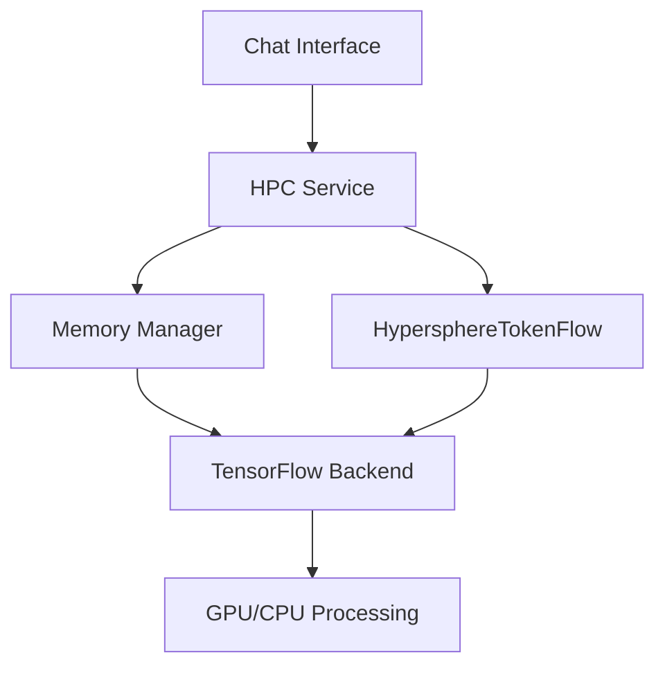

# AI Development Guide

## Overview

This guide details the AI integration architecture and development workflow for the Unified API Chatbot system. It covers model integration, optimization techniques, and best practices for AI development.

## Table of Contents

1. [Architecture](#architecture)
2. [Model Integration](#model-integration)
3. [Memory Management](#memory-management)
4. [Optimization Techniques](#optimization-techniques)
5. [Development Workflow](#development-workflow)
6. [Testing and Validation](#testing-and-validation)

## Architecture

### HPC Integration Layer



### Key Components

1. **HypersphereTokenFlow**
   - Manages embedding transformations
   - Handles tensor operations
   - Provides memory optimization
   - Implements shock absorption

2. **Memory Manager**
   - Dynamic memory allocation
   - Garbage collection
   - Cache management
   - Resource monitoring

3. **TensorFlow Integration**
   - GPU acceleration
   - Batch processing
   - Parallel computation
   - Tensor optimization

## Model Integration

### Adding New Models

1. **Model Configuration**
```typescript
interface ModelConfig {
  name: string;
  version: string;
  parameters: {
    batchSize: number;
    maxTokens: number;
    temperature: number;
  };
  memoryConfig: {
    maxTensors: number;
    gcThreshold: number;
  };
}
```

2. **Integration Steps**
```typescript
// 1. Initialize model
const model = await initializeModel(config);

// 2. Configure memory management
await setupMemoryManagement(model.memoryConfig);

// 3. Register with HPC service
HPCService.registerModel(model);
```

### Optimization Pipeline

```typescript
class OptimizationPipeline {
  async process(input: ModelInput): Promise<ModelOutput> {
    // 1. Preprocess input
    const preprocessed = await this.preprocess(input);
    
    // 2. Apply HPC optimizations
    const optimized = await HPCService.processEmbeddings(
      preprocessed,
      this.config.chatId
    );
    
    // 3. Run model inference
    const result = await this.runInference(optimized);
    
    // 4. Post-process output
    return this.postprocess(result);
  }
}
```

## Memory Management

### Memory Optimization Strategies

1. **Chunked Processing**
```typescript
const processLargeDataset = async (data: number[]) => {
  const chunks = splitIntoChunks(data, config.chunkSize);
  const results = [];
  
  for (const chunk of chunks) {
    // Process chunk with memory management
    const result = await HPCService.processChunk(chunk);
    results.push(result);
    
    // Force garbage collection if needed
    if (tf.memory().numTensors > config.gcThreshold) {
      tf.dispose(result);
    }
  }
  
  return mergeResults(results);
};
```

2. **Tensor Lifecycle Management**
```typescript
class TensorManager {
  private tensors: Map<string, tf.Tensor>;
  
  async manageTensor(operation: () => tf.Tensor): Promise<tf.Tensor> {
    return tf.tidy(() => {
      const result = operation();
      this.trackTensor(result);
      return result;
    });
  }
  
  cleanup(): void {
    this.tensors.forEach(tensor => tensor.dispose());
    this.tensors.clear();
  }
}
```

## Optimization Techniques

### 1. GPU Acceleration

```typescript
const configureGPU = async () => {
  if (tf.gpu.available()) {
    await tf.setBackend('webgl');
    await tf.ready();
    
    // Configure WebGL parameters
    tf.env().set('WEBGL_FORCE_F16_TEXTURES', true);
    tf.env().set('WEBGL_PACK', true);
  }
};
```

### 2. Batch Processing

```typescript
const batchProcessor = {
  async process(inputs: ModelInput[]): Promise<ModelOutput[]> {
    // Group inputs into optimal batch sizes
    const batches = createBatches(inputs, config.batchSize);
    
    // Process batches in parallel if possible
    const results = await Promise.all(
      batches.map(batch => this.processBatch(batch))
    );
    
    return flattenResults(results);
  }
};
```

### 3. Memory Profiling

```typescript
const memoryProfiler = {
  startProfiling(): void {
    this.snapshot = tf.memory();
    this.startTime = performance.now();
  },
  
  endProfiling(): MemoryProfile {
    const endSnapshot = tf.memory();
    return {
      duration: performance.now() - this.startTime,
      tensorDelta: endSnapshot.numTensors - this.snapshot.numTensors,
      byteDelta: endSnapshot.numBytes - this.snapshot.numBytes
    };
  }
};
```

## Development Workflow

### 1. Model Development Cycle


### 2. Testing Framework

```typescript
describe('AI Model Integration', () => {
  it('should handle memory efficiently', async () => {
    const before = tf.memory().numTensors;
    await processLargeDataset(testData);
    const after = tf.memory().numTensors;
    
    expect(after).toBeLessThanOrEqual(before + config.maxTensorDelta);
  });
});
```

## Testing and Validation

### 1. Performance Metrics

- Tensor allocation rate
- Memory usage patterns
- Processing latency
- GPU utilization

### 2. Validation Suite

```typescript
class ModelValidator {
  async validateModel(model: AIModel): Promise<ValidationReport> {
    return {
      memoryEfficiency: await this.testMemoryEfficiency(model),
      processingSpeed: await this.benchmarkProcessing(model),
      accuracy: await this.validateAccuracy(model),
      stability: await this.testStability(model)
    };
  }
}
```

### 3. Monitoring

```typescript
const modelMonitor = {
  metrics: new MetricsCollector(),
  
  async track(operation: () => Promise<void>): Promise<void> {
    this.metrics.startTracking();
    await operation();
    const report = this.metrics.generateReport();
    await this.storeMetrics(report);
  }
};
```

## Best Practices

1. **Memory Management**
   - Always use tf.tidy for tensor operations
   - Implement proper cleanup in finally blocks
   - Monitor tensor count regularly
   - Use chunked processing for large datasets

2. **Optimization**
   - Profile before optimizing
   - Use batch processing when possible
   - Leverage GPU acceleration
   - Implement proper error handling

3. **Testing**
   - Write comprehensive unit tests
   - Perform memory leak checks
   - Test with various input sizes
   - Validate optimization results

4. **Documentation**
   - Document memory requirements
   - Explain optimization strategies
   - Provide usage examples
   - Keep performance notes