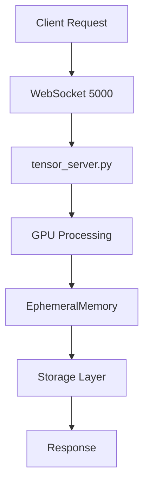
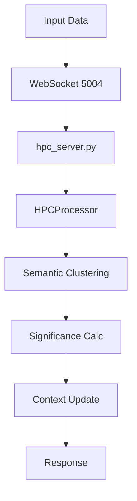

# Lucid Recall System Architecture

## Core Components

### 1. Memory System (tensor_server.py)
- **Port**: 5000
- **Primary Functions**:
  * Memory Operations
    - Ephemeral memory management
    - Tensor storage and retrieval
    - Significance tracking and decay
    - Automatic memory cleanup
  * GPU Processing
    - Real-time tensor operations
    - Mixed precision support
    - Dynamic memory management
    - Automatic cache cleanup
  * Memory Management
    - EphemeralMemory integration
    - Decay rate control
    - Retention threshold management
    - Batch processing optimization
  * GPU Acceleration
    - CUDA optimization
    - Memory fraction control (80%)
    - Automatic mixed precision
    - cuDNN benchmarking

### 2. HPC System (hpc_server.py)
- **Port**: 5004
- **Primary Functions**:
  * Sequence Processing
    - Hypersphere projection
    - Semantic clustering
    - Momentum-based processing
    - Batch handling
  * Significance Calculation
    - Context-aware analysis
    - Temporal weighting
    - Cluster-based significance
    - Surprise detection
  * Pattern Processing
    - Semantic cluster management
    - Shock absorption
    - Pattern diversity control
    - Momentum adaptation
  * Client Management
    - Context isolation
    - State tracking
    - Connection handling
    - Resource cleanup

## System Architecture

### 1. Memory Operations Flow


### 2. HPC Processing Flow


## Component Integration

### 1. Memory-HPC Integration
- Direct Communication
  * Shared tensor formats
  * Efficient data transfer
  * State synchronization
- Resource Sharing
  * GPU memory coordination
  * Processing prioritization
  * Cache management

### 2. Processing Pipeline
- Semantic Processing
  * Hypersphere projection
  * Cluster management
  * Pattern detection
- Memory Management
  * Dynamic allocation
  * Automatic cleanup
  * Resource monitoring

## Resource Management

### 1. GPU Resources
```python
# Memory Management
GPU_MEMORY_FRACTION = 0.8  # 80% of available memory
CLEANUP_THRESHOLD = 0.9    # 90% triggers cleanup
CACHE_CLEAR_THRESHOLD = 0.95  # 95% forces cache clear

# Processing Optimization
MIXED_PRECISION = True
CUDNN_BENCHMARK = True
TENSOR_CORES = True
```

### 2. System Resources
- Memory Management
  * Dynamic GPU allocation
  * Automatic cache cleanup
  * Resource monitoring
- Processing Control
  * Batch size optimization
  * Queue management
  * Priority handling

## Security Model

### 1. Container Security
- Isolation
  * Process separation
  * Resource limits
  * Network restrictions
- Access Control
  * Port restrictions
  * Command limitations
  * Resource protection

### 2. Network Security
- WebSocket Security
  * Connection validation
  * Message verification
  * Rate limiting
- Data Protection
  * Input validation
  * Output sanitization
  * Error handling

## System Requirements

### 1. Hardware Requirements
- GPU
  * NVIDIA CUDA support
  * Minimum 8GB VRAM
  * PCIe 3.0 or higher
- System
  * 16GB+ RAM
  * Multi-core CPU
  * Fast storage

### 2. Software Requirements
- Container Environment
  * Docker
  * NVIDIA Container Toolkit
- Runtime
  * Python 3.8+
  * CUDA 11.0+
  * Node.js 18+
  * PyTorch with CUDA

## Processing Pipeline

### 1. Semantic Processing
- Hypersphere Projection
  * Unit normalization
  * Stability checking
  * Dimension preservation
- Cluster Management
  * Dynamic cluster creation
  * Cluster merging
  * Stability tracking
- Pattern Detection
  * Surprise scoring
  * Momentum tracking
  * Diversity analysis

### 2. Memory Management
- Storage Control
  * Dynamic allocation
  * Decay management
  * Cleanup scheduling
- Cache Management
  * Automatic cleanup
  * Usage monitoring
  * Optimization

## Error Handling

### 1. Component Errors
- Memory System
  * GPU memory errors
  * Storage failures
  * Processing errors
- HPC System
  * Cluster errors
  * Processing failures
  * Connection issues

### 2. Recovery Procedures
- Automatic Recovery
  * Cache clearing
  * Resource reallocation
  * Connection retry
- Manual Intervention
  * Component restart
  * Resource reset
  * Configuration update