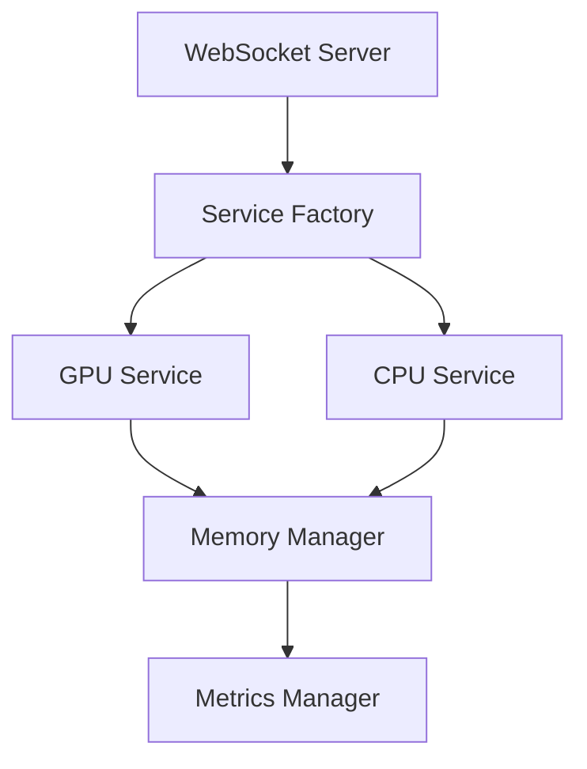

# Development Guide
*Titan Memory Server with GPU Acceleration*

**Version:** 1.0.0  
**Authors:** MEGA, JASON, KEG  
**Last Updated:** January 29, 2025

## Table of Contents
1. [Development Setup](#development-setup)
2. [Code Organization](#code-organization)
3. [Coding Standards](#coding-standards)
4. [Testing Guidelines](#testing-guidelines)
5. [Performance Optimization](#performance-optimization)
6. [Debugging](#debugging)
7. [Contributing](#contributing)

## Development Setup

### Environment Setup

1. **Required Tools**
```bash
# Python environment
python -m venv .venv
source .venv/bin/activate  # Windows: .\.venv\Scripts\activate
pip install -r requirements.txt

# Node.js dependencies
npm install

# CUDA toolkit
# Download from NVIDIA website
# Add to PATH
```

2. **IDE Configuration**
```json
// VSCode settings.json
{
    "python.linting.enabled": true,
    "python.linting.pylintEnabled": true,
    "python.formatting.provider": "black",
    "editor.formatOnSave": true,
    "editor.codeActionsOnSave": {
        "source.organizeImports": true
    }
}
```

3. **Environment Variables**
```bash
# Development environment
export NODE_ENV=development
export DEBUG=titan:*
export CUDA_VISIBLE_DEVICES=0
```

## Code Organization

### Project Structure
```
src/
├── services/
│   ├── implementations/
│   │   ├── cuda/
│   │   │   └── HPCService.py
│   │   └── cpu/
│   │       └── HPCService.js
│   └── factory/
│       └── HPCServiceFactory.js
├── managers/
│   ├── MemoryManager.js
│   └── MetricsManager.js
├── utils/
│   ├── logger.js
│   └── validators.js
└── test/
    ├── unit/
    ├── integration/
    └── performance/
```

### Module Dependencies


## Coding Standards

### Python Code Style

1. **Formatting**
```python
# Use type hints
def process_embeddings(
    self,
    embeddings: torch.Tensor,
    options: Optional[Dict[str, Any]] = None
) -> torch.Tensor:
    """Process embeddings with GPU acceleration.
    
    Args:
        embeddings: Input tensor
        options: Processing options
        
    Returns:
        Processed tensor
        
    Raises:
        ResourceError: If GPU memory is insufficient
    """
    if options is None:
        options = {}
```

2. **Error Handling**
```python
class ResourceError(Exception):
    """Raised when resource allocation fails."""
    pass

try:
    result = self.process_batch(batch)
except torch.cuda.OutOfMemoryError as e:
    raise ResourceError(f"GPU memory exhausted: {str(e)}")
```

### JavaScript Code Style

1. **ES6+ Features**
```javascript
// Use modern JavaScript features
class MemoryManager {
    #chunks = new Map();
    
    async allocate({ size, chatId }) {
        const chunk = await this.#createChunk(size);
        this.#chunks.set(chatId, chunk);
        return chunk;
    }
}
```

2. **Async/Await**
```javascript
// Prefer async/await over callbacks
async function processData(data) {
    try {
        const service = await factory.getService();
        const result = await service.process(data);
        return result;
    } catch (error) {
        logger.error('Processing failed:', error);
        throw error;
    }
}
```

## Testing Guidelines

### Unit Tests

1. **Python Tests (PyTest)**
```python
import pytest
import torch

def test_gpu_service():
    service = GPUAcceleratedHPCService()
    
    # Test tensor operations
    input_tensor = torch.randn(10, 10)
    result = service.process_embeddings(input_tensor)
    
    assert result.shape == (10, 10)
    assert torch.allclose(
        torch.norm(result, dim=1),
        torch.ones(10),
        atol=1e-6
    )
```

2. **JavaScript Tests (Jest)**
```javascript
describe('MemoryManager', () => {
    let manager;
    
    beforeEach(() => {
        manager = new MemoryManager();
    });
    
    test('allocates memory chunks', async () => {
        const chunk = await manager.allocate({
            size: 1024,
            chatId: 'test'
        });
        
        expect(chunk).toBeDefined();
        expect(chunk.size).toBe(1024);
    });
});
```

### Integration Tests

```javascript
describe('System Integration', () => {
    let server;
    let client;
    
    beforeAll(async () => {
        server = new TitanWebSocketServer();
        await server.start();
        client = new WebSocket('ws://localhost:3001');
    });
    
    test('processes embeddings end-to-end', async () => {
        const result = await client.send({
            jsonrpc: '2.0',
            method: 'processEmbeddings',
            params: {
                embeddings: new Float32Array([1, 2, 3]),
                chatId: 'test'
            }
        });
        
        expect(result.error).toBeUndefined();
        expect(result.result).toBeDefined();
    });
});
```

### Performance Tests

```python
def benchmark_gpu_operations():
    """Benchmark GPU operations with different sizes."""
    sizes = [1000, 5000, 10000]
    results = []
    
    for size in sizes:
        start_time = time.time()
        tensor = torch.randn(size, size, device='cuda')
        result = process_large_tensor(tensor)
        end_time = time.time()
        
        results.append({
            'size': size,
            'time': end_time - start_time,
            'memory': torch.cuda.max_memory_allocated()
        })
    
    return results
```

## Performance Optimization

### Memory Management

1. **GPU Memory**
```python
def optimize_memory_usage(self):
    """Optimize GPU memory usage."""
    # Clear cache periodically
    torch.cuda.empty_cache()
    
    # Use memory efficient operations
    with torch.cuda.amp.autocast():
        result = self.process_batch(batch)
    
    # Monitor memory usage
    memory_stats = {
        'allocated': torch.cuda.memory_allocated(),
        'cached': torch.cuda.memory_reserved()
    }
    return memory_stats
```

2. **Batch Processing**
```python
def process_large_dataset(self, data: List[torch.Tensor]):
    """Process large datasets in batches."""
    batch_size = self.config.batch_size
    results = []
    
    for i in range(0, len(data), batch_size):
        batch = data[i:i + batch_size]
        batch_result = self.process_batch(batch)
        results.extend(batch_result)
    
    return results
```

## Debugging

### Logging

```javascript
const logger = {
    debug: (msg, ...args) => {
        if (process.env.DEBUG) {
            console.debug(`[DEBUG] ${msg}`, ...args);
        }
    },
    
    error: (msg, error) => {
        console.error(`[ERROR] ${msg}`, {
            message: error.message,
            stack: error.stack,
            time: new Date().toISOString()
        });
    }
};
```

### Metrics Collection

```typescript
interface MetricsCollector {
    recordOperation(name: string, duration: number): void;
    recordMemoryUsage(stats: MemoryStats): void;
    getMetrics(): SystemMetrics;
}
```

## Contributing

### Pull Request Process

1. **Branch Naming**
```bash
# Feature branches
feature/gpu-optimization
feature/memory-management

# Bug fixes
fix/memory-leak
fix/cuda-error

# Documentation
docs/api-reference
docs/performance-guide
```

2. **Commit Messages**
```bash
# Format: <type>(<scope>): <description>

feat(gpu): add tensor quantization support
fix(memory): resolve memory leak in batch processing
docs(api): update WebSocket API documentation
test(integration): add end-to-end tests
```

3. **Code Review Checklist**
- [ ] Code follows style guide
- [ ] Tests are included
- [ ] Documentation is updated
- [ ] Performance impact is considered
- [ ] Error handling is implemented
- [ ] Memory management is optimized

### Development Workflow

1. **Feature Development**
```bash
# Create feature branch
git checkout -b feature/new-feature

# Implement changes
# Run tests
npm test

# Update documentation
# Create pull request
```

2. **Testing Process**
```bash
# Run all tests
npm run test:all

# Run specific tests
npm run test:unit
npm run test:integration
npm run test:performance
```

3. **Documentation Updates**
```bash
# Generate API documentation
npm run docs:generate

# Update README
# Update CHANGELOG
```

## Best Practices

### 1. Code Quality
- Write self-documenting code
- Use meaningful variable names
- Keep functions small and focused
- Follow SOLID principles

### 2. Performance
- Profile before optimizing
- Use async operations appropriately
- Implement proper cleanup
- Monitor resource usage

### 3. Testing
- Write tests first (TDD)
- Cover edge cases
- Include performance tests
- Document test scenarios

### 4. Documentation
- Keep documentation up-to-date
- Include examples
- Document breaking changes
- Maintain changelog

## Support

For development support:
- GitHub Issues
- Development Chat
- Documentation
- Code Review Process