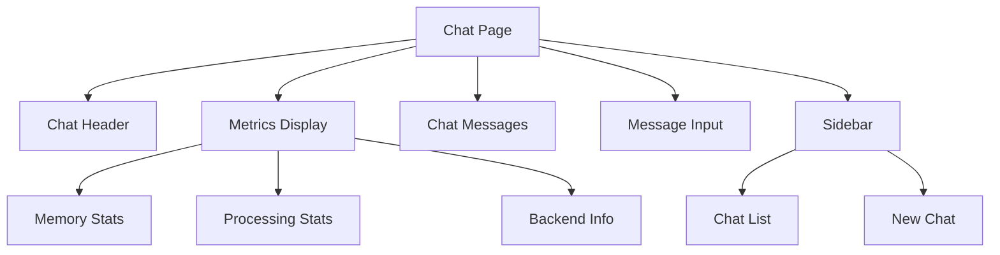

# Frontend Development Guide

## Overview

This guide covers the frontend architecture of the Unified API Chatbot, focusing on React components, state management, and integration with the HPC backend services.

## Table of Contents

1. [Architecture](#architecture)
2. [Component Structure](#component-structure)
3. [State Management](#state-management)
4. [HPC Integration](#hpc-integration)
5. [Metrics Display](#metrics-display)
6. [Performance Optimization](#performance-optimization)

## Architecture

### Component Hierarchy



## Component Structure

### 1. Chat Page (page.jsx)

```jsx
// Main chat interface component
export default function ChatPage() {
  // State management with Zustand
  const { 
    currentChat, 
    messages, 
    model,
    hpcMetrics 
  } = useChatStore();

  // Initialize HPC metrics polling
  useEffect(() => {
    if (currentChat) {
      const stopPolling = startMetricsPolling();
      return () => stopPolling();
    }
  }, [currentChat]);

  return (
    <div className="flex h-screen">
      <Sidebar />
      <main className="flex-grow">
        <ChatHeader />
        <MetricsDisplay />
        <ChatMessages />
        <MessageInput />
      </main>
    </div>
  );
}
```

### 2. Metrics Display (MetricsDisplay.jsx)

```jsx
export default function MetricsDisplay() {
  const metrics = useChatStore(state => state.hpcMetrics);

  return (
    <div className="metrics-panel">
      <MemoryStats data={metrics.memory} />
      <ProcessingStats data={metrics.processing} />
      <BackendInfo data={metrics.backend} />
    </div>
  );
}
```

## State Management

### 1. Chat Store (chatStore.jsx)

```typescript
interface ChatState {
  currentChat: string | null;
  messages: Message[];
  model: string;
  hpcMetrics: HPCMetrics;
}

const useChatStore = create<ChatState>((set) => ({
  // Chat state
  currentChat: null,
  messages: [],
  model: 'gpt-4o-mini',
  
  // HPC metrics state
  hpcMetrics: {
    memory: {
      avgNorm: 0,
      maxNorm: 0,
      minNorm: 0
    },
    processing: {
      chunksProcessed: 0,
      shockAbsorberApplied: false,
      surpriseValue: 0
    },
    backend: {
      name: 'cpu',
      isGPU: false,
      memoryInfo: {}
    }
  },
  
  // Actions
  setCurrentChat: (chatId) => set({ currentChat: chatId }),
  updateMetrics: (metrics) => set({ hpcMetrics: metrics }),
  
  // HPC integration
  startMetricsPolling: () => {
    const interval = setInterval(async () => {
      const metrics = await fetchHPCMetrics();
      set({ hpcMetrics: metrics });
    }, 2000);
    
    return () => clearInterval(interval);
  }
}));
```

## HPC Integration

### 1. API Integration

```typescript
// API utilities for HPC interaction
const hpcApi = {
  async fetchMetrics(chatId: string): Promise<HPCMetrics> {
    const response = await fetch(`/api/hpc-metrics?chatId=${chatId}`);
    return response.json();
  },
  
  async processMessage(message: string, chatId: string): Promise<void> {
    await fetch('/api/process-message', {
      method: 'POST',
      body: JSON.stringify({ message, chatId })
    });
  }
};
```

### 2. Metrics Hooks

```typescript
// Custom hook for HPC metrics
function useHPCMetrics(chatId: string) {
  const updateMetrics = useChatStore(state => state.updateMetrics);
  
  useEffect(() => {
    if (!chatId) return;
    
    const fetchMetrics = async () => {
      const metrics = await hpcApi.fetchMetrics(chatId);
      updateMetrics(metrics);
    };
    
    const interval = setInterval(fetchMetrics, 2000);
    return () => clearInterval(interval);
  }, [chatId, updateMetrics]);
}
```

## Metrics Display

### 1. Memory Stats Component

```jsx
function MemoryStats({ data }) {
  return (
    <div className="stats-panel">
      <div className="stat-item">
        <label>Average Norm</label>
        <value>{data.avgNorm.toFixed(4)}</value>
      </div>
      <div className="stat-item">
        <label>Max Norm</label>
        <value>{data.maxNorm.toFixed(4)}</value>
      </div>
      <div className="stat-item">
        <label>Min Norm</label>
        <value>{data.minNorm.toFixed(4)}</value>
      </div>
    </div>
  );
}
```

### 2. Processing Stats Component

```jsx
function ProcessingStats({ data }) {
  return (
    <div className="stats-panel">
      <div className="stat-item">
        <label>Chunks Processed</label>
        <value>{data.chunksProcessed}</value>
      </div>
      <div className="stat-item">
        <label>Shock Absorber</label>
        <value>
          <StatusIndicator active={data.shockAbsorberApplied} />
        </value>
      </div>
      <div className="stat-item">
        <label>Surprise Value</label>
        <value>{data.surpriseValue.toFixed(4)}</value>
      </div>
    </div>
  );
}
```

## Performance Optimization

### 1. Component Memoization

```jsx
// Memoize expensive components
const MemoizedMetricsDisplay = memo(MetricsDisplay, (prev, next) => {
  return isEqual(prev.data, next.data);
});

// Use in parent component
function ChatInterface() {
  return (
    <div>
      <MemoizedMetricsDisplay data={metrics} />
    </div>
  );
}
```

### 2. Render Optimization

```jsx
// Optimize lists with virtualization
function ChatMessageList({ messages }) {
  return (
    <VirtualList
      height={600}
      itemCount={messages.length}
      itemSize={50}
      width="100%"
    >
      {({ index, style }) => (
        <ChatMessage
          message={messages[index]}
          style={style}
        />
      )}
    </VirtualList>
  );
}
```

### 3. State Updates

```typescript
// Batch state updates
const updateChatState = (updates: Partial<ChatState>) => {
  useChatStore.setState(state => ({
    ...state,
    ...updates
  }), true); // true enables batching
};
```

## Best Practices

1. **Component Design**
   - Keep components focused and small
   - Use proper TypeScript types
   - Implement error boundaries
   - Optimize re-renders

2. **State Management**
   - Centralize state in Zustand store
   - Use selectors for performance
   - Implement proper cleanup
   - Handle loading states

3. **HPC Integration**
   - Handle API errors gracefully
   - Implement retry logic
   - Cache responses when appropriate
   - Monitor performance

4. **Styling**
   - Use Tailwind utilities
   - Maintain consistent theme
   - Implement responsive design
   - Follow accessibility guidelines