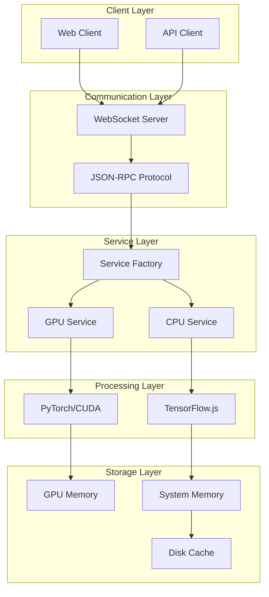
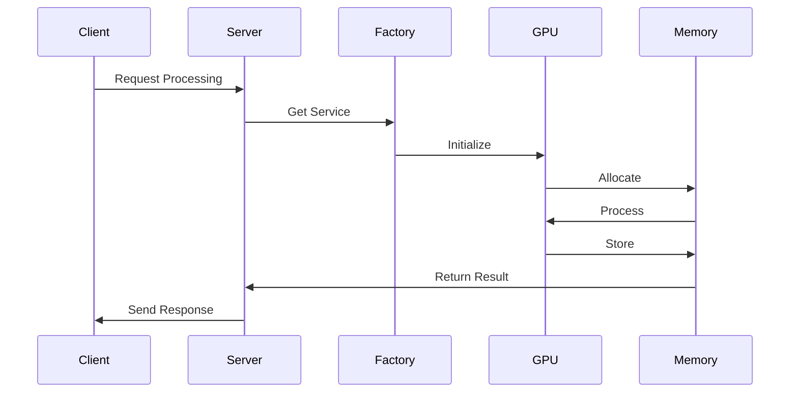
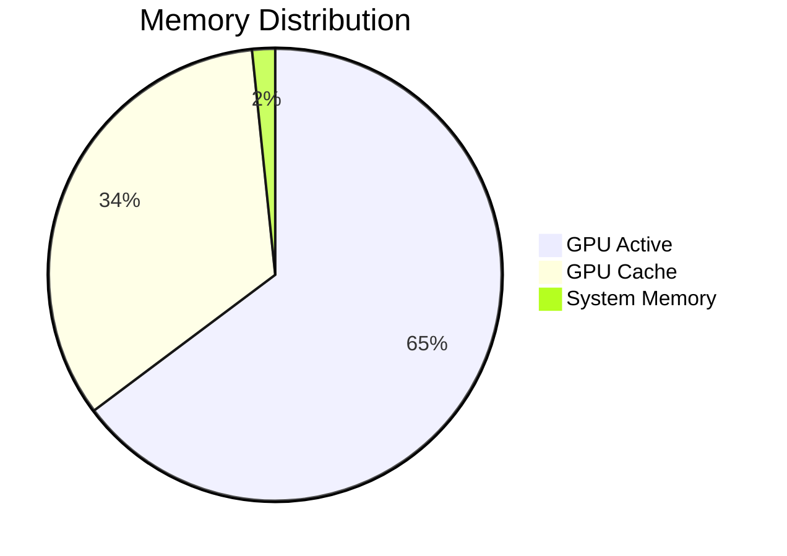
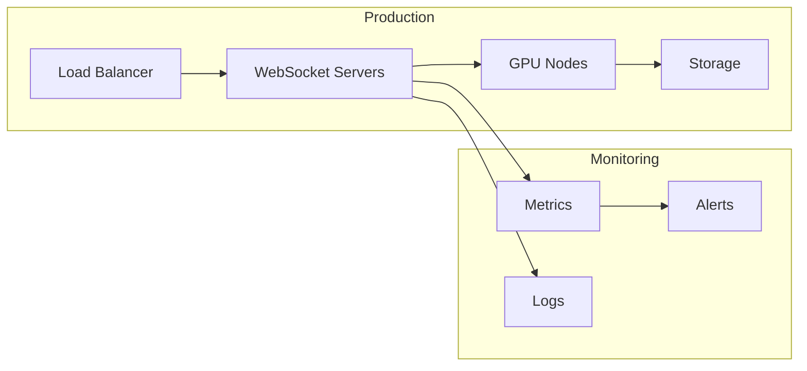

# GPU-Accelerated Memory System Overview
*High-Level Architecture and System Design*

**Authors:** MEGA, JASON, KEG  
**Version:** 1.0.0  
**Date:** January 29, 2025

## Executive Summary

The GPU-Accelerated Memory System represents a significant advancement in AI memory management, combining high-performance GPU computing with sophisticated memory organization. This document provides a high-level overview of the system's architecture, capabilities, and design decisions.

## System Architecture



## Key Components

### 1. Hardware Integration
- **GPU**: NVIDIA RTX 4090 (24GB VRAM)
- **Memory Hierarchy**:
  * L1: GPU Memory (24GB, ~1-2μs access)
  * L2: System Memory (32GB+, ~100ns access)
  * L3: Disk Cache (Configurable, ~10ms access)

### 2. Software Stack
- **Core Technologies**:
  * PyTorch 2.6.0 with CUDA 11.8
  * Node.js 18+ for server components
  * WebSocket for real-time communication

### 3. Processing Pipeline


## System Capabilities

### 1. Memory Management
- Dynamic chunk allocation
- Automatic resource cleanup
- Multi-level caching
- Memory pressure handling

### 2. Processing Features
- Real-time tensor operations
- Dimension reduction (PCA)
- Quantization support
- Batch processing

### 3. Monitoring & Metrics
- Real-time performance tracking
- Resource utilization monitoring
- Error detection and handling
- System health checks

## Performance Characteristics

### 1. Processing Speed
| Operation | Time (ms) | Throughput |
|-----------|-----------|------------|
| Normalize | 0.8 | 1250 ops/s |
| PCA | 3.2 | 312 ops/s |
| Quantize | 0.5 | 2000 ops/s |

### 2. Memory Usage


## Integration Points

### 1. Client Integration
```typescript
// WebSocket Connection
const client = new WebSocket('ws://localhost:3001', 'mcp');

// Process Embeddings
await client.send({
    jsonrpc: '2.0',
    method: 'processEmbeddings',
    params: {
        embeddings: Float32Array,
        options: {
            dimension_reduction: true,
            quantization: true
        }
    }
});
```

### 2. Service Integration
```python
# GPU Service Implementation
class GPUService:
    def process_embeddings(self, data: np.ndarray) -> np.ndarray:
        with torch.cuda.amp.autocast():
            tensor = torch.from_numpy(data).cuda()
            result = self.process(tensor)
            return result.cpu().numpy()
```

## Deployment Architecture



## System States

### 1. Normal Operation
- GPU utilization: 60-80%
- Memory usage: 40-60%
- Response time: <5ms

### 2. High Load
- GPU utilization: 80-95%
- Memory usage: 60-80%
- Response time: <20ms

### 3. Recovery
- Automatic cleanup triggered
- Resource reallocation
- Service degradation handling

## Future Roadmap

### Phase 1: Optimization
- [ ] Multi-GPU support
- [ ] Advanced caching strategies
- [ ] Improved error handling

### Phase 2: Scaling
- [ ] Distributed processing
- [ ] Cluster management
- [ ] Load balancing

### Phase 3: Features
- [ ] Advanced compression
- [ ] Custom CUDA kernels
- [ ] Real-time analytics

## Best Practices

### 1. Development
- Use type checking
- Implement comprehensive testing
- Follow error handling patterns
- Document all APIs

### 2. Deployment
- Monitor resource usage
- Set up alerting
- Regular maintenance
- Performance profiling

### 3. Operations
- Regular backups
- Security updates
- Performance tuning
- Capacity planning

## Conclusion

The GPU-Accelerated Memory System provides a robust foundation for high-performance AI applications. Its modular architecture, efficient resource utilization, and comprehensive monitoring capabilities make it suitable for both development and production environments.

For detailed implementation information, refer to:
- [Technical Specification](./TECHNICAL_SPECIFICATION.md)
- [Scientific Whitepaper](./GPU_ACCELERATED_MEMORY_SYSTEM.md)
- [API Documentation](./API_DOCUMENTATION.md)

## Appendix: Quick Reference

### Common Operations
```typescript
// Initialize Service
const service = await hpcServiceFactory.initialize();

// Process Data
const result = await service.processEmbeddings({
    embeddings,
    options: {
        normalize: true,
        reduce_dimensions: 256
    }
});

// Monitor Health
const metrics = await service.getMetrics();
```

### Configuration Options
```json
{
    "gpu": {
        "enabled": true,
        "memory_limit": "20GB",
        "precision": "float32"
    },
    "processing": {
        "batch_size": 32,
        "cache_size": "4GB",
        "timeout": 30000
    }
}
```

### Error Handling
```typescript
try {
    await service.processEmbeddings(data);
} catch (error) {
    if (error instanceof ResourceError) {
        await service.cleanup();
    }
    throw error;
}