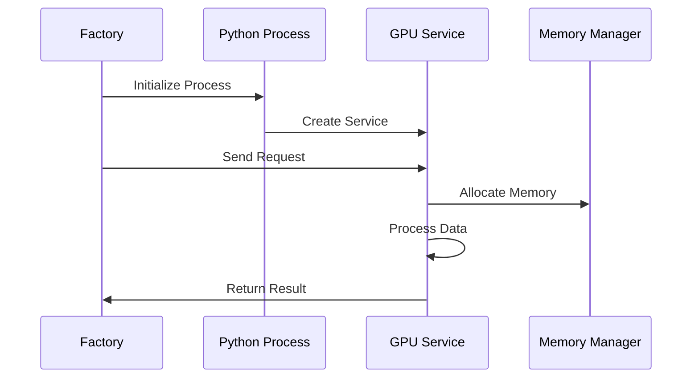
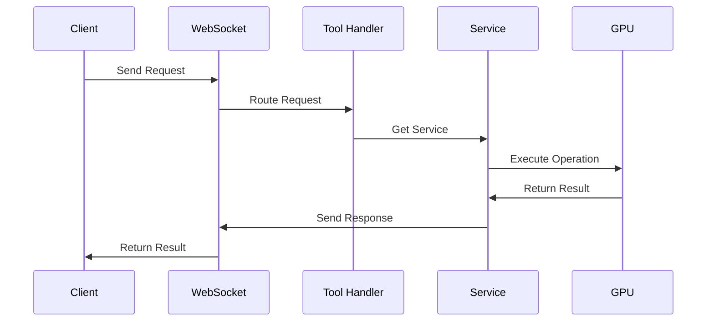

# Tool Implementation Analysis
*Titan Memory Server Tool System*

**Version:** 1.0.0  
**Authors:** MEGA, JASON, KEG  
**Last Updated:** January 29, 2025

## Tool Registration System

The tool registration system is implemented in the WebSocket server through JSON-RPC capabilities:

```javascript
// From src/run-titan-websocket.js
this.server = new Server({
    name: 'titan-memory',
    version: '1.0.0',
    capabilities: {
        tools: {
            // Memory Management Tools
            allocateMemory: {
                description: "Allocate memory chunk for processing",
                inputSchema: {
                    type: "object",
                    properties: {
                        size: { type: "number" },
                        chatId: { type: "string" }
                    },
                    required: ["size", "chatId"]
                }
            },
            
            // Processing Tools
            processEmbeddings: {
                description: "Process embeddings with HPC flow",
                inputSchema: {
                    type: "object",
                    properties: {
                        embeddings: { type: "array" },
                        chatId: { type: "string" },
                        options: { type: "object" }
                    },
                    required: ["embeddings", "chatId"]
                }
            },
            
            // Monitoring Tools
            getMetrics: {
                description: "Get memory and HPC metrics",
                inputSchema: {
                    type: "object",
                    properties: {}
                }
            }
        }
    }
});
```

## GPU Integration

The GPU-accelerated service is integrated through the Service Factory pattern:

```javascript
// From src/services/HPCServiceFactory.js
class HPCServiceFactory {
    async initialize() {
        try {
            // Check if CUDA is available
            const verifyResult = await this.runPythonScript('verify-memory.py');
            const hasCUDA = verifyResult.includes('CUDA is available');
            
            if (hasCUDA) {
                logger.info(COMPONENT_NAME, 'CUDA support detected, initializing GPU service');
                await this.initializeGPUService();
            } else {
                logger.info(COMPONENT_NAME, 'CUDA not available, falling back to CPU implementation');
                const { HPCFlowManager } = await import('./HPCFlowManager.js');
                this.service = new HPCFlowManager();
            }
            
            return true;
        } catch (error) {
            logger.error(COMPONENT_NAME, 'Initialization failed:', error);
            throw error;
        }
    }

    async initializeGPUService() {
        // Start Python GPU service
        const scriptPath = path.join(process.cwd(), 'src', 'services', 'implementations', 'cuda', 'HPCService.py');
        this.pythonProcess = spawn('python', [scriptPath], {
            stdio: ['pipe', 'pipe', 'pipe']
        });

        // Create proxy methods
        this.service = {
            processEmbeddings: async (args) => this.sendToPython('process_embeddings', args),
            getMetrics: async () => this.sendToPython('get_metrics'),
            cleanup: async () => this.cleanup()
        };
    }
}
```

## Tool Execution Patterns

The system implements several tool execution patterns:

### 1. Direct Tool Execution

```javascript
// From src/run-titan-websocket.js
async handleRequest(socket, request) {
    try {
        let result;
        const hpcService = hpcServiceFactory.getService();
        
        switch (request.params.name) {
            case 'allocateMemory':
                result = await this.memoryManager.allocate(request.params.arguments);
                break;
            case 'processEmbeddings':
                result = await hpcService.processEmbeddings(request.params.arguments);
                break;
            case 'getMetrics':
                result = {
                    memory: await this.memoryManager.getMetrics(),
                    hpc: await hpcService.getMetrics()
                };
                break;
            default:
                throw new Error(`Unknown tool: ${request.params.name}`);
        }

        socket.send(JSON.stringify({
            jsonrpc: "2.0",
            id: request.id,
            result: {
                content: [{
                    type: 'text',
                    text: JSON.stringify(result, null, 2)
                }]
            }
        }));
    } catch (error) {
        // Error handling
    }
}
```

### 2. GPU-Accelerated Processing

```python
# From src/services/implementations/cuda/HPCService.py
class GPUAcceleratedHPCService:
    async def process_embeddings(self, embeddings: List[float], chat_id: str, options: Dict = None) -> Dict:
        try:
            # Convert to tensor and move to GPU
            embedding_tensor = torch.tensor(embeddings, dtype=torch.float32, device=self.device)
            
            # Process embeddings
            with torch.no_grad():
                normalized = self.normalize_embeddings(embedding_tensor)
                processed = self.apply_processing_options(normalized, options or {})
                result = processed.cpu().numpy().tolist()

            return {
                'processed': result,
                'metadata': {
                    'processing_time': self.calculate_processing_time(),
                    'dimensions': len(result),
                    'device': self.device.type
                }
            }
        except Exception as e:
            self.update_processing_state(chat_id, {
                'status': 'error',
                'error': str(e)
            })
            raise
```

### 3. Memory Management

```javascript
// From src/managers/memory-manager.js
class MemoryManager {
    async allocate({ size, chatId }) {
        try {
            const chunk = await this.createChunk(size);
            this.chunks.set(chatId, chunk);
            
            // Update metrics
            this.metrics.recordAllocation(size);
            
            return {
                chunkId: chunk.id,
                size: chunk.size
            };
        } catch (error) {
            this.metrics.recordError('allocation_failed');
            throw error;
        }
    }

    async processChunk({ chunkId, embeddings }) {
        const chunk = this.chunks.get(chunkId);
        if (!chunk) {
            throw new Error(`Chunk not found: ${chunkId}`);
        }

        try {
            const service = await hpcServiceFactory.getService();
            const result = await service.processEmbeddings({
                embeddings,
                chatId: chunk.chatId
            });

            chunk.lastAccessed = Date.now();
            return result;
        } catch (error) {
            this.metrics.recordError('processing_failed');
            throw error;
        }
    }
}
```

## Integration Points

### 1. Service Factory to GPU Service



### 2. Tool Execution Flow



## Performance Considerations

1. **Memory Management**
   - Chunk-based allocation
   - Automatic cleanup
   - Resource monitoring

2. **GPU Optimization**
   - Batch processing
   - Async operations
   - Memory efficiency

3. **Error Handling**
   - Graceful degradation
   - Resource cleanup
   - Error recovery

## Best Practices

1. **Tool Registration**
   - Define clear schemas
   - Validate inputs
   - Document capabilities

2. **GPU Integration**
   - Check hardware availability
   - Handle resource limits
   - Implement fallbacks

3. **Execution Patterns**
   - Use async/await
   - Implement proper cleanup
   - Monitor performance

## Future Improvements

1. **Tool System**
   - Dynamic tool registration
   - Tool composition
   - Version management

2. **GPU Integration**
   - Multi-GPU support
   - Advanced scheduling
   - Resource optimization

3. **Execution Patterns**
   - Pipeline optimization
   - Caching strategies
   - Advanced monitoring