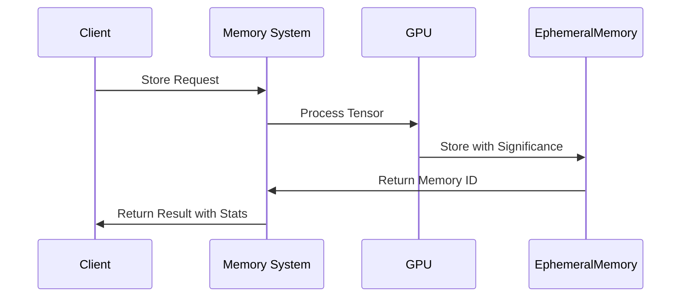
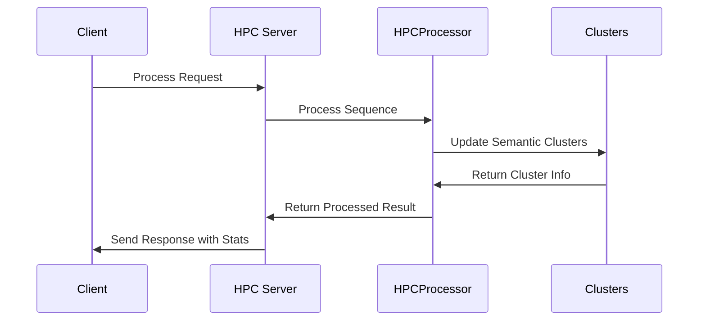

# Lucid Recall Integration Points

## Component Communication

### 1. Memory System Integration
```typescript
interface MemorySystemAPI {
    // Storage Operations
    storeEmbedding(data: Float32Array): Promise<{
        id: string;
        significance: number;
        stats: MemoryStats;
        gpu_memory?: GPUStats;
    }>;
    retrieveEmbedding(options: {
        count?: number;
        min_significance?: number;
    }): Promise<{
        memories: Float32Array[];
        gpu_memory?: GPUStats;
    }>;
    
    // System Operations
    getStats(): Promise<{
        stats: MemoryStats;
        gpu?: GPUStats;
    }>;
}

interface MemoryStats {
    total_memories: number;
    active_memories: number;
    significance_threshold: number;
    device: string;
}

interface GPUStats {
    allocated: number;      // GB
    cached: number;         // GB
    max_allocated: number;  // GB
    utilization: number;    // Percentage
}
```

### 2. HPC System Integration
```typescript
interface HPCSystemAPI {
    // Processing Operations
    processSequence(data: Float32Array): Promise<{
        sequence: Float32Array;
        chunks: ProcessedChunk[];
        significance: number;
        momentum_factor: number;
    }>;
    
    // Context Management
    updateContext(clientId: string, context: any): Promise<void>;
    resetState(clientId: string): Promise<void>;
    
    // Configuration
    updateConfig(config: HPCConfig): Promise<{
        processor_config: ProcessorConfig;
        significance_config: SignificanceConfig;
    }>;
}

interface ProcessedChunk {
    original: Float32Array;
    processed: Float32Array;
    significance: number;
    shock_applied: boolean;
    diversity_applied: boolean;
}

interface ClusterInfo {
    center: Float32Array;
    members: Set<number>;
    radius: number;
    last_update: number;
    stability: number;
}
```

## Data Flow Patterns

### 1. Memory Operations Flow


### 2. HPC Processing Flow


## Semantic Processing

### 1. Cluster Management
```typescript
interface ClusterManagement {
    // Cluster Operations
    createCluster(center: Float32Array): Promise<number>;
    updateCluster(id: number, embedding: Float32Array): Promise<void>;
    mergeClusters(id1: number, id2: number): Promise<number>;
    
    // Analysis
    findNearestCluster(embedding: Float32Array): Promise<{
        id: number;
        distance: number;
        stability: number;
    }>;
    
    // Maintenance
    cleanupClusters(): Promise<void>;
    getClusterStats(): Promise<ClusterStats>;
}

interface ClusterStats {
    total_clusters: number;
    avg_size: number;
    avg_stability: number;
    max_radius: number;
}
```

### 2. Pattern Detection
```typescript
interface PatternDetection {
    // Analysis
    computeSurprise(embedding: Float32Array): Promise<{
        score: number;
        momentum_component: number;
        cluster_component: number;
    }>;
    
    // Processing
    applyShockAbsorber(embedding: Float32Array): Promise<{
        absorbed: Float32Array;
        cluster_influence: number;
    }>;
    
    // State
    updateMomentum(embedding: Float32Array): Promise<void>;
    getMomentumStats(): Promise<MomentumStats>;
}

interface MomentumStats {
    buffer_size: number;
    current_factor: number;
    avg_surprise: number;
}
```

## Resource Management

### 1. GPU Resource Management
```typescript
interface GPUManagement {
    // Memory Management
    monitorMemory(): Promise<{
        current: GPUStats;
        history: GPUUsageHistory[];
    }>;
    
    // Optimization
    cleanupMemory(): Promise<void>;
    optimizeResources(): Promise<void>;
    
    // Stats
    getDetailedStats(): Promise<DetailedGPUStats>;
}

interface GPUUsageHistory {
    timestamp: number;
    allocated: number;
    reserved: number;
}

interface DetailedGPUStats extends GPUStats {
    avg_allocated: number;
    max_reserved: number;
    utilization_history: number[];
}
```

### 2. System Resource Management
```typescript
interface SystemManagement {
    // Process Management
    monitorProcessing(): Promise<{
        active_processes: number;
        queue_length: number;
        processing_load: number;
    }>;
    
    // Resource Control
    optimizeSystem(): Promise<void>;
    validateResources(): Promise<SystemStatus>;
    
    // Metrics
    getSystemMetrics(): Promise<SystemMetrics>;
}

interface SystemMetrics {
    cpu_usage: number;
    memory_usage: number;
    network_stats: NetworkStats;
    process_stats: ProcessStats;
}
```

## Error Handling

### 1. System Errors
```typescript
interface ErrorHandling {
    // GPU Errors
    handleGPUError(error: GPUError): Promise<{
        recovered: boolean;
        action_taken: string;
    }>;
    
    // Processing Errors
    handleProcessingError(error: ProcessError): Promise<{
        recovered: boolean;
        fallback_used: boolean;
    }>;
    
    // Recovery
    attemptRecovery(component: string): Promise<{
        success: boolean;
        new_state: SystemState;
    }>;
}

interface SystemState {
    gpu_healthy: boolean;
    memory_available: boolean;
    processing_active: boolean;
}
```

### 2. Communication Errors
```typescript
interface CommunicationErrors {
    // Connection Errors
    handleConnectionError(error: ConnectionError): Promise<{
        reconnected: boolean;
        retry_count: number;
    }>;
    
    // Message Errors
    handleMessageError(error: MessageError): Promise<{
        recovered: boolean;
        message_resent: boolean;
    }>;
    
    // Validation
    validateConnection(): Promise<ConnectionStatus>;
    checkMessageIntegrity(message: any): Promise<boolean>;
}

interface ConnectionStatus {
    connected: boolean;
    latency: number;
    error_rate: number;
    reconnect_attempts: number;
}