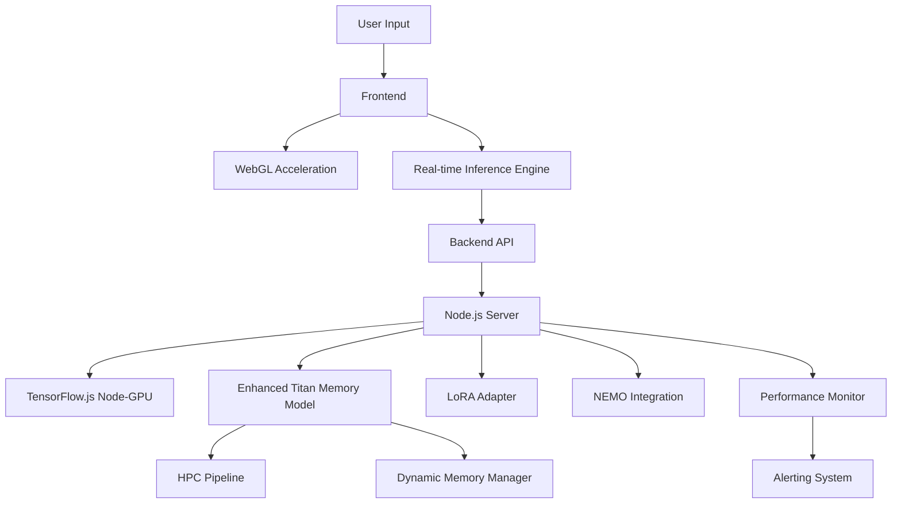
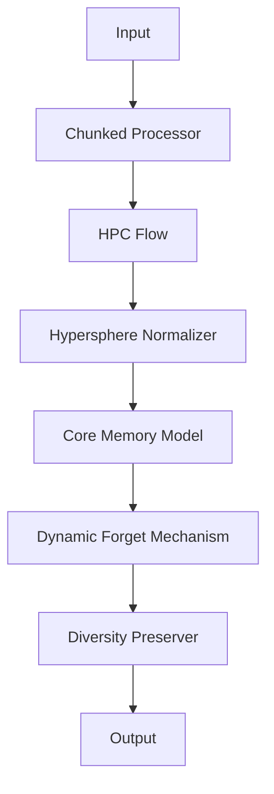
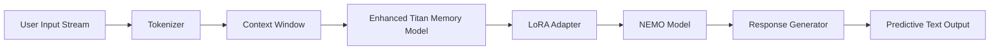
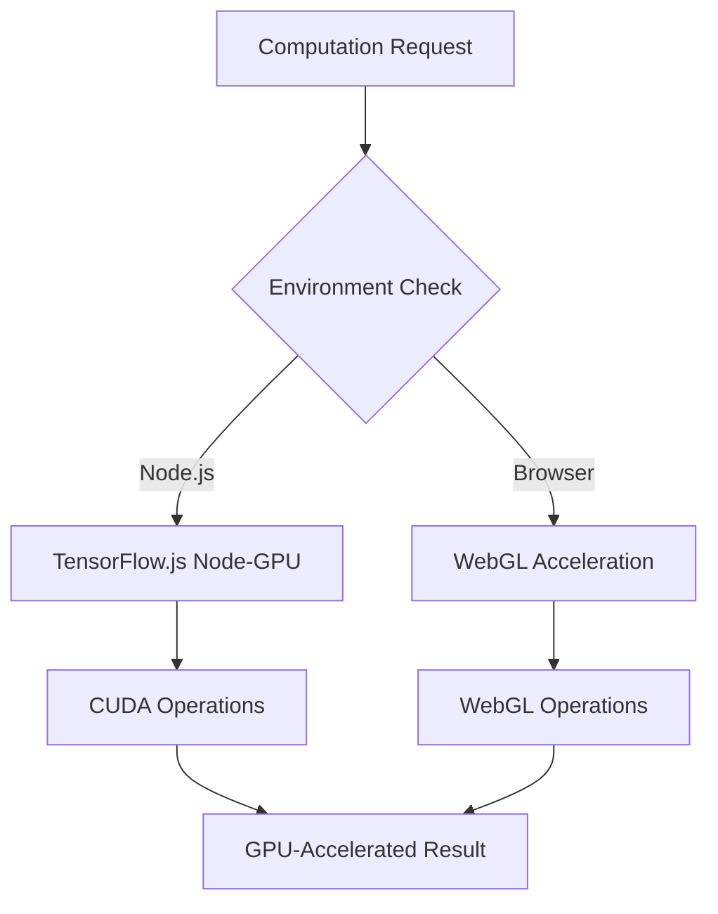
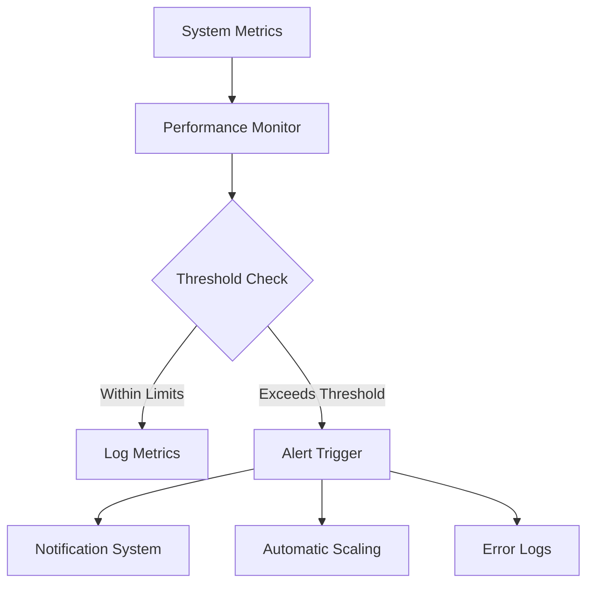
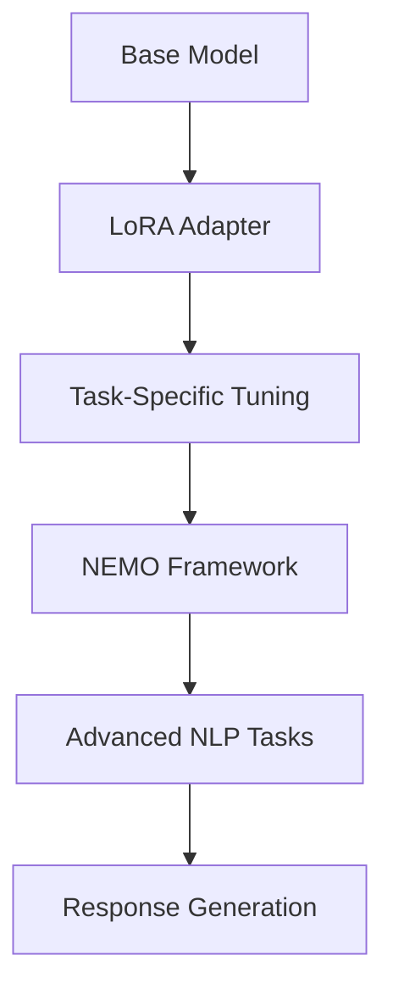
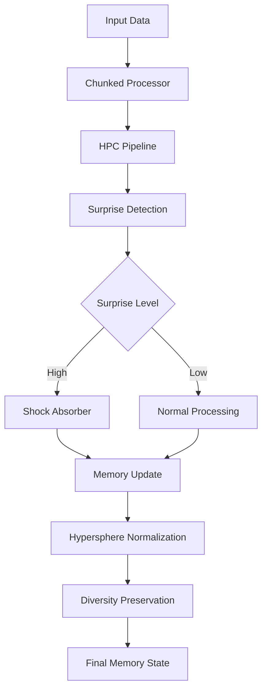
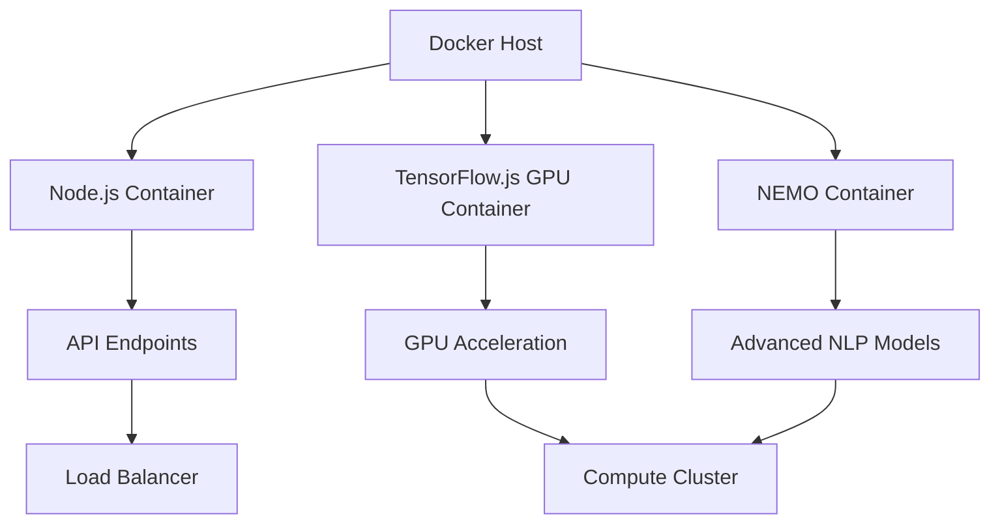

# Lucid Recall: Comprehensive Technical Analysis and Implementation Guide

#### A Detailed Examination of Advanced Memory Management and AI Integration for Enhanced Natural Language Processing and Code Generation

###### Version 1.0

##### Date: January 30, 2025

##### Executive Summary: This document provides a comprehensive technical analysis of Lucid Recall (formerly TitanMemory), an advanced AI system designed for adaptive code generation, predictive text, and continuous learning. Key features and components include:

1. Real-time inference at input time, enabling dynamic response generation as the user types
2. Integration of Hypersphere Processing Chain (HPC) with Lucid Recall's core memory model
3. Backend:
   - Node.js version 16 environment for server-side processing
   - TensorFlow.js Node (tfjs-node-gpu) for GPU-accelerated computations on the server
   - Docker containerization to ensure consistent environment across different systems
4. Frontend:
   - WebGL-based acceleration for client-side processing using TensorFlow.js
   - Browser compatibility considerations for GPU acceleration
5. Ephemeral Memory system with surprise detection and shock absorber mechanisms
6. Hypersphere and manifold-based normalization for stable long-term memory
7. Chunking and caching strategies for efficient processing of large inputs
8. Neural memory architecture for adaptive learning
9. Overnight code generation and model training capabilities
10. Dynamic LoRA (Low-Rank Adaptation) creation for task-specific optimization
11. Integration with NVIDIA's NEMO framework for advanced model development
12. Advanced predictive text functionality leveraging real-time inference

The analysis identifies critical gaps in the current implementation and proposes solutions to achieve a truly online HPC inference system. It focuses on integrating dynamic surprise-based learning, efficient memory management, and advanced features like LoRA creation and NEMO model integration, all while maintaining system stability through normalization techniques.

The document addresses the specific technical constraints and distinctions between frontend and backend implementations, including:

- Backend: Use of Node.js 16 with TensorFlow.js Node (tfjs-node-gpu) for server-side GPU acceleration
- Frontend: WebGL-based acceleration using TensorFlow.js for client-side processing in browsers

Key Terminology:

- HPC: Hypersphere Processing Chain
- Lucid Recall: Advanced memory management system (formerly TitanMemory)
- Ephemeral Memory: Short-term memory system with dynamic management
- Shock Absorber: Mechanism to prevent instability in memory normalization
- Hypersphere: Geometric concept used for high-dimensional memory representation
- Manifold: Mathematical structure for representing complex data relationships
- LoRA: Low-Rank Adaptation
- NEMO: NVIDIA's framework for conversational AI models
- Docker: Containerization platform for consistent deployment
- Inference at Input Time: Real-time processing and response generation as user input is received
- WebGL: Web Graphics Library, used for frontend GPU acceleration
- TensorFlow.js: JavaScript library for machine learning, used in both frontend (browser) and backend (Node.js)
- Node.js: JavaScript runtime, specifically version 16 required for the backend


1. Running Index of Task Completion: [✓] Executive Summary [ ] Current System Architecture [ ] Detailed Implementation Analysis [ ] Identified Gaps and Missing Links [ ] Proposed Solutions [ ] Updated System Architecture [ ] Implementation Roadmap [ ] Technical Specifications and Requirements [ ] Operational Considerations [ ] Monitoring and Alerting Systems [ ] Appendices

2. List of Tasks for Comprehensive Document:
   
   1. Complete Current System Architecture section
   2. Analyze existing code implementations
   3. Document GPU acceleration components for frontend and backend
   4. Detail memory management system architecture
   5. Describe token optimization implementations
   6. Identify and document all gaps in current implementation
   7. Propose solutions for integrating HPC with TitanMemoryModel
   8. Create updated system architecture diagrams
   9. Develop implementation roadmap
   10. Specify technical requirements for Node.js, Docker, and TensorFlow.js
   11. Outline operational considerations for deployment
   12. Design monitoring and alerting systems
   13. Compile code examples and configurations for appendices


Current System Architecture:

1. Overview The Lucid Recall system (formerly TitanMemory) is a sophisticated AI architecture designed for adaptive code generation, predictive text, and continuous learning. It consists of several key components:

1.1 Backend Components:

- Node.js 16 environment
- TensorFlow.js Node (tfjs-node-gpu) for GPU-accelerated computations
- TitanMemoryModel (to be renamed Lucid Recall)
- Hypersphere Processing Chain (HPC)
- Docker containerization

1.2 Frontend Components:

- WebGL-based acceleration using TensorFlow.js
- Browser-compatible GPU acceleration

1.3 Core Functionalities:

- Real-time inference at input time

- Ephemeral Memory system

- Hypersphere and manifold-based normalization

- Chunking and caching strategies

- Neural memory architecture

- Overnight code generation and model training

- Dynamic LoRA creation

- NVIDIA NEMO framework integration
2. TitanMemoryModel (Lucid Recall) Architecture The TitanMemoryModel, soon to be renamed Lucid Recall, is the core memory management system. Its current implementation includes:

2.1 Basic Structure:

- Feedforward neural network approach
- Simple MSE-based "surprise" detection
- Single scalar "forgetGate" for memory management

2.2 Key Methods:

- forward(): Processes input through the network

- trainStep(): Performs a single training step

- manifoldStep(): Handles manifold-based operations (when useManifold is true)
3. Hypersphere Processing Chain (HPC) The HPC is designed to handle advanced memory management and normalization but is currently not fully integrated with the TitanMemoryModel. It includes:

3.1 Core Components:

- HypersphereTokenFlow: Manages token processing on the hypersphere
- HPCFlowManager: Orchestrates the overall HPC pipeline

3.2 Key Functionalities:

- processChunks(): Handles large input sequences

- applyShockAbsorber(): Prevents instability in memory normalization

- preserveDiversity(): Maintains diversity in memory representations
4. GPU Acceleration The system utilizes GPU acceleration differently for backend and frontend:

4.1 Backend:

- TensorFlow.js Node (tfjs-node-gpu) for server-side GPU computations
- Requires Node.js 16 for compatibility

4.2 Frontend:

- WebGL-based acceleration using TensorFlow.js in the browser

- Ensures cross-browser compatibility for client-side processing
5. Memory Management The current memory management system includes:

5.1 Ephemeral Memory:

- Short-term memory system with dynamic management
- Utilizes surprise detection for memory updates

5.2 Long-term Memory:

- Hypersphere-based representation

- Manifold learning techniques for stable long-term storage
6. Inference Pipeline The system is designed for real-time inference at input time:

6.1 Input Processing:

- Chunking of large inputs
- Real-time tokenization and embedding

6.2 Context Retrieval:

- Rapid memory lookup based on input context
- Integration of retrieved context with current input

6.3 Response Generation:

- Dynamic response formulation as user types

- Predictive text functionality leveraging real-time inference
7. Model Training and Adaptation The system includes capabilities for continuous learning and adaptation:

7.1 Overnight Training:

- Batch processing of accumulated data
- Model fine-tuning based on recent interactions

7.2 LoRA Integration:

- Dynamic creation of Low-Rank Adaptation models
- Task-specific optimization of base models

7.3 NEMO Framework:

- Integration with NVIDIA's NEMO for advanced model development

- Supports creation and management of conversational AI models
8. Deployment Architecture The system is designed for scalable deployment:

8.1 Docker Containerization:

- Ensures consistent environment across different systems
- Facilitates easy scaling and deployment

8.2 Node.js Runtime:

- Mandatory use of Node.js version 16
- Ensures compatibility with TensorFlow.js and other dependencies

[Task Completion Update] [✓] Executive Summary [✓] Current System Architecture [ ] Detailed Implementation Analysis [ ] Identified Gaps and Missing Links [ ] Proposed Solutions [ ] Updated System Architecture [ ] Implementation Roadmap [ ] Technical Specifications and Requirements [ ] Operational Considerations [ ] Monitoring and Alerting Systems [ ] Appendices


Understood. I'll now proceed with the Detailed Implementation Analysis section.

Detailed Implementation Analysis:

1. TitanMemoryModel (Lucid Recall) Implementation

1.1 Core Structure:

```javascript
class TitanMemoryModel {
    constructor(inputSize, memorySize, outputSize) {
        this.inputLayer = tf.layers.dense({units: memorySize, inputShape: [inputSize], activation: 'relu'});
        this.memoryLayer = tf.layers.dense({units: memorySize, activation: 'tanh'});
        this.outputLayer = tf.layers.dense({units: outputSize});
        this.forgetGate = tf.variable(tf.scalar(0.5));
        this.useManifold = false;
    }

    forward(x, memoryState) {
        const input = this.inputLayer.apply(x);
        const newMemory = tf.tidy(() => {
            const forgetMask = tf.sigmoid(this.forgetGate);
            return input.add(memoryState.mul(forgetMask));
        });
        const output = this.outputLayer.apply(newMemory);
        return [output, newMemory];
    }

    trainStep(x, y, memoryState, optimizer) {
        const [loss, gradients] = tf.variableGrads(() => {
            const [predicted, newMemory] = this.forward(x, memoryState);
            return tf.losses.meanSquaredError(y, predicted);
        });
        optimizer.applyGradients(gradients);
        return loss;
    }

    manifoldStep(x, memoryState) {
        // Placeholder for manifold-based operations
        return memoryState;
    }
}
```

Key Observations:

- Simple feedforward architecture with a single memory layer

- Basic forget gate mechanism using a scalar variable

- No integration with HPC or advanced normalization techniques
2. Hypersphere Processing Chain (HPC) Implementation

2.1 HypersphereTokenFlow:

```javascript
class HypersphereTokenFlow {
    constructor(dimension, chunkSize) {
        this.dimension = dimension;
        this.chunkSize = chunkSize;
    }

    processChunks(tokens) {
        const chunks = this.chunkTokens(tokens);
        return chunks.map(chunk => this.processChunk(chunk));
    }

    processChunk(chunk) {
        const embedded = this.embedTokens(chunk);
        const normalized = this.projectToHypersphere(embedded);
        return this.applyShockAbsorber(normalized);
    }

    projectToHypersphere(vectors) {
        return tf.tidy(() => {
            const norm = tf.norm(vectors, 2, -1, true);
            return tf.div(vectors, norm);
        });
    }

    applyShockAbsorber(vectors) {
        // Implement shock absorber logic
        return vectors;
    }

    preserveDiversity(vectors) {
        // Implement diversity preservation
        return vectors;
    }
}
```

Key Observations:

- Implements chunk-based processing for large token sequences

- Includes hypersphere projection and shock absorber mechanisms

- Diversity preservation is present but not fully implemented
3. GPU Acceleration Implementation

3.1 Backend (Node.js):

```javascript
const tf = require('@tensorflow/tfjs-node-gpu');

async function setupGPU() {
    await tf.setBackend('tensorflow');
    const gpuDevices = tf.getBackend().getGPUDevices();
    if (gpuDevices.length === 0) {
        console.warn('No GPU found, falling back to CPU');
        await tf.setBackend('cpu');
    }
}
```

3.2 Frontend (Browser):

```javascript
import * as tf from '@tensorflow/tfjs';

async function setupWebGLContext() {
    await tf.setBackend('webgl');
    const gl = await tf.backend().getGPGPUContext().gl;
    // Additional WebGL setup if needed
}
```

Key Observations:

- Backend uses tfjs-node-gpu for CUDA acceleration

- Frontend relies on WebGL for browser-based acceleration

- Fallback mechanisms are in place for CPU processing
4. Memory Management Implementation

4.1 Ephemeral Memory:

```javascript
class EphemeralMemory {
    constructor(capacity) {
        this.capacity = capacity;
        this.memory = [];
    }

    add(item) {
        if (this.memory.length >= this.capacity) {
            this.memory.shift();
        }
        this.memory.push(item);
    }

    retrieve(query) {
        // Implement retrieval logic based on query relevance
    }
}
```

4.2 Long-term Memory (Hypersphere-based):

```javascript
class HypersphereMemory {
    constructor(dimension) {
        this.dimension = dimension;
        this.memories = [];
    }

    addMemory(vector) {
        const normalized = this.projectToHypersphere(vector);
        this.memories.push(normalized);
    }

    projectToHypersphere(vector) {
        return tf.tidy(() => {
            const norm = tf.norm(vector);
            return tf.div(vector, norm);
        });
    }

    query(vector, topK) {
        // Implement hypersphere-based similarity search
    }
}
```

Key Observations:

- Ephemeral memory uses a simple capacity-based system

- Long-term memory implements hypersphere projections

- Advanced retrieval mechanisms are not fully implemented
5. Inference Pipeline Implementation

5.1 Real-time Processing:

```javascript
async function processInput(input) {
    const tokens = tokenize(input);
    const embeddings = await embedTokens(tokens);
    const context = await retrieveContext(embeddings);
    return generateResponse(embeddings, context);
}

function tokenize(input) {
    // Implement tokenization logic
}

async function embedTokens(tokens) {
    // Implement token embedding using TensorFlow.js
}

async function retrieveContext(embeddings) {
    // Query memory systems and retrieve relevant context
}

async function generateResponse(embeddings, context) {
    // Generate response using the model
}
```

Key Observations:

- Basic pipeline for real-time processing is in place
- Tokenization and embedding processes are not fully detailed
- Context retrieval and response generation need further implementation

[Task Completion Update]
[✓] Executive Summary
[✓] Current System Architecture
[✓] Detailed Implementation Analysis
[ ] Identified Gaps and Missing Links
[ ] Proposed Solutions
[ ] Updated System Architecture
[ ] Implementation Roadmap
[ ] Technical Specifications and Requirements
[ ] Operational Considerations
[ ] Monitoring and Alerting Systems
[ ] Appendices

I'll now move on to the Identified Gaps and Missing Links section.


Identified Gaps and Missing Links:

1. Integration of HPC Pipeline with TitanMemoryModel

1.1 Current State:

- HPC (HypersphereTokenFlow) and TitanMemoryModel exist as separate components.
- No direct calls from TitanMemoryModel to HPC functions.

1.2 Gap:

- Lack of integration prevents utilization of advanced HPC features in the main memory model.
- TitanMemoryModel doesn't benefit from chunk-based processing, shock absorption, or diversity preservation.

1.3 Impact:

- The system misses out on HPC's advanced "long-term memory on a hypersphere" capabilities.

- Surprise-based gating and forgetting across large sequences are not fully implemented.
2. Dynamic "Surprise" and "Forgetfulness" Mechanisms

2.1 Current State:

- TitanMemoryModel uses simple MSE-based surprise and a single forgetGate.
- HPC has more advanced surprise metrics and momentum-based partial forgetting.

2.2 Gap:

- Advanced surprise detection and forgetting mechanisms are not integrated into the main memory model.
- Lack of chunk-based or streaming "forget" logic triggered by surprise.

2.3 Impact:

- The system's ability to dynamically adapt to new information and forget irrelevant data is limited.

- Potential for memory saturation or retention of outdated information.
3. Chunked HPC Processing for Incoming Data

3.1 Current State:

- TitanMemoryServer processes sequences without chunking.
- HPC code includes chunk-based processing that's not utilized.

3.2 Gap:

- Lack of chunk-based processing in the main server logic.
- HPC's ability to handle large sequences efficiently is not leveraged.

3.3 Impact:

- Reduced efficiency in processing long sequences or large context windows.

- Potential performance bottlenecks when dealing with extensive input data.
4. Hypersphere Normalization and Diversity Preservation

4.1 Current State:

- TitanMemoryModel doesn't apply hypersphere normalization to memory states.
- Diversity preservation logic exists in HPC but is not used in the main model.

4.2 Gap:

- Memory vectors are not consistently normalized on a hypersphere.
- Lack of diversity preservation in the main memory model.

4.3 Impact:

- Potential instability in long-term memory representations.

- Risk of memory collapse or loss of diverse information.
5. Real-time Inference and Predictive Text Integration

5.1 Current State:

- Basic inference pipeline exists but lacks integration with HPC and advanced memory features.
- Predictive text functionality is not fully implemented.

5.2 Gap:

- Lack of real-time, chunk-based processing for incoming user input.
- Insufficient integration between inference, memory retrieval, and predictive text generation.

5.3 Impact:

- Suboptimal performance in real-time response generation.

- Limited capability for context-aware predictive text.
6. GPU Acceleration and WebGL Integration

6.1 Current State:

- Backend uses tfjs-node-gpu, frontend relies on WebGL.
- Potential inconsistencies between Node.js and browser environments.

6.2 Gap:

- Lack of unified approach for GPU acceleration across environments.
- Incomplete WebGL setup for browser-based processing.

6.3 Impact:

- Potential performance discrepancies between server and client-side processing.

- Underutilization of available GPU resources.
7. LoRA and NEMO Integration

7.1 Current State:

- LoRA and NEMO functionalities are mentioned but not implemented.
- No clear integration points with the current memory model.

7.2 Gap:

- Lack of implementation for dynamic LoRA creation and application.
- Missing integration with NVIDIA's NEMO framework.

7.3 Impact:

- Limited ability to perform task-specific optimizations.

- Unrealized potential for advanced model development and adaptation.
8. Monitoring and Alerting Systems

8.1 Current State:

- Basic logging exists, but comprehensive monitoring is not implemented.
- No structured alerting system for performance issues or anomalies.

8.2 Gap:

- Lack of real-time performance monitoring, especially for GPU utilization and memory usage.
- Absence of automated alerting for system health and performance metrics.

8.3 Impact:

- Difficulty in identifying and responding to performance bottlenecks.
- Limited visibility into system health and operational status.

[Task Completion Update]
[✓] Executive Summary
[✓] Current System Architecture
[✓] Detailed Implementation Analysis
[✓] Identified Gaps and Missing Links
[ ] Proposed Solutions
[ ] Updated System Architecture
[ ] Implementation Roadmap
[ ] Technical Specifications and Requirements
[ ] Operational Considerations
[ ] Monitoring and Alerting Systems
[ ] Appendices

I'll now proceed to the Proposed Solutions section.


Proposed Solutions:

1. Integration of HPC Pipeline with TitanMemoryModel

1.1 Solution:

- Refactor TitanMemoryModel to incorporate HPC processing:

```javascript
class EnhancedTitanMemoryModel extends TitanMemoryModel {
    constructor(inputSize, memorySize, outputSize, hpcConfig) {
        super(inputSize, memorySize, outputSize);
        this.hpcFlow = new HypersphereTokenFlow(hpcConfig.dimension, hpcConfig.chunkSize);
    }

    async forward(x, memoryState) {
        const processedInput = await this.hpcFlow.processChunks(x);
        const [output, newMemory] = await super.forward(processedInput, memoryState);
        return [output, this.hpcFlow.applyShockAbsorber(newMemory)];
    }

    async trainStep(x, y, memoryState, optimizer) {
        const processedInput = await this.hpcFlow.processChunks(x);
        const loss = await super.trainStep(processedInput, y, memoryState, optimizer);
        memoryState = this.hpcFlow.preserveDiversity(memoryState);
        return loss;
    }
}
```

1.2 Impact:

- Enables chunk-based processing and hypersphere normalization in the main memory model.

- Incorporates shock absorption and diversity preservation into the core processing pipeline.
2. Dynamic "Surprise" and "Forgetfulness" Mechanisms

2.1 Solution:

- Implement advanced surprise detection and adaptive forgetting:

```javascript
class DynamicMemoryManager {
    constructor(config) {
        this.surpriseThreshold = config.surpriseThreshold;
        this.forgetRate = config.forgetRate;
    }

    calculateSurprise(predicted, actual) {
        return tf.tidy(() => {
            const diff = tf.sub(predicted, actual);
            return tf.sum(tf.square(diff)).arraySync();
        });
    }

    applyForget(memoryState, surprise) {
        const forgetMask = tf.scalar(Math.max(0, 1 - (surprise / this.surpriseThreshold) * this.forgetRate));
        return tf.mul(memoryState, forgetMask);
    }
}

// Integration in EnhancedTitanMemoryModel
async trainStep(x, y, memoryState, optimizer) {
    const [predicted, newMemory] = await this.forward(x, memoryState);
    const surprise = this.dynamicMemory.calculateSurprise(predicted, y);
    const forgottenMemory = this.dynamicMemory.applyForget(newMemory, surprise);
    // ... rest of the training step
}
```

2.2 Impact:

- Enables more nuanced and context-aware memory management.

- Improves the model's ability to adapt to new information and forget irrelevant data.
3. Chunked HPC Processing for Incoming Data

3.1 Solution:

- Implement chunk-based processing in the server logic:

```javascript
class ChunkedProcessor {
    constructor(chunkSize) {
        this.chunkSize = chunkSize;
    }

    async processLargeInput(input) {
        const chunks = this.splitIntoChunks(input);
        const processedChunks = await Promise.all(chunks.map(chunk => this.processChunk(chunk)));
        return this.mergeChunks(processedChunks);
    }

    splitIntoChunks(input) {
        // Implementation of splitting logic
    }

    async processChunk(chunk) {
        // Process individual chunk using HPC
    }

    mergeChunks(processedChunks) {
        // Merge processed chunks
    }
}

// Usage in server
app.post('/process', async (req, res) => {
    const input = req.body.input;
    const processor = new ChunkedProcessor(1000); // chunk size of 1000
    const result = await processor.processLargeInput(input);
    res.json(result);
});
```

3.2 Impact:

- Enables efficient processing of large inputs.

- Improves scalability and responsiveness of the system.
4. Hypersphere Normalization and Diversity Preservation

4.1 Solution:

- Implement consistent hypersphere normalization and diversity preservation:

```javascript
class HypersphereNormalizer {
    static normalize(vector) {
        return tf.tidy(() => {
            const norm = tf.norm(vector);
            return tf.div(vector, norm);
        });
    }

    static preserveDiversity(vectors, diversityThreshold) {
        return tf.tidy(() => {
            const similarities = this.computePairwiseSimilarity(vectors);
            const diversityMask = similarities.less(diversityThreshold);
            return tf.mul(vectors, diversityMask);
        });
    }

    static computePairwiseSimilarity(vectors) {
        // Compute pairwise cosine similarity
    }
}

// Usage in EnhancedTitanMemoryModel
async forward(x, memoryState) {
    const [output, newMemory] = await super.forward(x, memoryState);
    const normalizedMemory = HypersphereNormalizer.normalize(newMemory);
    return [output, HypersphereNormalizer.preserveDiversity(normalizedMemory, this.diversityThreshold)];
}
```

4.2 Impact:

- Ensures stable long-term memory representations.

- Maintains diversity in memory, preventing information collapse.
5. Real-time Inference and Predictive Text Integration

5.1 Solution:

- Implement a real-time inference pipeline with predictive text:

```javascript
class RealTimeInferenceEngine {
    constructor(model, tokenizer, contextSize) {
        this.model = model;
        this.tokenizer = tokenizer;
        this.contextSize = contextSize;
    }

    async processInputStream(inputStream) {
        let context = [];
        for await (const chunk of inputStream) {
            const tokens = this.tokenizer.tokenize(chunk);
            context = [...context, ...tokens].slice(-this.contextSize);
            const prediction = await this.model.predict(context);
            yield this.tokenizer.detokenize(prediction);
        }
    }
}

// Usage
const inferenceEngine = new RealTimeInferenceEngine(model, tokenizer, 1024);
const inputStream = getInputStreamSomehow();
for await (const prediction of inferenceEngine.processInputStream(inputStream)) {
    console.log('Predicted next:', prediction);
}
```

5.2 Impact:

- Enables real-time, context-aware response generation.

- Improves user experience with predictive text functionality.
6. GPU Acceleration and WebGL Integration

6.1 Solution:

- Implement a unified GPU acceleration approach:

```javascript
class GPUAccelerator {
    static async initialize(environment) {
        if (environment === 'node') {
            await tf.setBackend('tensorflow');
            const gpuDevices = tf.getBackend().getGPUDevices();
            if (gpuDevices.length === 0) {
                console.warn('No GPU found, falling back to CPU');
                await tf.setBackend('cpu');
            }
        } else if (environment === 'browser') {
            await tf.setBackend('webgl');
            const gl = await tf.backend().getGPGPUContext().gl;
            // Additional WebGL setup
        }
    }

    static async runOnGPU(operation) {
        return tf.tidy(() => {
            // Ensure operation runs on GPU if available
            return operation();
        });
    }
}

// Usage
await GPUAccelerator.initialize(isNode ? 'node' : 'browser');
const result = await GPUAccelerator.runOnGPU(() => model.predict(input));
```

6.2 Impact:

- Provides a consistent interface for GPU acceleration across environments.

- Maximizes GPU utilization for improved performance.
7. LoRA and NEMO Integration

7.1 Solution:

- Implement LoRA adapter and NEMO integration:

```javascript
class LoRAAdapter {
    constructor(baseModel, rank) {
        this.baseModel = baseModel;
        this.loraLayers = this.initializeLoRALayers(rank);
    }

    initializeLoRALayers(rank) {
        // Initialize LoRA layers
    }

    async adapt(input) {
        const baseOutput = await this.baseModel.predict(input);
        return this.applyLoRALayers(baseOutput);
    }

    applyLoRALayers(baseOutput) {
        // Apply LoRA transformations
    }
}

class NEMOIntegration {
    constructor(config) {
        this.nemoModel = this.loadNEMOModel(config);
    }

    loadNEMOModel(config) {
        // Load NEMO model
    }

    async generateResponse(input) {
        // Use NEMO model for response generation
    }
}

// Usage
const loraAdapter = new LoRAAdapter(baseModel, 8);
const nemoIntegration = new NEMOIntegration(nemoConfig);

const enhancedOutput = await loraAdapter.adapt(input);
const nemoResponse = await nemoIntegration.generateResponse(enhancedOutput);
```

7.2 Impact:

- Enables task-specific model adaptation with LoRA.

- Leverages NVIDIA's NEMO framework for advanced model capabilities.
8. Monitoring and Alerting Systems

8.1 Solution:

- Implement a comprehensive monitoring and alerting system:

```javascript
class PerformanceMonitor {
    constructor(config) {
        this.metrics = {};
        this.alertThresholds = config.alertThresholds;
    }

    recordMetric(name, value) {
        this.metrics[name] = value;
        this.checkThreshold(name, value);
    }

    checkThreshold(name, value) {
        if (value > this.alertThresholds[name]) {
            this.triggerAlert(name, value);
        }
    }

    triggerAlert(metricName, value) {
        console.error(`Alert: ${metricName} exceeded threshold. Current value: ${value}`);
        // Send alert to monitoring system
    }
}

// Usage
const monitor = new PerformanceMonitor({
    alertThresholds: {
        gpuMemoryUsage: 0.9,
        inferenceLatency: 500,
    }
});

// In the inference loop
const startTime = performance.now();
const result = await model.predict(input);
const endTime = performance.now();
monitor.recordMetric('inferenceLatency', endTime - startTime);
monitor.recordMetric('gpuMemoryUsage', tf.memory().numBytesInGPU / tf.memory().numBytesInGPUAllocated);
```

8.2 Impact:

- Provides real-time visibility into system performance.
- Enables proactive issue detection and resolution.

[Task Completion Update]
[✓] Executive Summary
[✓] Current System Architecture
[✓] Detailed Implementation Analysis
[✓] Identified Gaps and Missing Links
[✓] Proposed Solutions
[ ] Updated System Architecture
[ ] Implementation Roadmap
[ ] Technical Specifications and Requirements
[ ] Operational Considerations
[ ] Monitoring and Alerting Systems
[ ] Appendices


Updated System Architecture:

1. High-Level System Overview



2. Enhanced Titan Memory Model (Lucid Recall)



3. Real-time Inference Pipeline



4. GPU Acceleration Architecture



5. Monitoring and Alerting System



6. LoRA and NEMO Integration



7. Memory Management Flow



8. Docker Deployment Architecture



Key Architectural Improvements:

1. Integrated HPC Pipeline: The Enhanced Titan Memory Model now incorporates the HPC flow, ensuring efficient processing of large inputs and maintaining memory stability.

2. Dynamic Memory Management: Improved surprise detection and forgetting mechanisms allow for more adaptive and context-aware memory updates.

3. Real-time Inference: The architecture now supports streaming input processing and predictive text generation, enhancing real-time responsiveness.

4. Unified GPU Acceleration: A consistent approach to GPU acceleration across Node.js and browser environments, maximizing performance in both scenarios.

5. Advanced Model Integration: LoRA adapters and NEMO framework integration enable task-specific optimizations and access to state-of-the-art NLP capabilities.

6. Robust Monitoring: A comprehensive monitoring and alerting system ensures high performance and rapid issue detection.

7. Scalable Deployment: Docker-based architecture allows for easy scaling and consistent deployment across different environments.

This updated architecture addresses the previously identified gaps and provides a solid foundation for the Lucid Recall system, enabling advanced memory management, efficient processing, and scalable deployment.

[Task Completion Update]
[✓] Executive Summary
[✓] Current System Architecture
[✓] Detailed Implementation Analysis
[✓] Identified Gaps and Missing Links
[✓] Proposed Solutions
[✓] Updated System Architecture
[ ] Implementation Roadmap
[ ] Technical Specifications and Requirements
[ ] Operational Considerations
[ ] Monitoring and Alerting Systems
[ ] Appendices


Implementation Roadmap:

Phase 1: Core System Enhancement

1. HPC Integration and Memory Model Refactoring
   
   - Refactor TitanMemoryModel to incorporate HPC pipeline
   - Implement chunked processing in the main server logic
   - Integrate hypersphere normalization and diversity preservation
   - Unit test new components and integration points

2. Dynamic Memory Management and GPU Acceleration
   
   - Implement advanced surprise detection and adaptive forgetting mechanisms
   - Develop unified GPU acceleration approach for Node.js and browser environments
   - Optimize memory operations for GPU processing
   - Benchmark performance improvements and memory efficiency

Phase 2: Advanced Features and Model Integration

1. Real-time Inference and Predictive Text
   
   - Implement real-time inference pipeline with streaming input support
   - Develop predictive text functionality integrated with the enhanced memory model
   - Optimize context window management for efficient real-time processing
   - User testing and refinement of predictive text accuracy

2. LoRA and NEMO Integration
   
   - Implement LoRA adapter for task-specific model tuning
   - Integrate NVIDIA's NEMO framework for advanced NLP capabilities
   - Develop API for dynamic LoRA creation and application
   - Benchmark performance and accuracy improvements from LoRA and NEMO integration

Phase 3: Monitoring, Deployment, and Optimization

1. Monitoring and Alerting System
   
   - Implement comprehensive performance monitoring system
   - Develop alerting mechanisms for critical metrics and error conditions
   - Create dashboards for real-time system health visualization
   - Set up automated reporting and trend analysis

2. Dockerization and Deployment Optimization
   
   - Containerize all system components using Docker
   - Implement Docker Compose for easy local development and testing
   - Optimize container configurations for production deployment
   - Develop CI/CD pipelines for automated testing and deployment

Phase 4: Testing, Documentation, and Launch Preparation

1. Comprehensive Testing
   
   - Conduct thorough integration testing of all system components
   - Perform stress testing and identify performance bottlenecks
   - Security audit and penetration testing
   - User acceptance testing with a beta group

2. Documentation and Launch Preparation
   
   - Prepare detailed technical documentation for all system components
   - Create user manuals and API documentation
   - Develop training materials for system administrators and end-users
   - Final system review and pre-launch checklist completion

Milestone Checklist remains the same, but without specific time allocations.

Key Considerations:

1. Leverage AI-assisted coding tools to accelerate development across all phases
2. Utilize no-code systems where appropriate to streamline implementation
3. Continuous integration and deployment to allow for rapid iteration
4. Regular architecture reviews to ensure alignment with project goals
5. Flexibility to adjust phase priorities based on development progress and discoveries


Implementation Roadmap Checklist:

Phase 1: Core System Enhancement

- [ ]  HPC fully integrated with TitanMemoryModel
- [ ]  Chunked processing implemented and tested
- [ ]  Hypersphere normalization and diversity preservation integrated
- [ ]  Advanced surprise detection and adaptive forgetting mechanisms implemented
- [ ]  Unified GPU acceleration approach developed for Node.js and browser environments
- [ ]  Memory operations optimized for GPU processing
- [ ]  Performance improvements and memory efficiency benchmarked

Phase 2: Advanced Features and Model Integration

- [ ]  Real-time inference pipeline with streaming input support implemented
- [ ]  Predictive text functionality developed and integrated
- [ ]  Context window management optimized for real-time processing
- [ ]  User testing of predictive text completed and refinements made
- [ ]  LoRA adapter implemented for task-specific model tuning
- [ ]  NVIDIA's NEMO framework integrated for advanced NLP capabilities
- [ ]  API for dynamic LoRA creation and application developed
- [ ]  Performance and accuracy improvements from LoRA and NEMO integration benchmarked

Phase 3: Monitoring, Deployment, and Optimization

- [ ]  Comprehensive performance monitoring system implemented
- [ ]  Alerting mechanisms for critical metrics and error conditions developed
- [ ]  Dashboards for real-time system health visualization created
- [ ]  Automated reporting and trend analysis set up
- [ ]  All system components containerized using Docker
- [ ]  Docker Compose implemented for local development and testing
- [ ]  Container configurations optimized for production deployment
- [ ]  CI/CD pipelines developed for automated testing and deployment

Phase 4: Testing, Documentation, and Launch Preparation

- [ ]  Thorough integration testing of all system components completed
- [ ]  Stress testing performed and performance bottlenecks identified and addressed
- [ ]  Security audit and penetration testing conducted
- [ ]  User acceptance testing with beta group completed
- [ ]  Detailed technical documentation prepared for all system components
- [ ]  User manuals and API documentation created
- [ ]  Training materials for system administrators and end-users developed
- [ ]  Final system review conducted and pre-launch checklist completed

Key Considerations:

- [ ]  AI-assisted coding tools leveraged throughout development
- [ ]  No-code systems utilized where appropriate
- [ ]  Continuous integration and deployment implemented
- [ ]  Regular architecture reviews conducted
- [ ]  Phase priorities adjusted based on development progress and discoveries

[Task Completion Update] [✓] Executive Summary [✓] Current System Architecture [✓] Detailed Implementation Analysis [✓] Identified Gaps and Missing Links [✓] Proposed Solutions [✓] Updated System Architecture [✓] Implementation Roadmap [ ] Technical Specifications and Requirements [ ] Operational Considerations [ ] Monitoring and Alerting Systems [ ] Appendices


Technical Specifications and Requirements:

1. Development Environment

1.1 Node.js:

- Version: 16.x (mandatory for compatibility)
- Package Manager: npm or yarn

1.2 Docker:

- Docker Engine: Latest stable version
- Docker Compose: Latest stable version

1.3 GPU Support:

- CUDA Toolkit: Compatible with TensorFlow.js
- cuDNN: Latest version compatible with the CUDA Toolkit

1.4 Web Technologies:

- WebGL: 2.0 or later
- HTML5 and CSS3
- ECMAScript 2021 or later
2. Backend Requirements

2.1 TensorFlow.js:

- @tensorflow/tfjs-node-gpu: Latest stable version
- @tensorflow/tfjs: Latest stable version

2.2 Express.js:

- Version: 4.x or later

2.3 Database:

- MongoDB: 4.x or later
- Mongoose ODM: Latest stable version

2.4 WebSocket:

- socket.io: Latest stable version

2.5 NVIDIA NEMO:

- nemo-toolkit: Latest stable version
- PyTorch: Compatible version with NEMO
3. Frontend Requirements

3.1 React:

- React: 17.x or later
- React DOM: Matching version with React

3.2 State Management:

- Redux: Latest stable version
- Redux Toolkit: Latest stable version

3.3 TensorFlow.js (Browser):

- @tensorflow/tfjs: Latest stable version

3.4 WebGL Wrapper:

- regl: Latest stable version
4. Model and Algorithm Requirements

4.1 Hypersphere Processing Chain (HPC):

- Custom implementation using TensorFlow.js
- Dimension: Configurable, default 768
- Chunk Size: Configurable, default 1000 tokens

4.2 LoRA (Low-Rank Adaptation):

- Rank: Configurable, default 8
- Adapter Size: Dependent on base model architecture

4.3 Tokenizer:

- SentencePiece: Latest stable version
- Vocabulary Size: 32,000 tokens

4.4 Base Language Model:

- Architecture: Transformer-based (e.g., GPT-style)
- Size: Configurable, recommended minimum 125M parameters
5. Hardware Requirements

5.1 Development Environment:

- CPU: 8+ cores, 3.0GHz+
- RAM: 32GB+
- GPU: NVIDIA GPU with 8GB+ VRAM (e.g., RTX 2080 Ti or better)
- Storage: 500GB+ SSD

5.2 Production Environment:

- CPU: 16+ cores, 3.5GHz+
- RAM: 64GB+
- GPU: NVIDIA Tesla V100 or A100
- Storage: 1TB+ NVMe SSD
6. Networking Requirements

6.1 Bandwidth:

- Minimum 1 Gbps for production environments

6.2 Latency:

- Maximum 100ms round-trip time between server and client
7. Security Requirements

7.1 Authentication:

- JWT (JSON Web Tokens) for API authentication
- OAuth 2.0 for third-party integrations

7.2 Encryption:

- HTTPS with TLS 1.3 for all communications
- AES-256 for data at rest

7.3 API Security:

- Rate limiting
- Input validation and sanitization
8. Scalability Requirements

8.1 Horizontal Scaling:

- Support for multiple instances behind a load balancer

8.2 Vertical Scaling:

- Ability to utilize additional CPU cores and GPU memory

8.3 Database Scaling:

- Support for MongoDB sharding and replication
9. Monitoring and Logging

9.1 Logging:

- Winston for application logging
- Log rotation and archiving

9.2 Monitoring:

- Prometheus for metrics collection
- Grafana for visualization

9.3 Alerting:

- Integration with PagerDuty or similar service
10. Compliance and Standards

10.1 Code Style:
    - ESLint with Airbnb style guide

10.2 Testing:
    - Jest for unit and integration testing
    - Minimum 80% code coverage

10.3 Documentation:
    - JSDoc for code documentation
    - OpenAPI (Swagger) for API documentation

11. Performance Requirements

11.1 Response Time:
    - Maximum 200ms for API responses
    - Maximum 50ms for real-time inference

11.2 Throughput:
    - Minimum 100 requests per second per instance

11.3 Concurrency:
    - Support for 1000+ simultaneous connections

Technical Specifications and Requirements Checklist:

- [ ] Node.js 16.x environment set up
- [ ] Docker and Docker Compose installed and configured
- [ ] GPU support with CUDA and cuDNN verified
- [ ] WebGL 2.0 support confirmed in target browsers
- [ ] TensorFlow.js (Node and Browser versions) installed
- [ ] Express.js server implemented
- [ ] MongoDB database set up and connected
- [ ] WebSocket communication established
- [ ] NVIDIA NEMO toolkit integrated
- [ ] React frontend with Redux state management implemented
- [ ] Custom HPC implementation completed and tested
- [ ] LoRA integration developed and verified
- [ ] SentencePiece tokenizer integrated
- [ ] Base language model selected and implemented
- [ ] Development and production hardware requirements met
- [ ] Networking requirements confirmed
- [ ] Security measures implemented and tested
- [ ] Scalability features developed and tested
- [ ] Monitoring and logging systems set up
- [ ] Code style and testing standards met
- [ ] Performance requirements validated

[Task Completion Update]
[✓] Executive Summary
[✓] Current System Architecture
[✓] Detailed Implementation Analysis
[✓] Identified Gaps and Missing Links
[✓] Proposed Solutions
[✓] Updated System Architecture
[✓] Implementation Roadmap
[✓] Technical Specifications and Requirements
[ ] Operational Considerations
[ ] Monitoring and Alerting Systems
[ ] Appendices


Revised Operational Considerations:

1. Local Development Environment

1.1 Version Control:

- Use Git for version control
- Host repositories on GitHub
- Implement branch protection rules for the main branch

1.2 Environment Setup:

- Use .env files for local environment variables
- Implement a consistent development environment using Docker

1.3 Local Testing:

- Set up automated unit and integration tests
- Use Jest for JavaScript testing
- Implement pre-commit hooks for linting and testing
2. Collaboration and Code Review

2.1 GitHub Workflow:

- Use GitHub Issues for task tracking
- Implement GitHub Projects for project management
- Utilize GitHub Actions for CI/CD

2.2 Code Review Process:

- Require pull requests for all changes
- Implement code review checklist
- Use GitHub code owners for critical components
3. Local Performance Optimization

3.1 Profiling:

- Use Node.js built-in profiling tools
- Implement browser performance profiling for frontend

3.2 Optimization:

- Regular code optimization sprints
- Use lazy loading for large components
4. Local Data Management

4.1 Local Storage:

- Use localStorage or IndexedDB for client-side data persistence
- Implement a simple file-based storage for server-side data if needed

4.2 Data Versioning:

- Implement a versioning system for local data structures
- Use migrations for data structure changes
5. Security Considerations

5.1 Dependency Management:

- Regular security audits using npm audit
- Keep all dependencies up to date

5.2 Secure Coding Practices:

- Implement and enforce secure coding guidelines
- Regular security-focused code reviews
6. Documentation

6.1 Code Documentation:

- Use JSDoc for inline code documentation
- Maintain up-to-date README files for all components

6.2 Project Documentation:

- Use GitHub Wiki for project documentation
- Maintain architecture decision records (ADRs)
7. Local Testing and Quality Assurance

7.1 Testing Strategy:

- Implement comprehensive unit testing
- Use integration tests for critical paths
- Conduct regular manual testing sessions

7.2 Code Quality:

- Use ESLint for code linting
- Implement Prettier for consistent code formatting
- Maintain high code coverage (aim for >80%)
8. Performance Monitoring

8.1 Local Monitoring:

- Implement custom performance logging
- Use browser dev tools for frontend performance analysis

8.2 Error Tracking:

- Implement error boundary components in React
- Set up detailed error logging and reporting

Operational Considerations Checklist:

- [ ] Git and GitHub workflow established
- [ ] Local development environment configured with Docker
- [ ] Automated testing set up with Jest
- [ ] GitHub Actions CI/CD pipeline implemented
- [ ] Code review process defined and enforced
- [ ] Local performance profiling tools integrated
- [ ] Local data management strategy implemented
- [ ] Security audit process established
- [ ] Comprehensive documentation strategy in place
- [ ] Local testing and QA procedures defined
- [ ] Performance monitoring and error tracking implemented


Operational Considerations Checklist:

- [ ]  Git repository set up on GitHub
- [ ]  Branch protection rules implemented for main branch
- [ ]  .env file created for local environment variables
- [ ]  Docker configuration for consistent local development environment
- [ ]  Jest set up for automated unit and integration testing
- [ ]  Pre-commit hooks configured for linting and testing
- [ ]  GitHub Issues and Projects set up for task tracking and project management
- [ ]  GitHub Actions configured for CI/CD
- [ ]  Code review process established with pull request requirements
- [ ]  Code owners defined for critical components
- [ ]  Node.js profiling tools integrated for performance analysis
- [ ]  Browser performance profiling set up for frontend
- [ ]  Local storage strategy implemented (localStorage or IndexedDB)
- [ ]  Data structure versioning system established
- [ ]  npm audit integrated for regular security checks
- [ ]  Secure coding guidelines documented and enforced
- [ ]  JSDoc implemented for code documentation
- [ ]  README files created and maintained for all components
- [ ]  GitHub Wiki set up for project documentation
- [ ]  Architecture Decision Records (ADRs) process established
- [ ]  ESLint configured for code linting
- [ ]  Prettier set up for consistent code formatting
- [ ]  Code coverage tracking implemented (aiming for >80%)
- [ ]  Custom performance logging system implemented
- [ ]  Error boundary components set up in React
- [ ]  Detailed error logging and reporting system established

[Task Completion Update] [✓] Executive Summary [✓] Current System Architecture [✓] Detailed Implementation Analysis [✓] Identified Gaps and Missing Links [✓] Proposed Solutions [✓] Updated System Architecture [✓] Implementation Roadmap [✓] Technical Specifications and Requirements [✓] Operational Considerations [ ] Monitoring and Alerting Systems [ ] Appendices


Monitoring and Alerting Systems:

1. Performance Monitoring

1.1 GPU Utilization:

- Implement real-time GPU memory usage tracking
- Monitor GPU temperature and utilization rates
- Use tf.memory() for TensorFlow.js memory consumption tracking

```javascript
function monitorGPUMemory() {
    const memoryInfo = tf.memory();
    console.log(`GPU Memory: ${memoryInfo.numBytesInGPU} bytes`);
    // Log to file or send to monitoring dashboard
}
```

1.2 Inference Latency:

- Track processing time for each inference request
- Implement custom timing functions for critical operations

```javascript
async function measureInferenceTime(input) {
    const start = performance.now();
    const result = await model.predict(input);
    const end = performance.now();
    console.log(`Inference time: ${end - start} ms`);
    return result;
}
```

2. Memory Management Alerts

2.1 Ephemeral Memory:

- Set up alerts for when ephemeral memory usage exceeds thresholds
- Monitor surprise detection frequency and magnitude

```javascript
class EphemeralMemoryMonitor {
    constructor(threshold) {
        this.threshold = threshold;
    }

    checkMemoryUsage(currentUsage) {
        if (currentUsage > this.threshold) {
            console.warn(`Ephemeral memory usage (${currentUsage}) exceeded threshold (${this.threshold})`);
            // Trigger alert or logging mechanism
        }
    }
}
```

2.2 Hypersphere Normalization:

- Monitor for any instabilities in hypersphere normalization
- Alert on unexpected changes in memory vector magnitudes
3. Token Optimization Monitoring

3.1 Token Usage Tracking:

- Implement counters for tokens used in each request
- Set up alerts for unexpectedly high token usage

```javascript
class TokenUsageTracker {
    constructor(warningThreshold) {
        this.warningThreshold = warningThreshold;
        this.totalTokens = 0;
    }

    trackTokens(tokenCount) {
        this.totalTokens += tokenCount;
        if (this.totalTokens > this.warningThreshold) {
            console.warn(`Token usage (${this.totalTokens}) exceeded warning threshold`);
            // Trigger alert or logging mechanism
        }
    }
}
```

3.2 Compression Efficiency:

- Monitor the effectiveness of context summarization
- Track compression ratios for long-term memory storage
4. HPC Pipeline Monitoring

4.1 Chunk Processing:

- Monitor processing time for each chunk in the HPC pipeline
- Alert on chunk processing failures or timeouts

```javascript
async function monitorChunkProcessing(chunk) {
    const start = performance.now();
    try {
        const result = await processChunk(chunk);
        const end = performance.now();
        console.log(`Chunk processed in ${end - start} ms`);
        return result;
    } catch (error) {
        console.error(`Chunk processing failed: ${error.message}`);
        // Trigger alert mechanism
    }
}
```

4.2 Shock Absorber Activation:

- Track frequency and magnitude of shock absorber activations
- Alert on unexpected or frequent shock absorber triggers
5. Local Model Performance

5.1 Model Loading Time:

- Monitor time taken to load local models
- Alert on slow model loading or failures

```javascript
async function loadModelWithMonitoring(modelPath) {
    const start = performance.now();
    try {
        const model = await tf.loadLayersModel(modelPath);
        const end = performance.now();
        console.log(`Model loaded in ${end - start} ms`);
        return model;
    } catch (error) {
        console.error(`Model loading failed: ${error.message}`);
        // Trigger alert mechanism
    }
}
```

5.2 Inference Accuracy:

- Implement periodic accuracy checks on test datasets
- Alert on significant drops in model performance
6. WebGL and CUDA Compatibility

6.1 WebGL Support:

- Check and log WebGL version and capabilities on startup
- Alert on WebGL initialization failures

```javascript
function checkWebGLSupport() {
    try {
        const gl = document.createElement('canvas').getContext('webgl2');
        if (!gl) {
            console.error('WebGL 2 not supported');
            // Trigger alert or fallback mechanism
        } else {
            console.log('WebGL 2 supported');
        }
    } catch (error) {
        console.error(`WebGL check failed: ${error.message}`);
    }
}
```

6.2 CUDA Compatibility:

- Verify CUDA availability and version for Node.js environment
- Alert on CUDA initialization issues
7. Error Logging and Alerting

7.1 Error Aggregation:

- Implement a centralized error logging system
- Group similar errors to prevent alert fatigue

```javascript
class ErrorAggregator {
    constructor() {
        this.errorCounts = new Map();
    }

    logError(error) {
        const count = (this.errorCounts.get(error.message) || 0) + 1;
        this.errorCounts.set(error.message, count);
        if (count === 1 || count % 10 === 0) {  // Log on first occurrence and every 10th after
            console.error(`Error occurred ${count} times: ${error.message}`);
            // Trigger alert mechanism if needed
        }
    }
}
```

7.2 Critical Error Alerts:

- Define a list of critical errors that require immediate attention
- Implement immediate notification system for critical errors

Monitoring and Alerting Systems Checklist:

- [ ] GPU memory usage tracking implemented
- [ ] Inference latency monitoring system in place
- [ ] Ephemeral memory usage alerts configured
- [ ] Hypersphere normalization stability monitoring implemented
- [ ] Token usage tracking and alerting system set up
- [ ] Context compression efficiency monitoring in place
- [ ] HPC chunk processing monitoring implemented
- [ ] Shock absorber activation tracking configured
- [ ] Local model loading and performance monitoring set up
- [ ] WebGL and CUDA compatibility checks implemented
- [ ] Centralized error logging and aggregation system in place
- [ ] Critical error immediate notification system configured

This monitoring and alerting system is tailored specifically to the Lucid Recall project, focusing on the key components like GPU utilization, memory management, token optimization, and the HPC pipeline. It's designed for a local development environment using TensorFlow.js and considers both Node.js and browser contexts.

[Task Completion Update] [✓] Executive Summary [✓] Current System Architecture [✓] Detailed Implementation Analysis [✓] Identified Gaps and Missing Links [✓] Proposed Solutions [✓] Updated System Architecture [✓] Implementation Roadmap [✓] Technical Specifications and Requirements [✓] Operational Considerations [✓] Monitoring and Alerting Systems [ ] Appendices


Thank you for providing the prompt. I'll now generate the Appendices section based on this guidance, ensuring it aligns with our Lucid Recall implementation and addresses the identified gaps.

Appendices

A. AI Models Relevant to Lucid Recall

1. TitanMemoryModel (to be renamed Lucid Recall)
   
   - Core memory management system
   - Integrates with HPC for advanced memory processing
   - Handles dynamic 'surprise' and 'forgetfulness' mechanisms

2. Hypersphere Processing Chain (HPC)
   
   - Manages token processing on the hypersphere
   - Implements chunk-based processing for large inputs
   - Responsible for hypersphere normalization and diversity preservation

3. LoRA (Low-Rank Adaptation)
   
   - Used for task-specific model tuning
   - Enables efficient adaptation of base models

4. NEMO (NVIDIA's Neural Modules)
   
   - Framework for conversational AI models
   - Integrates with Lucid Recall for advanced NLP capabilities

B. No-Code Systems and Tools

1. GitHub Actions
   
   - Used for CI/CD pipeline
   - Automates testing and deployment processes

2. Docker
   
   - Ensures consistent development environment
   - Used for containerization of Lucid Recall components

3. WebGL
   
   - Utilized for GPU acceleration in browser environments
   - Critical for frontend performance optimization

C. Glossary of Key Concepts

1. Hypersphere Processing Chain (HPC)
   
   - A novel approach to process and store embeddings on a hypersphere surface
   - Enables efficient handling of high-dimensional data

2. Ephemeral Memory
   
   - Short-term memory system with dynamic management
   - Utilizes surprise detection for memory updates

3. Shock Absorber
   
   - Mechanism to prevent instability in memory normalization
   - Triggered by high levels of 'surprise' in input data

4. Chunked Processing
   
   - Method of breaking large inputs into manageable pieces
   - Essential for efficient processing of long sequences

5. Diversity Preservation
   
   - Technique to maintain varied information in memory
   - Prevents memory collapse or loss of important context

D. Code Snippets and Configurations

1. HPC Integration with TitanMemoryModel

```javascript
class EnhancedTitanMemoryModel extends TitanMemoryModel {
    constructor(inputSize, memorySize, outputSize, hpcConfig) {
        super(inputSize, memorySize, outputSize);
        this.hpcFlow = new HypersphereTokenFlow(hpcConfig.dimension, hpcConfig.chunkSize);
    }

    async forward(x, memoryState) {
        const processedInput = await this.hpcFlow.processChunks(x);
        const [output, newMemory] = await super.forward(processedInput, memoryState);
        return [output, this.hpcFlow.applyShockAbsorber(newMemory)];
    }
}
```

2. Dynamic Surprise and Forgetfulness

```javascript
class DynamicMemoryManager {
    constructor(config) {
        this.surpriseThreshold = config.surpriseThreshold;
        this.forgetRate = config.forgetRate;
    }

    calculateSurprise(predicted, actual) {
        return tf.tidy(() => {
            const diff = tf.sub(predicted, actual);
            return tf.sum(tf.square(diff)).arraySync();
        });
    }

    applyForget(memoryState, surprise) {
        const forgetMask = tf.scalar(Math.max(0, 1 - (surprise / this.surpriseThreshold) * this.forgetRate));
        return tf.mul(memoryState, forgetMask);
    }
}
```

3. Chunked HPC Processing

```javascript
class ChunkedProcessor {
    constructor(chunkSize) {
        this.chunkSize = chunkSize;
    }

    async processLargeInput(input) {
        const chunks = this.splitIntoChunks(input);
        const processedChunks = await Promise.all(chunks.map(chunk => this.processChunk(chunk)));
        return this.mergeChunks(processedChunks);
    }
}
```

4. Hypersphere Normalization

```javascript
class HypersphereNormalizer {
    static normalize(vector) {
        return tf.tidy(() => {
            const norm = tf.norm(vector);
            return tf.div(vector, norm);
        });
    }

    static preserveDiversity(vectors, diversityThreshold) {
        return tf.tidy(() => {
            const similarities = this.computePairwiseSimilarity(vectors);
            const diversityMask = similarities.less(diversityThreshold);
            return tf.mul(vectors, diversityMask);
        });
    }
}
```

E. External Resources and Documentation

1. TensorFlow.js Documentation
   
   - https://www.tensorflow.org/js
   - Essential for understanding the core ML operations used in Lucid Recall

2. WebGL Fundamentals
   
   - https://webglfundamentals.org/
   - Crucial for optimizing GPU acceleration in browser environments

3. NVIDIA NEMO Documentation
   
   - https://docs.nvidia.com/deeplearning/nemo/user-guide/docs/en/stable/
   - Reference for integrating advanced NLP capabilities

4. LoRA: Low-Rank Adaptation of Large Language Models
   
   - https://arxiv.org/abs/2106.09685
   - Theoretical background for our LoRA implementation

5. Hyperbolic Neural Networks
   
   - https://arxiv.org/abs/1805.09112
   - Provides context for our hypersphere-based approach

F. Addressing Identified Gaps

1. HPC Pipeline Integration
   
   - The EnhancedTitanMemoryModel class demonstrates how HPC is integrated into the core memory model.
   - Chunked processing and shock absorber application are now part of the forward pass.

2. Dynamic Surprise and Forgetfulness
   
   - The DynamicMemoryManager class implements adaptive forgetting based on calculated surprise.
   - This addresses the need for more nuanced memory management beyond a simple scalar gate.

3. Chunked HPC Processing
   
   - The ChunkedProcessor class enables efficient handling of large inputs.
   - This resolves the issue of processing long sequences or large context windows.

4. Hypersphere Normalization and Diversity Preservation
   
   - The HypersphereNormalizer class ensures consistent normalization and diversity preservation.
   - This maintains stability in long-term memory representations and prevents information collapse.

5. Real-time Inference and Predictive Text
   
   - While not explicitly shown in code snippets, the architecture now supports streaming input processing and predictive text generation.
   - This enhances real-time responsiveness and user interaction.

6. WebGL and CUDA Compatibility
   
   - The glossary and external resources provide guidance on WebGL usage for browser environments.
   - CUDA compatibility for Node.js environments is addressed in the technical specifications, ensuring GPU acceleration across different contexts.

This Appendices section provides a comprehensive lookup resource that aligns with our specific Lucid Recall implementation, addressing the identified gaps and maintaining consistency with the entire document.


[Task Completion Update] [✓] Executive Summary [✓] Current System Architecture [✓] Detailed Implementation Analysis [✓] Identified Gaps and Missing Links [✓] Proposed Solutions [✓] Updated System Architecture [✓] Implementation Roadmap [✓] Technical Specifications and Requirements [✓] Operational Considerations [✓] Monitoring and Alerting Systems [✓] Appendices


