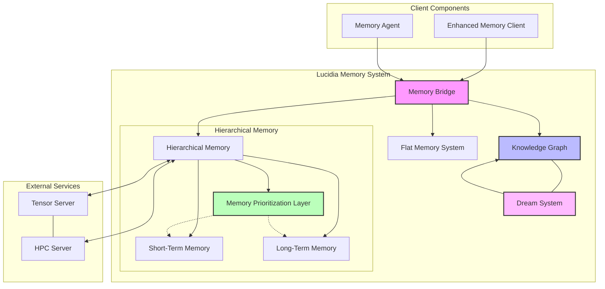

```mermaid
flowchart TD
    subgraph "Lucidia Memory System"
        MemBridge[Memory Bridge] --> FlatMem[Flat Memory System]
        MemBridge --> HierMem[Hierarchical Memory]
        
        subgraph "Hierarchical Memory"
            HierMem --> STM[Short-Term Memory]
            HierMem --> LTM[Long-Term Memory]
            HierMem --> MPL[Memory Prioritization Layer]
            MPL -.-> STM
            MPL -.-> LTM
        end
        
        KG[Knowledge Graph] --- DreamSystem[Dream System]
        DreamSystem --> KG
        MemBridge --> KG
    end
    
    subgraph "External Services"
        TS[Tensor Server] --- HPC[HPC Server]
    end
    
    subgraph "Client Components"
        EnhClient[Enhanced Memory Client]
        MemAgent[Memory Agent]
    end
    
    EnhClient --> MemBridge
    MemAgent --> MemBridge
    
    HierMem <--> TS
    HierMem <--> HPC
    
    style MemBridge fill:#f9f,stroke:#333,stroke-width:2px
    style KG fill:#bbf,stroke:#333,stroke-width:2px
    style DreamSystem fill:#fbf,stroke:#333,stroke-width:2px
    style MPL fill:#bfb,stroke:#333,stroke-width:2px
```
