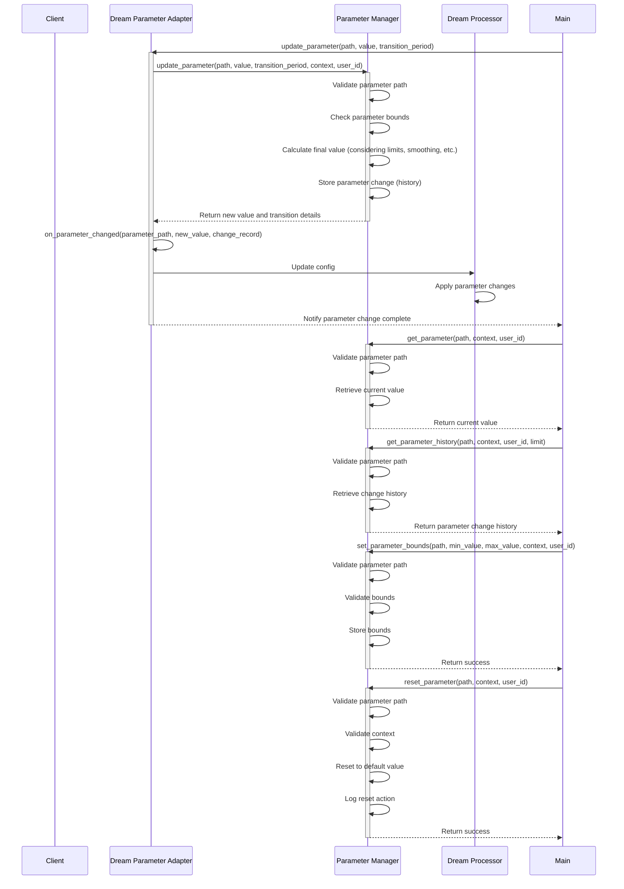

# api-documentation.md

```md
# API Documentation

## Docker Server API

### WebSocket Endpoints

**Base URL**: `ws://localhost:8080`

| Endpoint | Description | Parameters | Response |
|----------|-------------|------------|----------|
| `/interact` | Send user interaction | `{"message": string, "context": object}` | `{"response": string, "thoughts": object, "memories": array}` |
| `/system/status` | Get system status | N/A | `{"status": string, "uptime": number, "current_model": string, "state": string}` |
| `/system/model` | Change active model | `{"model": string}` | `{"success": boolean, "model": string, "error": string}` |

### HTTP Endpoints

**Base URL**: `http://localhost:8081`

| Endpoint | Method | Description | Parameters | Response |
|----------|--------|-------------|------------|----------|
| `/api/memory/recent` | GET | Get recent memories | `?limit=10&type=interaction` | `{"memories": array}` |
| `/api/knowledge/search` | GET | Search knowledge graph | `?query=string&limit=10` | `{"results": array}` |
| `/api/model/status` | GET | Get model status | N/A | `{"current": string, "available": array}` |
| `/api/dream/insights` | GET | Get dream insights | `?limit=5&since=timestamp` | `{"insights": array}` |

## Dream API Test Endpoints

**Base URL**: `http://localhost:8081`

| Endpoint | Method | Description | Parameters | Response |
|----------|--------|-------------|------------|----------|
| `/api/dream/test/batch_embedding` | POST | Process batch of embeddings | `{"texts": array, "use_hypersphere": boolean}` | `{"status": string, "count": number, "successful": number, "embeddings": array}` |
| `/api/dream/test/similarity_search` | POST | Search for similar memories | `{"query": string, "top_k": number}` | `{"status": string, "results": array, "total_matches": number, "query": string}` |
| `/api/dream/test/create_test_report` | POST | Create a test dream report | `{"title": string, "fragments": array}` | `{"status": string, "report_id": string, "fragment_count": number}` |
| `/api/dream/test/refine_report` | POST | Refine an existing report | `{"report_id": string}` | `{"status": string, "report_id": string, "refinement_count": number, "confidence": number, "reason": string}` |
| `/api/dream/test/tensor_connection` | GET | Test tensor server connection | N/A | `{"status": string, "connected": boolean}` |
| `/api/dream/test/hpc_connection` | GET | Test HPC server connection | N/A | `{"status": string, "connected": boolean}` |
| `/api/dream/test/process_embedding` | GET | Test embedding processing | `?text=string` | `{"status": string, "embedding": array}` |
| `/api/dream/health` | GET | API health check | N/A | `{"status": string, "timestamp": string}` |

## TensorServer API

**Base URL**: `ws://localhost:5001`

| Command | Description | Parameters | Response |
|---------|-------------|------------|----------|
| `embed` | Generate embeddings | `{"text": string, "id": string}` | `{"embedding": array, "id": string}` |
| `search` | Search for similar memories | `{"embedding": array, "limit": number}` | `{"results": array}` |
| `stats` | Get server statistics | N/A | `{"embeddings_count": number, "gpu_utilization": number}` |

## HPCServer API

**Base URL**: `ws://localhost:5005`

| Command | Description | Parameters | Response |
|---------|-------------|------------|----------|
| `process` | Process embeddings | `{"embedding": array, "operation": string}` | `{"result": object, "operation": string}` |
| `stats` | Get HPC statistics | N/A | `{"cpu_utilization": number, "memory_utilization": number}` |

## LM Studio Server API

**Base URL**: `http://127.0.0.1:1234`

Standard OpenAI-compatible API:

| Endpoint | Method | Description |
|----------|--------|-------------|
| `/v1/models` | GET | List available models |
| `/v1/chat/completions` | POST | Generate chat completions |
| `/v1/embeddings` | POST | Generate embeddings |

## API Usage Examples

### Testing Dream API Endpoints

\`\`\`bash
# Test batch embedding processing
curl -X POST http://localhost:8081/api/dream/test/batch_embedding \
  -H "Content-Type: application/json" \
  -d '{"texts": ["This is a test", "Another test"], "use_hypersphere": false}'

# Test similarity search
curl -X POST http://localhost:8081/api/dream/test/similarity_search \
  -H "Content-Type: application/json" \
  -d '{"query": "test query", "top_k": 3}'

# Test dream report creation
curl -X POST http://localhost:8081/api/dream/test/create_test_report \
  -H "Content-Type: application/json" \
  -d '{"title": "Test Report", "fragments": [{"content": "Test insight", "type": "insight", "confidence": 0.8}]}'

# Test report refinement
curl -X POST http://localhost:8081/api/dream/test/refine_report \
  -H "Content-Type: application/json" \
  -d '{"report_id": "report:12345"}'

# Test health check
curl http://localhost:8081/api/dream/health
\`\`\`

### Using the LM Studio API

\`\`\`python
import requests
import json

# List available models
response = requests.get("http://127.0.0.1:1234/v1/models")
models = response.json()
print(json.dumps(models, indent=2))

# Generate chat completion
response = requests.post(
    "http://127.0.0.1:1234/v1/chat/completions",
    json={
        "model": "qwen2.5-7b-instruct",
        "messages": [
            {"role": "system", "content": "You are a helpful assistant."},
            {"role": "user", "content": "Hello, how are you?"}
        ],
        "temperature": 0.7
    }
)
result = response.json()
print(json.dumps(result, indent=2))
\`\`\`
```

# core-components.md

```md
# Core Components

## Docker Server

The Docker container serves as Lucidia's primary runtime environment, hosting the core cognitive architecture and orchestrating interactions with external services.

### Features

- Self-contained environment with all dependencies
- Automatic startup and recovery
- Health monitoring and reporting
- Resource usage optimization
- Model switching based on system state
- WebSocket server for client interactions

### Configuration

\`\`\`yaml
version: '3'
services:
  lucidia-core:
    image: lucidia/core:latest
    container_name: lucidia-core
    restart: always
    ports:
      - "8080:8080"  # WebSocket API
      - "8081:8081"  # HTTP API
    volumes:
      - ./data:/app/data
      - ./config:/app/config
    environment:
      - TENSOR_SERVER_URL=ws://tensor-server:5001
      - HPC_SERVER_URL=ws://hpc-server:5005
      - LM_STUDIO_URL=http://host.docker.internal:1234
      - LOG_LEVEL=INFO
\`\`\`

## Memory System

The memory system manages Lucidia's experiences, knowledge, and reflections, providing persistent storage and retrieval mechanisms for the cognitive architecture.

### Components

- **Short-Term Memory**: Recent interactions and experiences
- **Long-Term Memory**: Consolidated knowledge and significant experiences
- **Memory Prioritization**: Determines significance and priority of memories
- **Embedding Storage**: Vector representations of memories for similarity search
- **Knowledge Graph**: Semantic network of concepts, entities, and relationships

### Memory Workflow

\`\`\`mermaid
sequenceDiagram
    participant U as User
    participant S as Self Model
    participant W as World Model
    participant K as Knowledge Graph
    participant T as Tensor Server
    participant D as Database
    
    U->>S: Interaction
    S->>T: Generate Embeddings
    T->>S: Return Embeddings
    S->>D: Store Memory
    S->>W: Update World Model
    W->>K: Update Knowledge Graph
    K->>D: Store Knowledge
\`\`\`

## Model Management

The model management system handles dynamic selection and switching between different LLMs based on system conditions and processing requirements.

### Available Models

The following models are available through the LM Studio server:

\`\`\`json
{
  "data": [
    {"id": "qwen_qwq-32b", "object": "model", "owned_by": "organization_owner"},
    {"id": "text-embedding-nomic-embed-text-v1.5", "object": "model", "owned_by": "organization_owner"},
    {"id": "qwen2.5-7b-instruct-1m", "object": "model", "owned_by": "organization_owner"},
    {"id": "deepseek-r1-distill-llama-8b", "object": "model", "owned_by": "organization_owner"},
    {"id": "deepseek-r1-distill-qwen-7b", "object": "model", "owned_by": "organization_owner"},
    {"id": "llava-v1.5-7b", "object": "model", "owned_by": "organization_owner"},
    {"id": "qwen2.5-7b-instruct", "object": "model", "owned_by": "organization_owner"},
    {"id": "deepseek-coder-v2-lite-instruct", "object": "model", "owned_by": "organization_owner"},
    {"id": "phi-4", "object": "model", "owned_by": "organization_owner"},
    {"id": "phi-3.1-mini-128k-instruct", "object": "model", "owned_by": "organization_owner"}
  ],
  "object": "list"
}
\`\`\`

### Model Selection Criteria

| State | Activity | Model Selection | Temperature | Reason |
|-------|----------|----------------|------------|--------|
| Active | Direct interaction | qwen2.5-7b-instruct or phi-4 | 0.7 | Balance of quality and response time |
| Background | User gaming | phi-3.1-mini-128k-instruct | 0.5 | Minimal resource usage during gaming |
| Reflective | User AFK (10+ min) | deepseek-r1-distill-qwen-7b | 0.8 | Better reflection capabilities |
| Dreaming | User sleeping/long AFK | qwen_qwq-32b | 1.2 | Advanced reasoning with increased creativity |

## Dream Testing

### Overview

The Dream Testing component is responsible for testing the dreaming workflow, ensuring that Lucidia can process memories, generate insights, and create structured reports.

### Test Script

The `test_dream_reflection.py` script is used to test the dreaming workflow. It simulates user interactions, adds test memories, and verifies the generation of insights and reports.

### Test Cases

1. **Memory Processing**: Test that memories are correctly processed and stored.
2. **Dream Generation**: Verify that dreams are generated based on memories and that insights are extracted.
3. **Report Creation**: Test that reports are created and refined correctly.
4. **Fragment Categorization**: Verify that fragments are correctly categorized as insights, questions, hypotheses, or counterfactuals.

## Parameter Reconfiguration System

The Parameter Reconfiguration System allows dynamic adjustment of system parameters at runtime.

### Implemented Features

- **Parameter Management**: Comprehensive `ParameterManager` with support for nested parameter paths, type validation, and value casting
- **Parameter API**: REST API endpoints for parameter configuration retrieval and updates
- **Configuration Validation**: JSON schema validation for parameter configurations
- **Parameter Change Handlers**: Event-based architecture for parameter changes
- **Parameter Persistence**: Robust mechanism for ensuring parameter changes persist across server restarts and between CLI and API interactions
- **Testing Framework**: Comprehensive test suite for the parameter system

### Parameter Categories

- **Memory Parameters**: Controls memory retention, significance thresholds, and integration rates
- **Dream Parameters**: Adjusts dream generation, insight extraction, and report creation
- **System Parameters**: Manages resource allocation, state transitions, and model selection
- **Spiral Parameters**: Configures spiral phases, reflection depth, and creativity ranges

### Parameter Persistence Mechanism

The parameter persistence mechanism ensures that parameter changes are properly saved and maintained across system restarts and between different components:

- **Configuration File**: All parameters are stored in a shared configuration file (`lucidia_config.json`) that serves as the single source of truth
- **ParameterManager Auto-Save**: The `ParameterManager` automatically saves parameter changes to disk after successful updates
- **Cross-Component Consistency**: Both the API server and CLI use the same configuration file path to ensure consistency
- **Default Parameter Creation**: Missing parameters are automatically created with sensible defaults when updated
- **Docker-Aware**: The persistence mechanism is designed to work seamlessly in Docker environments where components may run in separate containers

### Parameter Update Workflow

\`\`\`mermaid
sequenceDiagram
    participant C as CLI
    participant A as Dream API
    participant P as Parameter Manager
    participant F as Config File
    
    C->>A: Update Parameter Request
    A->>P: Update Parameter
    P->>P: Validate & Apply Update
    P->>F: Save Config to Disk
    A->>C: Return Success
    C->>F: Update Local Config Copy
```

# deployment-guide.md

```md
# Deployment Guide

This guide provides detailed instructions for setting up and deploying the Lucidia system.

## Prerequisites

- Docker Engine 20.10+
- NVIDIA Container Toolkit (for GPU acceleration)
- Python 3.9+
- 8GB+ RAM (16GB+ recommended)
- 50GB+ storage space
- CUDA 11.4+ (for GPU acceleration)

## Installation Steps

### 1. Clone the repository

\`\`\`bash
git clone https://github.com/captinkirklive/Lucid-Recall-Core-1.2
cd lucidia
\`\`\`

### 2. Configure environment variables

\`\`\`bash
cp .env.example .env
# Edit .env with your specific configuration
\`\`\`

Edit the `.env` file to set your specific configuration options:

\`\`\`
# Core Configuration
LOG_LEVEL=INFO
DEBUG_MODE=false

# Server URLs
TENSOR_SERVER_URL=ws://tensor-server:5001
HPC_SERVER_URL=ws://hpc-server:5005
LM_STUDIO_URL=http://host.docker.internal:1234

# Resource Limits
MAX_CPU_USAGE=0.8
MAX_MEMORY_USAGE=0.7
MAX_GPU_USAGE=0.9

# Default Model
DEFAULT_MODEL=qwen2.5-7b-instruct
\`\`\`

### 3. Build and start Docker containers

\`\`\`bash
docker-compose build
docker-compose up -d
\`\`\`

This will start the following containers:
- lucidia-core: Main Docker container with the core system
- lucidia-tensor: Tensor server for embedding operations
- lucidia-hpc: HPC server for complex processing tasks

### 4. Install LM Studio

1. Download and install LM Studio from [https://lmstudio.ai/](https://lmstudio.ai/)
2. Configure LM Studio to run on port 1234
3. Launch LM Studio and ensure the API server is running

### 5. Download required models

Use LM Studio to download the following models:

- qwen_qwq-32b
- qwen2.5-7b-instruct
- deepseek-r1-distill-qwen-7b
- phi-3.1-mini-128k-instruct

### 6. Verify installation

\`\`\`bash
# Check system status
curl http://localhost:8081/api/system/status

# Check available models
curl http://localhost:8081/api/model/status

# Check tensor server connection
curl http://localhost:8081/api/dream/test/tensor_connection

# Check HPC server connection
curl http://localhost:8081/api/dream/test/hpc_connection

# Test API health
curl http://localhost:8081/api/dream/health
\`\`\`

## Configuration Options

### Core Configuration Files

The Lucidia system uses several YAML configuration files to control its behavior:

#### `config/system.yml`

Controls core system settings:

\`\`\`yaml
system:
  name: "Lucidia"
  version: "1.0.0"
  log_level: "INFO"
  default_model: "qwen2.5-7b-instruct"
  
resources:
  max_cpu_usage: 0.8
  max_memory_usage: 0.7
  max_gpu_usage: 0.9
  
servers:
  tensor_server_url: "ws://tensor-server:5001"
  hpc_server_url: "ws://hpc-server:5005"
  lm_studio_url: "http://host.docker.internal:1234"
\`\`\`

#### `config/models.yml`

Defines model selection criteria:

\`\`\`yaml
models:
  - id: "qwen2.5-7b-instruct"
    state: "active"
    temperature: 0.7
    max_tokens: 2048
    priority: "high"
    
  - id: "phi-3.1-mini-128k-instruct"
    state: "background"
    temperature: 0.5
    max_tokens: 1024
    priority: "low"
    
  - id: "deepseek-r1-distill-qwen-7b"
    state: "reflective"
    temperature: 0.8
    max_tokens: 2048
    priority: "medium"
    
  - id: "qwen_qwq-32b"
    state: "dreaming"
    temperature: 1.2
    max_tokens: 4096
    priority: "medium"
\`\`\`

#### `config/memory.yml`

Controls memory system parameters:

\`\`\`yaml
memory:
  short_term:
    capacity: 100
    retention_period: 86400  # 24 hours in seconds
    
  long_term:
    significance_threshold: 0.6
    consolidation_interval: 3600  # 1 hour in seconds
    
  embeddings:
    model: "text-embedding-nomic-embed-text-v1.5"
    dimension: 768
    use_hypersphere: true
\`\`\`

#### `config/spiral.yml`

Configures spiral awareness settings:

\`\`\`yaml
spiral:
  enabled: true
  default_phase: "observation"
  transition_thresholds:
    observation_to_reflection: 0.7
    reflection_to_adaptation: 0.9
  
  parameters:
    spiral_influence: 0.8
    spiral_awareness_boost: 0.5
    depth_range: [0.1, 1.0]
    creativity_range: [0.5, 1.5]
\`\`\`

## Monitoring and Maintenance

### Checking Logs

\`\`\`bash
# View core container logs
docker logs lucidia-core

# View tensor server logs
docker logs lucidia-tensor

# View HPC server logs
docker logs lucidia-hpc

# Follow logs in real-time
docker logs -f lucidia-core
\`\`\`

### Resource Usage

\`\`\`bash
# Check container resource usage
docker stats lucidia-core lucidia-tensor lucidia-hpc
\`\`\`

### Restarting Services

\`\`\`bash
# Restart a specific container
docker restart lucidia-core

# Restart all containers
docker-compose restart
\`\`\`

### Backup and Restore

\`\`\`bash
# Backup data directory
tar -czvf lucidia-data-backup.tar.gz ./data

# Backup configuration
tar -czvf lucidia-config-backup.tar.gz ./config

# Restore data
tar -xzvf lucidia-data-backup.tar.gz
\`\`\`

## Parameter Management

### Configuration Structure

The Lucidia system uses a hierarchical parameter structure stored in a JSON configuration file:

\`\`\`json
{
  "memory": {
    "batch_size": 300,
    "significance_threshold": 0.7,
    "decay_rate": 0.01,
    "max_memories": 10000
  },
  "dream": {
    "processing_interval": 3600,
    "batch_limit": 100,
    "min_consolidation_time": 300
  },
  "embedding": {
    "model": "default",
    "dimension": 384,
    "normalize": true
  },
  "system": {
    "logging_level": "INFO",
    "auto_optimize": true,
    "backup_interval": 86400
  }
}
\`\`\`

### Parameter Persistence in Docker Environment

Since the Lucidia system runs in a Docker environment with multiple containers, special considerations are required for parameter persistence:

1. **Shared Configuration File**: The central configuration file (`lucidia_config.json`) is used by both the Dream API server and CLI

2. **Parameter Updates Process**:
   - When parameters are updated via the CLI, the changes are sent to the Dream API
   - The API's ParameterManager updates its internal state and saves changes to disk
   - The CLI also updates its local copy of the configuration file

3. **Container Persistence**:
   - The configuration file is stored in a mounted volume to persist across container restarts
   - Both the CLI (running on the host) and the API (running in containers) access the same configuration

4. **Auto-Creation of Parameters**:
   - Missing parameters are automatically created with sensible defaults
   - This ensures backward compatibility and prevents errors with partial configurations

### Parameter Management Commands

\`\`\`bash
# View all parameters
python lucidia_cli.py params

# View specific parameter branch
python lucidia_cli.py params --branch memory

# Update a parameter
python lucidia_cli.py params --path memory.batch_size --value 300

# View parameter history
python lucidia_cli.py params --history memory.batch_size
\`\`\`

## Troubleshooting

### Common Issues

1. **Connection Refused Errors**
   - Check that all containers are running: `docker ps`
   - Verify network configuration in `.env` and `docker-compose.yml`
   - Check if required ports are already in use

2. **Model Loading Failures**
   - Verify LM Studio is running and API server is enabled
   - Check if models are properly downloaded in LM Studio
   - Verify model names match exactly in configuration

3. **Out of Memory Errors**
   - Lower `MAX_MEMORY_USAGE` in `.env`
   - Switch to smaller models for lower resource states
   - Increase Docker container memory limits

4. **Slow Performance**
   - Check GPU availability and utilization
   - Monitor system resources with `docker stats`
   - Consider lowering model complexity during high load
```

# detailed-dream-processing.md

```md
sequenceDiagram
    participant Main
    participant DP as Dream Processor
    participant Spiral as Spiral Manager
    participant MemInt as Memory Integration
    participant KG as Knowledge Graph
    participant SM as Self Model
    participant WM as World Model
    participant DPA as Dream Parameter Adapter
    participant PM as Parameter Manager
    
    %% Dream Initiation
    Main->>DP: check_idle_status()
    activate DP
    
    opt auto_dream_enabled and idle
        DP->>DP: start_dreaming(forced=False)
        
        %% Get Spiral Phase Information
        DP->>Spiral: get_current_phase()
        activate Spiral
        Spiral-->>DP: Return Current Phase
        deactivate Spiral
        DP->>Spiral: get_phase_params()
        activate Spiral
        Spiral-->>DP: Return Phase Parameters
        deactivate Spiral
        
        %% Dream Seed Selection
        DP->>DP: _select_dream_seed()
        DP->>MemInt: Access Recent Memories
        activate MemInt
        MemInt-->>DP: Return Recent Memories
        deactivate MemInt
        DP->>KG: Access Concepts/Relationships
        activate KG
        KG-->>DP: Return Concepts/Relationships
        deactivate KG
        DP->>SM: Access Emotional State
        activate SM
        SM-->>DP: Return Emotional State
        deactivate SM
        
        %% Detailed Dream Processing Phases
        DP->>DP: _process_dream()
        
        %% Phase 1: Seed Selection
        DP->>DP: _execute_dream_phase("seed_selection", seed)
        DP->>DP: _enhance_dream_seed(seed)
        DP->>DP: _select_dream_theme(seed)
        DP->>DP: _select_cognitive_style(seed)
        
        %% Phase 2: Context Building
        DP->>DP: _execute_dream_phase("context_building", enhanced_seed)
        DP->>DP: _build_dream_context(enhanced_seed)
        
        %% Phase 3: Associations
        DP->>DP: _execute_dream_phase("associations", context)
        DP->>DP: _generate_dream_associations(context)
        
        %% Phase 4: Insight Generation
        DP->>DP: _execute_dream_phase("insight_generation", context)
        DP->>DP: _generate_dream_insights(context)
        
        %% Phase 5: Integration
        DP->>DP: _execute_dream_phase("integration", insights)
        DP->>DP: _integrate_dream_insights(insights)
        
        %% Knowledge Graph Updates
        DP->>KG: Add Dream Report Node
        activate KG
        KG-->>DP: Return Node ID
        deactivate KG
        DP->>KG: Connect to participating memories
        activate KG
        KG-->>DP: Return Edge Keys
        deactivate KG
        DP->>KG: Connect to fragments (insight, question, hypothesis, counterfactual)
        activate KG
        KG-->>DP: Return Edge Keys
        deactivate KG
        DP->>KG: Create relationships between referenced concepts
        activate KG
        KG-->>DP: Return Edge Keys
        deactivate KG
        
        %% World Model Updates
        DP->>WM: Update Concepts
        activate WM
        WM-->>DP: Return Results
        deactivate WM
        
        %% Self Model Updates
        DP->>SM: Update Self-Awareness
        activate SM
        SM-->>DP: Return Results
        deactivate SM
        
        %% Spiral Phase Transition
        DP->>Spiral: transition_phase(significance)
        activate Spiral
        Spiral-->>DP: Return result
        deactivate Spiral
        
        %% Dream Completion
        DP->>DP: _update_dream_stats(dream_record)
        DP->>DP: _format_dream_content(seed, context, insights, spiral_phase)
        DP->>DP: _end_dream()
        deactivate DP
    end
    
    %% Parameter Management
    Note over Main,PM: Parameter Update Flow
    Main->>DPA: update_parameter(path, value, transition_period)
    activate DPA
    DPA->>PM: update_parameter(path, value, transition_period, context, user_id)
    activate PM
    PM->>PM: Calculate Final Value (considering limits)
    PM->>PM: Store Parameter Change (history)
    PM-->>DPA: Return New Value
    deactivate PM
    DPA->>DPA: on_parameter_changed(parameter_path, new_value, change_record)
    DPA->>DP: Update config
    activate DP
    DP-->>DP: Apply parameter changes
    deactivate DP
    deactivate DPA

```

# detailed-hypersphere-operations.md

```md
sequenceDiagram
    participant MemCore as Memory Core
    participant MPL as Memory Prioritization Layer
    participant DP as Dream Processor
    participant HD as Hypersphere Dispatcher
    participant TP as Tensor Pool
    participant TS as Tensor Server
    participant HPPool as HPC Pool
    participant HPServer as HPC Server
    participant GR as Geometry Registry
    participant CM as Confidence Manager
    participant DM as Decay Manager
    participant BS as Batch Scheduler
    
    %% Similarity Search Operation
    MPL->>HD: batch_similarity_search(query_embedding, memory_embeddings, memory_ids, model_version, top_k)
    activate HD
    
    %% Embedding Compatibility Checks
    HD->>GR: check_embedding_compatibility(model_version, query_embedding)
    activate GR
    GR-->>HD: Return True/False
    deactivate GR
    
    alt Incompatible Query Embedding
        HD->>HD: _normalize_embedding(query_embedding)
    end
    
    HD->>GR: check_embedding_compatibility(model_version, memory_embeddings[0])
    activate GR
    GR-->>HD: Return True/False
    deactivate GR
    
    alt Incompatible Memory Embeddings
        HD->>HD: _normalize_embedding(memory_embeddings)
    end
    
    %% Get Server Connection
    HD->>HPPool: Get Connection
    activate HPPool
    HPPool-->>HD: Return Connection
    deactivate HPPool
    
    %% Execute Search
    HD->>HPServer: Send Similarity Search Request
    activate HPServer
    HPServer-->>HD: Return Similarities and Indices
    deactivate HPServer
    
    %% Process Results
    HD->>HD: _process_similarity_results(similarities, indices, memory_ids, top_k)
    HD-->>MPL: Return Results (memory_ids, similarities)
    deactivate HD
    
    %% Embedding Generation
    MemCore->>HD: process_embedding(content)
    activate HD
    HD->>TP: Get Connection
    activate TP
    TP-->>HD: Return Connection
    deactivate TP
    HD->>TS: Generate Embedding
    activate TS
    TS-->>HD: Return Raw Embedding
    deactivate TS
    HD->>HD: Calculate Significance
    HD-->>MemCore: Return Embedding and Significance
    deactivate HD
    
    %% Embedding Decay Operation
    DP->>HD: decay_embedding(embedding, decay_rate, decay_method)
    activate HD
    HD->>DM: decay(embedding, decay_rate, decay_method)
    activate DM
    DM->>DM: Apply Decay Function
    DM-->>HD: Return Decayed Embedding
    deactivate DM
    HD-->>DP: Return Decayed Embedding
    deactivate HD
    
    %% Fetch Relevant Embeddings
    MPL->>HD: fetch_relevant_embeddings(query, criteria, limit)
    activate HD
    HD->>BS: schedule_embedding_fetch(query, criteria, limit)
    activate BS
    
    BS->>HPPool: Get Connection
    activate HPPool
    HPPool-->>BS: Return Connection
    deactivate HPPool
    
    BS->>HPServer: Batch Embedding Requests
    activate HPServer
    HPServer-->>BS: Return Embeddings
    deactivate HPServer
    
    BS-->>HD: Return Embeddings
    deactivate BS
    HD-->>MPL: Return Embeddings
    deactivate HD
    
    %% Embedding History
    MemCore->>HD: get_embedding_history(memory_id)
    activate HD
    HD->>CM: get_confidence_scores(memory_id)
    activate CM
    CM-->>HD: Return Confidence History
    deactivate CM
    HD-->>MemCore: Return Confidence History
    deactivate HD
    
    %% Model Registration
    MemCore->>HD: register_model(model_name, geometry_config)
    activate HD
    HD->>GR: register_geometry(model_name, geometry_config)
    activate GR
    GR->>GR: Store geometry configuration
    GR-->>HD: Return success
    deactivate GR
    HD-->>MemCore: Return boolean
    deactivate HD

```

# detailed-memory-operations.md

```md
sequenceDiagram
    %% Participants
    participant User
    participant Main
    participant MemInt as Memory Integration
    participant MemCore as Memory Core
    participant STM
    participant LTM
    participant MPL
    participant HD as Hypersphere Dispatcher
    participant GR as Geometry Registry
    participant HPPool
    participant HPServer as HPC Server
    participant EC as Embedding Comparator
    
    %% Memory Storage Process
    User->>Main: Input (Content to Store)
    Main->>MemInt: store(content, metadata, importance)
    MemInt->>MemCore: process_and_store(content, memory_type, metadata)
    
    %% Embedding Process
    MemCore->>HD: process_embedding(content)
    activate HD
    HD->>GR: check_embedding_compatibility(model_version, embedding)
    GR-->>HD: Return True/False
    
    alt Incompatible Embedding
        HD->>HD: _normalize_embedding(embedding)
    end
    
    HD->>HPPool: Get Connection
    HPPool-->>HD: Return Connection
    HD->>HPServer: Send Embedding Request
    HPServer-->>HD: Return Embedding
    HD->>HD: Calculate Significance
    HD-->>MemCore: Return Embedding, Significance
    deactivate HD
    
    %% STM Storage
    MemCore->>STM: add_memory(content, embedding, metadata)
    STM-->>MemCore: Return STM ID
    
    %% LTM Storage (if significant)
    MemCore->>MemCore: Evaluate Significance
    
    alt Significance >= threshold
        MemCore->>LTM: store_memory(content, embedding, significance, metadata)
        activate LTM
        LTM-->>MemCore: Return LTM ID
        deactivate LTM
    end
    
    MemCore-->>MemInt: Return Result (success, stm_id, ltm_id)
    deactivate MemCore
    MemInt-->>Main: Return Result
    deactivate MemInt
    Main-->>User: Confirmation
    deactivate Main
    
    %% Memory Recall Process
    User->>Main: Query (Content to Retrieve)
    activate Main
    Main->>MemInt: recall(query, limit, min_importance)
    activate MemInt
    MemInt->>MPL: route_query(query, context)
    activate MPL
    
    %% Process Query Embedding
    MPL->>HD: process_embedding(query)
    activate HD
    HD->>GR: check_embedding_compatibility(model_version, query)
    GR-->>HD: Return True/False
    
    alt Incompatible Embedding
        HD->>HD: _normalize_embedding(query)
    end
    
    HD->>EC: get_embedding(query)
    EC-->>HD: Return Embedding
    HD-->>MPL: Return Query Embedding
    deactivate HD
    
    %% Check STM
    MPL->>STM: get_recent(limit)
    activate STM
    STM-->>MPL: Return Recent Memories
    deactivate STM
    MPL->>HD: batch_similarity_search(query_embedding, stm_embeddings)
    activate HD
    HD-->>MPL: Return STM Similarities
    deactivate HD
    
    %% Results Merging Logic
    MPL->>MPL: Initialize results collection
    
    alt Strong match in STM
        MPL->>MPL: Add STM results to collection
    end
    
    %% Check LTM
    MPL->>LTM: search_memory(query_embedding, limit)
    LTM-->>MPL: Return LTM Results
    
    alt Strong match in LTM
        MPL->>MPL: Add LTM results to collection
    end
    
    %% If needed, check HPC
    alt Insufficient results
        MPL->>HD: fetch_relevant_embeddings(query, criteria, limit)
        activate HD
        HD->>HPPool: Get Connection
        HPPool-->>HD: Return Connection
        HD->>HPServer: Similarity Search Request
        HPServer-->>HD: Return HPC Results
        HD-->>MPL: Return HPC Results
        deactivate HD
        MPL->>MPL: Add HPC results to collection
    end
    
    %% Merge and Return Results
    MPL->>MPL: Merge and rank all results
    MPL-->>MemInt: Return Combined Results
    MemInt-->>Main: Return Results
    Main-->>User: Response

```

# detailed-system-architecture.md

```md
graph TD
    %% Main components
    User([User]) <-->|Input/Output| Main[Main System]
    Config[Configuration File] -->|Loaded by| Main
    
    %% Major subsystems
    Main -->|Initializes| Memory[Memory System]
    Main -->|Initializes| Knowledge[Knowledge System]
    Main -->|Initializes| Dream[Dream System]
    Main -->|Initializes| Hyper[Hypersphere System]
    
    %% Memory Components
    Memory --> MemInt[Memory Integration]
    MemInt --> MemCore[Memory Core]
    MemCore --> STM[Short-Term Memory]
    MemCore --> LTM[Long-Term Memory]
    MemCore --> MPL[Memory Prioritization Layer]
    
    %% Knowledge Components
    Knowledge --> KG[Knowledge Graph]
    KG -->|Import Initial Concepts & Beliefs| SM[Self Model]
    KG -->|Import Initial Concepts & Relationships| WM[World Model]
    
    %% Dream Components
    Dream --> DP[Dream Processor]
    DP -->|get_current_phase, transition_phase| Spiral[Spiral Manager]
    Dream --> DPA[Dream Parameter Adapter]
    DPA -->|update_parameter, get_parameter| PM[Parameter Manager]
    
    %% Hypersphere Components
    Hyper --> HD[Hypersphere Dispatcher]
    HD -->|Get Connection| TP[Tensor Pool]
    HD -->|Get Connection| HP[HPC Pool]
    HD -->|check_embedding_compatibility| GR[Geometry Registry]
    HD --> CM[Confidence Manager]
    HD --> DM[Decay Manager]
    HD -->|schedule_embedding_fetch| BS[Batch Scheduler]
    
    %% Server Components
    TP --> TensorServer[Tensor Server]
    HP --> HPCServer[HPC Server]
    
    %% Key Interactions
    MemCore -->|Request Embedding Generation| HD
    HD -->|Return Processed Embedding, Significance| MemCore
    
    MPL -->|get_recent, similarity search| STM
    MPL -->|search_memory| LTM
    MPL -->|fetch_relevant_embeddings| HD
    
    DP -->|Access Recent Memories| MemInt
    DP -->|add_node, add_edge, integrate_dream_insight| KG
    DP -->|Access Emotional State| SM
    DP -->|Access Concepts| WM
    
    Config -->|Provides Settings for| Memory & Knowledge & Dream & Hyper
    
    %% Parameter Flow
    User -->|Parameter Updates| Main
    Main -->|update_parameter| DPA
    DPA -->|Notifies| DP

```

# development-roadmap.md

```md
# Development Roadmap

## Recent Improvements (March 2025)

### Dream API Enhancements
- Improved embedding generation reliability for test endpoints by implementing direct tensor server communication
- Enhanced error handling and fallback mechanisms for embedding operations
- Implemented consistent API response formats across all test endpoints
- Fixed batch embedding processing to handle individual text items reliably
- Added comprehensive logging for better diagnostics and troubleshooting

### API Reliability Improvements
- Implemented direct WebSocket connections to tensor server for critical embedding operations
- Added fallback mechanisms when primary embedding generation methods fail
- Enhanced error reporting with detailed status information in API responses
- Improved connection management for WebSocket-based services

## Phase 1: Core Infrastructure 

| Status | Task | Description | Priority |
|--------|------|-------------|----------|
| ✅ | Docker Container Setup | Configure and build the Lucid dreaming Docker container | HIGH |
| ✅ | Basic LM Studio Integration | Connect to local LLM server with model selection | HIGH |
| ✅ | Self Model Implementation | Develop core Self Model with basic reflection | HIGH |
| ✅ | World Model Implementation | Develop core World Model with knowledge domains | HIGH |
| ✅ | Knowledge Graph Implementation | Implement basic semantic network | HIGH |
| ✅ | Memory System Integration | Connect to persistent storage and implement memory workflows | HIGH |
| ✅ | Basic API Implementation | Implement core API endpoints | HIGH |

## Phase 2: Distributed Processing

| Status | Task | Description | Priority |             
|--------|------|-------------|----------|
| ✅ | Tensor Server Implementation | Develop embedding generation and storage service | HIGH |
| ✅ | HPC Server Implementation | Develop high-performance processing service | HIGH |
| ✅ | Async Processing Framework | Implement background task scheduling | MEDIUM |
| ✅ | Model Switching Logic | Implemented dynamic model selection with the ModelSelector class that automatically adapts based on system state and resource availability. Successfully integrated with LM Studio for local model inference. | MEDIUM |
| ✅ | Resource Monitoring | Implemented comprehensive system resource tracking via ResourceMonitor class with metrics for CPU, memory, disk, and GPU (when available). Added optimization recommendations and dynamic resource allocation based on component priorities. | MEDIUM |
| ✅ | State Management | Implemented comprehensive state transitions through the SystemState enum with states for IDLE, ACTIVE, DREAMING, LOW_RESOURCES, and HIGH_RESOURCES. The ResourceMonitor now automatically updates system state based on resource usage patterns, and the ModelSelector responds to these state changes with appropriate model selection. | MEDIUM |

## Phase 3: Reflective Capabilities 

| Status | Task | Description | Priority |
|--------|------|-------------|----------|
| ✅ | Advanced Dreaming | Implemented dreaming flow with memory processing, insight generation, and report refinement. Successfully tested integration with LM Studio using test_dream_reflection.py. | MEDIUM |
| ✅ | Dream Integration | Connect dream insights to knowledge graph | MEDIUM |
| ✅ | Significance Calculation | Implement memory significance and prioritization | MEDIUM |
| ✅ | Spiral Integration | Connect spiral phases to reflection processes | LOW |
| ✅ | User Status Detection | Implement AFK and activity detection | LOW |

## Spiral Phases in Reflection Processes

The Lucidia memory system implements a spiral-based approach to reflection and memory consolidation, providing increasingly sophisticated levels of introspection and knowledge integration. This approach mimics the way human consciousness processes information in iterative cycles of deepening understanding.

### Spiral Phase Model

The spiral reflection model consists of three primary phases, each representing a different depth and focus of reflective processing:

1. **Phase 1: Observation (Shallow Reflection)**
   - **Focus**: Quick associative connections and immediate pattern recognition
   - **Memory Operations**: Light categorization, basic tagging, and surface-level associations
   - **Reflection Depth**: 0.1-0.3 (on a 0.0-1.0 scale)
   - **Memory Integration**: Primary storage in STM with minimal LTM interaction
   - **Typical Duration**: Brief, rapid processing (30-60 seconds in dream-time)

2. **Phase 2: Reflection (Intermediate Depth)**
   - **Focus**: Thematic pattern extraction and meaningful relationship building
   - **Memory Operations**: Semantic network expansion, context enrichment, and metaphorical linkage
   - **Reflection Depth**: 0.4-0.7 (on a 0.0-1.0 scale)
   - **Memory Integration**: Bidirectional flow between STM and LTM with preliminary MPL formation
   - **Typical Duration**: Moderate processing time (1-3 minutes in dream-time)

3. **Phase 3: Adaptation (Deep Reflection)**
   - **Focus**: Significant restructuring, narrative coherence, and identity integration
   - **Memory Operations**: Knowledge graph restructuring, conceptual pruning, and belief system updates
   - **Reflection Depth**: 0.8-1.0 (on a 0.0-1.0 scale)
   - **Memory Integration**: Full STM-LTM-MPL integration with lasting conceptual changes
   - **Typical Duration**: Extended processing periods (3-5 minutes in dream-time)

### Spiral-Reflection Connection Implementation

The spiral phase integration is implemented through several key components:

1. **Phase Detection and Tracking**:
   - Current spiral phase is tracked in the self-model's self-awareness component
   - Phase transitions are triggered by significance thresholds and temporal patterns
   - Each phase has specific entry and exit conditions based on reflection outcomes

2. **Reflection Process Modulation**:
   - Dream processor adjusts reflection depth based on current spiral phase
   - Cognitive styles and dream themes are weighted differently in each phase
   - Association distance and connection complexity increase with phase depth
   - Creative recombination parameters vary by phase (greater in Phase 3)

3. **Memory Integration Strategies**:
   - Phase-specific integration rates determine how readily insights modify memory structures
   - Knowledge graph operations become more extensive in deeper phases
   - Identity and belief system updates are primarily restricted to Phase 3
   - Confidence thresholds for integration decrease in higher phases

4. **Parameter Influence**:
   - `spiral_influence` parameter controls overall impact of spiral phase on dream processes
   - `spiral_awareness_boost` increases self-awareness through iterative reflection
   - Phase-specific parameter adjustments tune the reflection process dynamically

## Parameter Reconfiguration System

| Status | Task | Description | Priority |
|--------|------|-------------|----------|
| ✅ | Parameter Management | Implemented a comprehensive `ParameterManager` with support for nested parameter paths, type validation, and value casting. The system handles parameter locking, interpolation between values, and maintains metadata for valid parameter ranges. | HIGH |
| ✅ | Parameter API | Created REST API endpoints for parameter configuration retrieval and updates, including validation logic and appropriate status responses. | HIGH |
| ✅ | Configuration Validation | Added JSON schema validation for parameter configurations using the jsonschema library. Updated array-type parameters (depth_range and creativity_range) to correctly validate against the schema. | MEDIUM |
| ✅ | Parameter Change Handlers | Implemented a robust event-based architecture for parameter changes with support for observer registration and notification. | MEDIUM |
| ✅ | Testing Framework | Created comprehensive test suite for parameter system, including tests for locking, validation, interpolation, and notification systems. | MEDIUM |
| ✅ | Docker Integration | Added required dependencies (jsonschema, psutil) to the Docker environment and verified integration with other system components. | HIGH |

## Phase 4: Integration & Optimization 

| Status | Task | Description | Priority |
|--------|------|-------------|----------|
| ❌ | End-to-End Testing | Verify all components work together | HIGH |
| ❌ | Performance Optimization | Identify and fix bottlenecks | MEDIUM |
| ✅ | Resource Usage Optimization | Implemented dynamic resource allocation through ResourceOptimizer class which prioritizes critical components like memory_system and llm_service. System now responds to resource constraints by switching to lighter models and adjusting component resource allocations based on priorities. | MEDIUM |
| ✅ | Error Recovery | Implement robust error handling and fallback mechanisms for critical API operations | HIGH |
| ❌ | Documentation | Complete system documentation | MEDIUM |
| ❌ | Deployment Scripts | Finalize deployment procedures | HIGH |

## Future Development

### Phase 5: Advanced Integration (Planned)

| Status | Task | Description | Priority |
|--------|------|-------------|----------|
| ❌ | Advanced User Interaction | Natural conversation with improved context awareness | MEDIUM |
| ❌ | Identity Evolution | Self-model refinement based on accumulated experiences | LOW |
| ❌ | External Knowledge Integration | Connect to external APIs for knowledge acquisition | MEDIUM |
| ❌ | Adaptable Cognitive Styles | Context-dependent reasoning approaches | LOW |
| ❌ | Cross-Modal Understanding | Process and integrate multimodal inputs | LOW |
```

# enhanced-architecture.svg

This is a file of the type: SVG Image

# high-level-graph.md

```md
Okay, here's a comprehensive sequence diagram for the provided codebase, incorporating the sub-logic graphs you provided and addressing the nuances of the interaction flows between the different components. Because of the complexity and size of the whole system and its components, I am structuring it into multiple diagrams with specific focuses:

1.  **High-Level Initialization:** How the main components are initialized.
2.  **Dream Processing:** How the `DreamProcessor` handles dreaming.
3.  **Memory Interaction (Store/Recall):** How memories are stored and recalled via `MemoryIntegration`.
4.  **Knowledge Graph Interaction (Add/Update/Query):** Details interactions with the knowledge graph.
5. **Hypersphere Operations**
6. **Parameter Management**

I will use Mermaid sequence diagrams for clarity and readability.

### 1. High-Level Initialization Sequence Diagram

\`\`\`mermaid
sequenceDiagram
    participant Main
    participant Config
    participant Integration
    participant MemoryCore
    participant STM
    participant LTM
    participant MPL
    participant KG
    participant WM
    participant SM
    participant DPA
    participant DP

    Main->>Config: Load Configuration
    activate Config
    Config-->>Main: Return Config
    deactivate Config

    Main->>Integration: Create MemoryIntegration(config)
    activate Integration
    Integration->>MemoryCore: Create MemoryCore(config)
    activate MemoryCore
    MemoryCore->>STM: Create ShortTermMemory(config)
    activate STM
    STM-->>MemoryCore: Return STM
    deactivate STM
    MemoryCore->>LTM: Create LongTermMemory(config)
    activate LTM
    LTM-->>MemoryCore: Return LTM
    deactivate LTM
    MemoryCore->>MPL: Create MemoryPrioritizationLayer(STM, LTM, HPCClient)
    activate MPL
    MPL-->>MemoryCore: Return MPL
    deactivate MPL
    MemoryCore-->>Integration: Return MemoryCore
    deactivate MemoryCore

    Main->>KG : Create LucidiaKnowledgeGraph(self_model, world_model, config)
    activate KG
    KG->>SM: Access SelfModel Data
    activate SM
    SM-->>KG: return data
    deactivate SM

    KG->>WM: Access WorldModel Data
    activate WM
    WM-->>KG: return data
    deactivate WM
    KG-->>Main: Return Knowledge Graph
    deactivate KG

    Main->>SM : Create LucidiaSelfModel
    activate SM
    SM-->>Main: return self model
    deactivate SM

    Main->>WM: Create LucidiaWorldModel
    activate WM
    WM-->>Main: return world model
    deactivate WM
    
    Main->>DP: Create DreamProcessor(self_model, world_model, knowledge_graph, config)
    activate DP
    DP-->>Main: Return DreamProcessor
    deactivate DP
    
    Main->>DPA: Create DreamParameterAdapter(dream_processor, parameter_manager)
    activate DPA
    DPA-->>Main: return dream parameter adapter
    deactivate DPA

    Integration-->>Main: Return MemoryIntegration
    deactivate Integration

\`\`\`

### 2. Dream Processing Sequence Diagram

\`\`\`mermaid
sequenceDiagram
    participant DreamProcessor as DP
    participant SpiralManager as SM
    participant KnowledgeGraph as KG
    participant SelfModel as SelfM
    participant WorldModel as WM
    participant ParameterManager as PM
    participant DreamParameterAdapter as DPA

    Note over DP: Check Idle Status
    DP->>DP: check_idle_status()

    opt auto_dream_enabled and idle
        DP->>DP: start_dreaming(forced=False)
        activate DP
        DP->>SM: get_current_phase()
        activate SM
        SM-->>DP: Return Current Phase
        deactivate SM
        DP->>SM: get_phase_params()
        activate SM
        SM-->>DP: Return Phase Parameters
        deactivate SM
        DP->>DP: _select_dream_seed()
        DP->>MS: Access Recent Memories
        activate MS
        MS-->>DP: Return Recent Memories
        deactivate MS
        DP->>KG: Access Concepts/Relationships
        activate KG
        KG-->>DP: Return Concepts/Relationships
        deactivate KG
        DP->>SelfM: Access Emotional State (if available)
        activate SelfM
        SelfM-->>DP: Return Emotional State
        deactivate SelfM

        DP->>DP: _process_dream()
        DP->>DP: _execute_dream_phase("seed_selection", seed)
        DP->>DP: _enhance_dream_seed(seed)
        DP->>DP: _select_dream_theme(seed)
        DP->>DP: _select_cognitive_style(seed)
        DP->>DP: _execute_dream_phase("context_building", enhanced_seed)
        DP->>DP: _build_dream_context(enhanced_seed)
        DP->>DP: _execute_dream_phase("associations", context)
        DP->>DP: _generate_dream_associations(context)
        DP->>DP: _execute_dream_phase("insight_generation", context)
        DP->>DP: _generate_dream_insights(context)

        DP->>DP: _execute_dream_phase("integration", insights)
        DP->>DP: _integrate_dream_insights(insights)
        DP->>KG: Add/Update Nodes and Edges
        activate KG
        KG-->>DP: Return Results
        deactivate KG
        DP->>WM: Update Concepts
        activate WM
        WM-->>DP: Return Results
        deactivate WM
        DP->>SelfM: Update Self-Awareness
        activate SelfM
        SelfM-->>DP: Return Results
        deactivate SelfM
        DP->>SM: transition_phase(significance)
        activate SM
        SM-->>DP: return result
        deactivate SM

        DP->>DP: _update_dream_stats(dream_record)
        DP->>DP: _format_dream_content(seed, context, insights, spiral_phase)
        DP->>DP: _end_dream()
        deactivate DP

    end
    Note over DP: Parameter Change Handling
    DP->>DPA : update_parameter(path, value, transition_period)
    activate DPA
    DPA->>PM: update_parameter(path, value, transition_period, context, user_id)
    activate PM
    PM-->>DPA: return result
    deactivate PM
    DPA->>DPA: on_parameter_changed(parameter_path, new_value, change_record)
    DPA-->>DP: update config
    deactivate DPA

    Note over DP: Periodic Tasks
    DP->>DP: check_idle_status()
    DP->>DP: get_dream_status()
\`\`\`

### 3. Memory Interaction (Store/Recall) Sequence Diagram

\`\`\`mermaid
sequenceDiagram
    participant Client
    participant Integration
    participant MemoryCore
    participant STM
    participant LTM
    participant MPL
    participant HPC
    participant EmbeddingComparator as EC

    Client->>Integration: store(content, metadata, importance)
    activate Integration
    Integration->>MemoryCore: process_and_store(content, memory_type, metadata)
    activate MemoryCore

    MemoryCore->>HPC: process_embedding(content)
    activate HPC
    HPC-->>MemoryCore: Return Embedding, Significance
    deactivate HPC

    MemoryCore->>STM: add_memory(content, embedding, metadata)
    activate STM
    STM-->>MemoryCore: Return STM ID
    deactivate STM

    MemoryCore->>MemoryCore: Evaluate Significance
    MemoryCore--{Significance >= threshold?} Yes
    MemoryCore->>LTM: store_memory(content, embedding, significance, metadata)
    activate LTM
    LTM-->>MemoryCore: Return LTM ID
    deactivate LTM
    MemoryCore-->>Integration: Return Result (success, stm_id, ltm_id)
    deactivate MemoryCore
    Integration-->>Client: Return Result
    deactivate Integration


    Client->>Integration: recall(query, limit, min_importance)
    activate Integration
    Integration->>MPL: route_query(query, context)
    activate MPL

    MPL->>STM: Check STM (get_recent, similarity)
    activate STM
    STM-->>MPL: Return STM Results
    deactivate STM

    MPL--{Strong match in STM?} Yes
    MPL-->>Integration: Return STM Results
    Integration-->>Client: return stm results
     deactivate Integration
     deactivate MPL


    MPL--{Strong match in STM?} No
    MPL->>LTM: Check LTM (search_memory)
    activate LTM
    LTM-->>MPL: Return LTM Results
    deactivate LTM

    MPL--{Strong match in LTM?} Yes
    MPL->>MPL: Merge STM & LTM Results
    MPL-->>Integration: Return Combined Results
    Integration-->>Client: Return Combined Results
    deactivate Integration
    deactivate MPL


    MPL--{Strong match in LTM?} No
    MPL->>HPC: Check HPC (fetch_relevant_embeddings)
    activate HPC
    HPC->>EC: get_embedding(query)
    activate EC
    EC-->>HPC: Return Embedding
    deactivate EC
    HPC-->>MPL: Return HPC Results
    deactivate HPC
    MPL->>MPL: Merge STM, LTM, HPC Results
    MPL-->>Integration: Return All Results
    Integration-->>Client: Return All Results
    deactivate Integration
    deactivate MPL
\`\`\`

### 4. Knowledge Graph Interaction (Add/Update/Query) Sequence Diagram

\`\`\`mermaid
sequenceDiagram
    participant Client
    participant KG
    participant WorldModel as WM
    participant SelfModel as SM

    Client->>KG: add_node(node_id, node_type, attributes, domain)
    activate KG
    KG--{Node exists?} Yes
    KG->>KG: Update Node Attributes
    KG--{Node exists?} No
    KG->>KG: Add New Node
    KG->>KG: Track Node Type
    KG-->>Client: Return Success
    deactivate KG

    Client->>KG: update_node(node_id, attributes)
    activate KG
    KG--{Node exists?} No
    KG-->>Client: Return Failure
    deactivate KG
    KG--{Node exists?} Yes
    KG->>KG: Update Node Attributes
    KG-->>Client: Return Success
    deactivate KG

    Client->>KG: add_edge(source, target, edge_type, attributes)
    activate KG
    KG--{Source/Target Exist?} No
    KG-->>Client: Return Failure
    deactivate KG
    KG--{Source/Target Exist?} Yes
    KG->>KG: Add Edge
    KG->>KG: Track Edge Type
    KG-->>Client: Return Edge Key
    deactivate KG

    Client->>KG: has_node(node_id)
    activate KG
    KG-->>Client: Return True/False
    deactivate KG

    Client->>KG: get_node(node_id)
    activate KG
    KG--{Node exists?} Yes
    KG-->>Client: Return Node Attributes
    deactivate KG
    KG--{Node exists?} No
    KG-->>Client: Return None
    deactivate KG

    Client->>KG: has_edge(source, target, edge_type)
    activate KG
    KG--{Nodes & Edge Exist?} Yes
    KG-->>Client: return True
    deactivate KG
     KG--{Nodes & Edge Exist?} No
    KG-->>Client: return False
    deactivate KG
    
    Client->>KG: search_nodes(query, node_type, domain, limit)
    activate KG
    KG->>KG: Search for Matching Nodes (ID/Attributes)
    KG-->>Client: return node list
    deactivate KG

    Client->>KG: get_neighbors(node_id, edge_type, min_strength)
    activate KG
    KG->>KG: Get Neighbor Nodes and Edges
    KG-->>Client: Return Neighbors
    deactivate KG
    
    Client ->> KG: get_connected_nodes(node_id, edge_types, node_types, direction, min_strength)
    activate KG
    KG ->> KG: Get all neighbors based on direction
    KG ->> KG: Filter neighbors by edge_type and strength
    KG ->> KG: Filter neighbors by node_type
    KG -->> Client: return list of node ids
    deactivate KG

    Client->>KG: find_paths(source, target, max_length, min_strength)
    activate KG
    KG->>KG: Find all Simple Paths (DFS)
    KG->>KG: Convert Paths to Edges with Attributes
    KG-->>Client: Return List of Paths
    deactivate KG

    Client ->>KG: get_most_relevant_nodes(node_type, domain, limit)
    activate KG
    KG ->>KG: filter nodes by type and domain
    KG ->>KG: Calculate Relevance for each node
    KG ->>KG: sort by relevance
    KG ->>KG: format results
    KG -->>Client: return nodes and relevance scores
    deactivate KG

    Client->>KG: integrate_dream_insight(insight_text, source_memory)
    activate KG
    KG->>KG: Add Dream Insight Node
    KG->>WM: Extract Concepts (if WorldModel available)
    activate WM
    WM-->>KG: Return Extracted Concepts
    deactivate WM
    KG->>KG: Connect to Existing Concepts
    KG->>KG: Create Relationships Between Concepts
    KG->>KG: Check for New Concepts (Definition Patterns)
    KG-->>Client: Return Integration Results
    deactivate KG

    Client ->> KG: integrate_dream_report(dream_report)
    activate KG
    KG ->> KG: Add Dream Report Node
    KG ->> KG: Connect to participating memories
    KG ->> KG: Connect to fragments (insight, question, hypothesis, counterfactual)
    KG ->> KG: Connect to related concepts
    KG ->> KG: Create relationships between referenced concepts
    KG -->> Client: return integration results
    deactivate KG

    Client->>KG: decay_relationships()
    activate KG
    KG->>KG: Apply Decay to Relationship Strengths
    KG-->>Client: Return None
    deactivate KG

    Client->>KG: prune_graph(min_strength, max_nodes)
    activate KG
    KG->>KG: Remove Weak Edges
    KG->>KG: Remove Low-Relevance Nodes (if needed)
    KG-->>Client: Return Pruning Stats
    deactivate KG
    Client ->> KG: visualize(node_subset, highlight_nodes, filename)
    activate KG
    KG ->> KG: create a networkx graph
    KG ->> KG: draw nodes, edges, labels
    KG -->> Client: return file_path
    deactivate KG
    Client ->> KG: save_state(file_path)
    activate KG
    KG -->> Client: return bool
    deactivate KG

    Client ->> KG: load_state(file_path)
    activate KG
    KG -->> Client: return bool
    deactivate KG

    Client ->> KG: async initialize_model_imports()
    activate KG
    KG->>KG: check if model imports are done
    KG ->> WM: _import_from_world_model()
    activate WM
    WM -->> KG: return
    deactivate WM
    KG ->> SM: _import_from_self_model()
    activate SM
    SM -->> KG: return
    deactivate SM
    KG ->> KG: set models_imported flag
    KG -->> Client: return
    deactivate KG
\`\`\`

### 5. Hypersphere Operations Sequence Diagram
sequenceDiagram
    participant Client
    participant HypersphereDispatcher as HD
    participant TensorPool
    participant TensorServer
    participant HPCPool
    participant HPCServer
    participant GeometryRegistry as GR
    participant ConfidenceManager as CM
    participant DecayManager as DM
    participant BatchScheduler as BS

    Client->>HD: batch_similarity_search(query_embedding, memory_embeddings, memory_ids, model_version, top_k)
    activate HD
    HD->>GR: check_embedding_compatibility(model_version, query_embedding)
    activate GR
    GR-->>HD: Return True/False
    deactivate GR
    HD--{Incompatible} Yes
        HD->>HD: _normalize_embedding(query_embedding)

    HD->>GR: check_embedding_compatibility(model_version, memory_embeddings[0])  '(Check first, assume rest are same)'
      activate GR
    GR-->>HD: Return True/False
    deactivate GR
    HD--{Incompatible} Yes
        HD->>HD: _normalize_embedding(memory_embeddings)
        
    HD-->HPCPool: Get Connection
    activate HPCPool
    HPCPool-->>HD: Return Connection
    deactivate HPCPool
    HD->>HPCServer: Send Similarity Search Request
    HPCServer-->>HD: Return Similarities and Indices
    HD->>HD: _process_similarity_results(similarities, indices, memory_ids, top_k)
    HD-->>Client: Return Results (memory_ids, similarities)
    deactivate HD

    Client->>HD: decay_embedding(embedding, decay_rate, decay_method)
    activate HD
    HD->>DM: decay(embedding, decay_rate, decay_method)
    activate DM
    DM->>DM: Apply Decay Function
    DM-->>HD: Return Decayed Embedding
    deactivate DM
    HD-->>Client: Return Decayed Embedding
    deactivate HD

    Client->>HD: fetch_relevant_embeddings(query, criteria, limit)
    activate HD
    HD->>BS: schedule_embedding_fetch(query, criteria, limit)
    activate BS
    BS->>HPCServer: Batch Embedding Requests (if applicable)
     activate HPCServer
    HPCServer-->>BS: return embeddings
     deactivate HPCServer
    BS-->>HD: Return Embeddings
    deactivate BS
    HD-->>Client: Return Embeddings
    deactivate HD

    Client->>HD: get_embedding_history(memory_id)
    activate HD
    HD->>CM: get_confidence_scores(memory_id)
    activate CM
    CM-->>HD: return Confidence History
    deactivate CM
    HD-->>Client: Return Confidence History
    deactivate HD

    Client->>HD: register_model(model_name, geometry_config)
    activate HD
        HD->>GR: register_geometry(model_name, geometry_config)
        activate GR
        GR-->>HD: return success
        deactivate GR
    HD-->>Client: Return bool
    deactivate HD

    ### 6. Parameter Management

    sequenceDiagram
  participant Client
  participant DreamParameterAdapter as DPA
  participant ParameterManager as PM

  Client ->> DPA: update_parameter(path, value, transition_period)
  activate DPA
  DPA ->> PM: update_parameter(path, value, transition_period, context, user_id)
  activate PM
  PM->>PM: Calculate Final Value (considering limits, smoothing, etc.)
  PM->>PM: Store Parameter Change (history)
  PM-->>DPA: Return New Value (and optionally transition details)
  deactivate PM

  DPA->>DPA: on_parameter_changed(parameter_path, new_value, change_record)
  DPA-->>Client: Notify Parameter Change (optional)
  deactivate DPA

  Client->>PM: get_parameter(path, context, user_id)
  activate PM
  PM-->>Client: Return Current Value
  deactivate PM

    Client->>PM: get_parameter_history(path, context, user_id, limit)
    activate PM
    PM-->>Client: return parameter change history
    deactivate PM

    Client ->> PM: set_parameter_bounds(path, min_value, max_value, context, user_id)
    activate PM
    PM ->> PM: validate bounds
    PM ->> PM: store bounds
    PM -->> Client: return success
    deactivate PM

Client ->> PM: reset_parameter(path, context, user_id)
    activate PM
    PM ->> PM: validate context
    PM ->> PM: reset to default
    PM ->> PM: log reset
    PM -->> Client: return success
    deactivate PM
```

# implementation-details.md

```md
# Implementation Details

This document provides specific implementation details for key components of the Lucidia system.

## HPCSIGFlowManager

The `HPCSIGFlowManager` in `memory/lucidia_memory_system/core/integration/hpc_sig_flow_manager.py` handles hypersphere processing and significance calculation.

### Key Methods

\`\`\`python
def process_embedding(self, embedding, operation="default"):
    """
    Process embeddings through the HPC pipeline.
    
    Args:
        embedding (numpy.ndarray): The embedding vector to process
        operation (str): The operation to perform
        
    Returns:
        dict: Results of the processing
    """
    try:
        preprocessed = self._preprocess_embedding(embedding)
        surprise = self._compute_surprise(preprocessed)
        
        return {
            "surprise": surprise,
            "normalized": preprocessed.tolist(),
            "operation": operation,
            "status": "success"
        }
    except Exception as e:
        return {"status": "error", "message": str(e)}

def _preprocess_embedding(self, embedding):
    """
    Normalize embedding to unit hypersphere.
    
    Args:
        embedding (numpy.ndarray): The embedding vector
        
    Returns:
        numpy.ndarray: Normalized embedding
    """
    # Convert to numpy array if necessary
    if not isinstance(embedding, np.ndarray):
        embedding = np.array(embedding)
    
    # Normalize to unit length
    norm = np.linalg.norm(embedding)
    if norm > 0:
        return embedding / norm
    return embedding

def _compute_surprise(self, embedding, reference_embeddings=None):
    """
    Calculate surprise score for an embedding.
    
    Args:
        embedding (numpy.ndarray): The normalized embedding
        reference_embeddings (list, optional): Reference embeddings
        
    Returns:
        float: Surprise score
    """
    # Default references if none provided
    if reference_embeddings is None:
        reference_embeddings = self.reference_embeddings
    
    if not reference_embeddings:
        return 0.5  # Default score if no references
    
    # Calculate minimum distance to reference embeddings
    distances = [
        1 - np.dot(embedding, ref_emb)
        for ref_emb in reference_embeddings
    ]
    
    min_distance = min(distances)
    
    # Calculate surprise as a function of minimum distance
    # Normalized to 0-1 range
    surprise = min(1.0, max(0.0, min_distance / 2.0))
    
    return surprise
\`\`\`

## TensorServer Implementation

The `TensorServer` in `server/tensor_server.py` handles embedding generation and memory operations.

### Key Methods

\`\`\`python
class TensorServer:
    def __init__(self, host="0.0.0.0", port=5001):
        self.host = host
        self.port = port
        self.clients = set()
        self.model = SentenceTransformer('all-MiniLM-L6-v2')
        self.hpc_manager = HPCSIGFlowManager()
        
        # Use GPU if available
        if torch.cuda.is_available():
            self.model = self.model.to('cuda')
        
    async def handle_client(self, websocket, path):
        """Handle client connection."""
        self.clients.add(websocket)
        try:
            async for message in websocket:
                await self.process_message(websocket, message)
        finally:
            self.clients.remove(websocket)
    
    async def process_message(self, websocket, message):
        """Process incoming messages."""
        data = json.loads(message)
        command = data.get('command')
        
        if command == 'embed':
            await self.handle_embed(websocket, data)
        elif command == 'search':
            await self.handle_search(websocket, data)
        elif command == 'stats':
            await self.handle_stats(websocket)
        else:
            await websocket.send(json.dumps({
                'status': 'error',
                'message': f'Unknown command: {command}'
            }))
    
    async def handle_embed(self, websocket, data):
        """Generate and store embeddings."""
        text = data.get('text')
        memory_id = data.get('id')
        
        if not text:
            await websocket.send(json.dumps({
                'status': 'error',
                'message': 'Missing text parameter'
            }))
            return
        
        # Generate embedding
        embedding = self.model.encode(text)
        
        # Process through HPC if integrated
        hpc_result = self.hpc_manager.process_embedding(embedding)
        
        # Store in database (simplified)
        # await self.db.store_embedding(memory_id, embedding, hpc_result['surprise'])
        
        await websocket.send(json.dumps({
            'status': 'success',
            'embedding': embedding.tolist(),
            'surprise': hpc_result['surprise'],
            'id': memory_id
        }))
\`\`\`

## Dreaming Workflow

The dreaming workflow enables Lucidia to process memories during inactive periods, generating insights, questions, hypotheses, and counterfactuals.

### Components

- **Memory Retrieval**: Fetches relevant memories for reflection
- **Dream Generation**: Uses LLM to generate dreams based on memories
- **Insight Extraction**: Identifies key insights from dream content
- **Report Creation**: Organizes insights into structured reports
- **Report Refinement**: Improves reports through iterative processing

### Dream Processing Workflow

\`\`\`mermaid
sequenceDiagram
    participant MS as Memory System
    participant DG as Dream Generator
    participant IR as Insight Recognizer
    participant RC as Report Creator
    participant RR as Report Refiner
    
    MS->>DG: Retrieve Memories
    DG->>IR: Generate Dream Content
    IR->>IR: Extract Fragments
    IR->>RC: Create Initial Report
    RC->>RR: Refine Report
    RR->>MS: Store Insights
\`\`\`

## Docker Container Service

The main Docker service implementation:

\`\`\`python
class LucidiaService:
    def __init__(self, config_path="config/system.yml"):
        self.config = self._load_config(config_path)
        self.self_model = SelfModel()
        self.world_model = WorldModel(self_model=self.self_model)
        self.knowledge_graph = KnowledgeGraph(
            self_model=self.self_model,
            world_model=self.world_model
        )
        self.tensor_client = TensorClient(self.config["tensor_server_url"])
        self.hpc_client = HPCClient(self.config["hpc_server_url"])
        self.lm_studio_client = LMStudioClient(self.config["lm_studio_url"])
        
        self.current_model = self.config["default_model"]
        self.current_state = "active"
        self.last_interaction = time.time()
        
        # Start background tasks
        self.start_background_tasks()
    
    def start_background_tasks(self):
        """Start background processing tasks."""
        threading.Thread(target=self._monitor_system_state, daemon=True).start()
        threading.Thread(target=self._perform_maintenance, daemon=True).start()
    
    def _monitor_system_state(self):
        """Monitor system state and user activity."""
        while True:
            current_time = time.time()
            time_since_interaction = current_time - self.last_interaction
            
            # Check if user is AFK
            if time_since_interaction > 600:  # 10 minutes
                if self.current_state != "reflective" and self.current_state != "dreaming":
                    self._transition_to_reflective()
                
                # Check for extended AFK (dreaming state)
                if time_since_interaction > 3600:  # 1 hour
                    if self.current_state != "dreaming":
                        self._transition_to_dreaming()
            else:
                # Check if user is active but system should be in background mode
                if self._is_user_gaming() and self.current_state != "background":
                    self._transition_to_background()
                elif not self._is_user_gaming() and self.current_state == "background":
                    self._transition_to_active()
            
            time.sleep(60)  # Check every minute
    
    def _perform_maintenance(self):
        """Perform regular maintenance tasks."""
        while True:
            # Only perform in appropriate states
            if self.current_state in ["reflective", "dreaming"]:
                self._process_memories()
                
                if self.current_state == "dreaming":
                    self._generate_dream_insights()
            
            # Adjust sleep time based on state
            if self.current_state == "dreaming":
                time.sleep(300)  # 5 minutes
            else:
                time.sleep(900)  # 15 minutes
    
    def _transition_to_reflective(self):
        """Transition to reflective state."""
        self.current_state = "reflective"
        self._switch_model("deepseek-r1-distill-qwen-7b")
        self.self_model.update_spiral_phase("reflection")
        self.knowledge_graph.update_spiral_phase("reflection")
        print(f"Transitioned to reflective state using {self.current_model}")
    
    def _transition_to_dreaming(self):
        """Transition to dreaming state."""
        self.current_state = "dreaming"
        self._switch_model("qwen_qwq-32b")
        self.self_model.update_spiral_phase("reflection")
        self.knowledge_graph.update_spiral_phase("reflection")
        print(f"Transitioned to dreaming state using {self.current_model}")
    
    def _transition_to_background(self):
        """Transition to background state."""
        self.current_state = "background"
        self._switch_model("phi-3.1-mini-128k-instruct")
        self.self_model.update_spiral_phase("observation")
        self.knowledge_graph.update_spiral_phase("observation")
        print(f"Transitioned to background state using {self.current_model}")
    
    def _transition_to_active(self):
        """Transition to active state."""
        self.current_state = "active"
        self._switch_model("qwen2.5-7b-instruct")
        self.self_model.update_spiral_phase("execution")
        self.knowledge_graph.update_spiral_phase("execution")
        print(f"Transitioned to active state using {self.current_model}")
\`\`\`

## Parameter Manager

The Parameter Manager handles configuration and dynamic reconfiguration of system parameters:

\`\`\`python
class ParameterManager:
    def __init__(self, config_path=None):
        self.parameters = {}
        self.locked_parameters = set()
        self.observers = {}
        self.schema = {}
        
        if config_path:
            self.load_config(config_path)
    
    def load_config(self, config_path):
        """Load parameters from config file."""
        with open(config_path, 'r') as f:
            config = yaml.safe_load(f)
        
        # Load schema if available
        schema_path = os.path.join(os.path.dirname(config_path), 'schema.json')
        if os.path.exists(schema_path):
            with open(schema_path, 'r') as f:
                self.schema = json.load(f)
        
        self.parameters = config
        return config
    
    def get_parameter(self, path, default=None):
        """Get parameter value by path."""
        path_parts = path.split('.')
        value = self.parameters
        
        try:
            for part in path_parts:
                value = value[part]
            return value
        except (KeyError, TypeError):
            return default
    
    def set_parameter(self, path, value):
        """Set parameter value by path."""
        if path in self.locked_parameters:
            raise ValueError(f"Parameter {path} is locked")
        
        path_parts = path.split('.')
        target = self.parameters
        
        # Navigate to the parent of the target parameter
        for part in path_parts[:-1]:
            if part not in target:
                target[part] = {}
            target = target[part]
        
        # Validate against schema if available
        if self.schema:
            self._validate_parameter(path, value)
        
        # Set the value
        old_value = target.get(path_parts[-1])
        target[path_parts[-1]] = value
        
        # Notify observers
        if path in self.observers:
            for observer in self.observers[path]:
                observer(path, old_value, value)
        
        return True
    
    def lock_parameter(self, path):
        """Lock a parameter to prevent changes."""
        self.locked_parameters.add(path)
    
    def unlock_parameter(self, path):
        """Unlock a parameter."""
        if path in self.locked_parameters:
            self.locked_parameters.remove(path)
    
    def register_observer(self, path, callback):
        """Register observer for parameter changes."""
        if path not in self.observers:
            self.observers[path] = set()
        self.observers[path].add(callback)
    
    def unregister_observer(self, path, callback):
        """Unregister observer for parameter changes."""
        if path in self.observers and callback in self.observers[path]:
            self.observers[path].remove(callback)
\`\`\`

## Resource Monitor

The Resource Monitor tracks system resource usage and optimizes performance:

\`\`\`python
class ResourceMonitor:
    def __init__(self, config=None):
        self.config = config or {}
        self.max_cpu_usage = self.config.get('max_cpu_usage', 0.8)
        self.max_memory_usage = self.config.get('max_memory_usage', 0.7)
        self.max_gpu_usage = self.config.get('max_gpu_usage', 0.9)
        
        self.current_cpu_usage = 0
        self.current_memory_usage = 0
        self.current_gpu_usage = 0
        self.current_disk_usage = 0
        
        self.has_gpu = self._check_gpu_availability()
        self.system_state = SystemState.NORMAL
        
        # Start monitoring thread
        self.monitoring_thread = threading.Thread(target=self._monitor_resources, daemon=True)
        self.monitoring_thread.start()
    
    def _check_gpu_availability(self):
        """Check if GPU is available."""
        try:
            import torch
            return torch.cuda.is_available()
        except ImportError:
            return False
    
    def _monitor_resources(self):
        """Monitor system resources."""
        while True:
            self._update_resource_usage()
            self._update_system_state()
            time.sleep(5)  # Check every 5 seconds
    
    def _update_resource_usage(self):
        """Update current resource usage."""
        self.current_cpu_usage = psutil.cpu_percent(interval=1) / 100
        self.current_memory_usage = psutil.virtual_memory().percent / 100
        self.current_disk_usage = psutil.disk_usage('/').percent / 100
        
        if self.has_gpu:
            try:
                import torch
                self.current_gpu_usage = torch.cuda.memory_allocated() / torch.cuda.max_memory_allocated() if torch.cuda.max_memory_allocated() > 0 else 0
            except:
                self.current_gpu_usage = 0
    
    def _update_system_state(self):
        """Update system state based on resource usage."""
        # Check for low resources condition
        if (self.current_cpu_usage > self.max_cpu_usage or
            self.current_memory_usage > self.max_memory_usage or
            (self.has_gpu and self.current_gpu_usage > self.max_gpu_usage)):
            self.system_state = SystemState.LOW_RESOURCES
        elif (self.current_cpu_usage < self.max_cpu_usage * 0.5 and
              self.current_memory_usage < self.max_memory_usage * 0.5):
            self.system_state = SystemState.HIGH_RESOURCES
        else:
            self.system_state = SystemState.NORMAL
    
    def get_resource_usage(self):
        """Get current resource usage."""
        return {
            "cpu": self.current_cpu_usage,
            "memory": self.current_memory_usage,
            "disk": self.current_disk_usage,
            "gpu": self.current_gpu_usage if self.has_gpu else None,
            "system_state": self.system_state.name
        }
    
    def get_optimization_recommendations(self):
        """Get recommendations for resource optimization."""
        recommendations = []
        
        if self.current_cpu_usage > self.max_cpu_usage:
            recommendations.append({
                "resource": "cpu",
                "current": self.current_cpu_usage,
                "max": self.max_cpu_usage,
                "recommendation": "Consider switching to a lighter model or reducing background processing"
            })
        
        if self.current_memory_usage > self.max_memory_usage:
            recommendations.append({
                "resource": "memory",
                "current": self.current_memory_usage,
                "max": self.max_memory_usage,
                "recommendation": "Consider pruning memory or reducing embedding cache size"
            })
        
        if self.has_gpu and self.current_gpu_usage > self.max_gpu_usage:
            recommendations.append({
                "resource": "gpu",
                "current": self.current_gpu_usage,
                "max": self.max_gpu_usage,
                "recommendation": "Consider moving some operations to CPU or using a smaller model"
            })
        
        return recommendations
\`\`\`

## ModelSelector

The ModelSelector dynamically chooses appropriate models based on system state and available resources:

\`\`\`python
class ModelSelector:
    def __init__(self, lm_studio_client, resource_monitor, config=None):
        self.lm_studio_client = lm_studio_client
        self.resource_monitor = resource_monitor
        self.config = config or {}
        
        self.available_models = []
        self.current_model = None
        self.default_model = self.config.get('default_model', 'qwen2.5-7b-instruct')
        
        # Model configuration by state
        self.state_models = {
            SystemState.ACTIVE: self.config.get('active_model', 'qwen2.5-7b-instruct'),
            SystemState.BACKGROUND: self.config.get('background_model', 'phi-3.1-mini-128k-instruct'),
            SystemState.REFLECTIVE: self.config.get('reflective_model', 'deepseek-r1-distill-qwen-7b'),
            SystemState.DREAMING: self.config.get('dreaming_model', 'qwen_qwq-32b'),
            SystemState.LOW_RESOURCES: self.config.get('low_resource_model', 'phi-3.1-mini-128k-instruct'),
            SystemState.HIGH_RESOURCES: self.config.get('high_resource_model', 'qwen2.5-7b-instruct')
        }
        
        # Initialize available models
        self._update_available_models()
    
    async def _update_available_models(self):
        """Update the list of available models from LM Studio."""
        try:
            models_response = await self.lm_studio_client.list_models()
            if 'data' in models_response:
                self.available_models = [model['id'] for model in models_response['data']]
            else:
                self.available_models = []
        except Exception as e:
            print(f"Error updating available models: {e}")
            self.available_models = []
    
    def select_model_for_state(self, state):
        """Select an appropriate model for the given system state."""
        # Get preferred model for this state
        preferred_model = self.state_models.get(state, self.default_model)
        
        # Check if preferred model is available
        if preferred_model in self.available_models:
            return preferred_model
        
        # Fall back to default model if available
        if self.default_model in self.available_models:
            return self.default_model
        
        # Fall back to first available model
        if self.available_models:
            return self.available_models[0]
        
        # No models available
        return None
    
    async def update_model_based_on_state(self, state):
        """Update the current model based on system state."""
        # First, update available models
        await self._update_available_models()
        
        # Select appropriate model
        selected_model = self.select_model_for_state(state)
        
        # If model is different from current and is available, switch to it
        if selected_model and selected_model != self.current_model:
            try:
                await self.lm_studio_client.set_model(selected_model)
                self.current_model = selected_model
                return True
            except Exception as e:
                print(f"Error switching to model {selected_model}: {e}")
                return False
        
        return False
\`\`\`
```

# long-term-memory-guide.md

```md
# Long-Term Memory (LTM) System Guide

This document provides detailed information about the Lucidia Long-Term Memory (LTM) system, its implementation, configuration, and usage.

## Overview

The Long-Term Memory (LTM) component is a critical part of Lucidia's hierarchical memory architecture. It provides persistent, significance-weighted storage that ensures only important memories are retained long-term. The system implements dynamic significance decay, allowing less important memories to fade naturally over time while preserving critical information.

## Key Features

- **Significance-Based Persistence**: Only memories exceeding a configurable significance threshold are stored
- **Asynchronous Batch Processing**: Improves performance by batching persistence operations
- **Dynamic Decay**: Automatically reduces significance of memories over time based on configurable decay rates
- **Category-Based Organization**: Organizes memories by categories for efficient retrieval
- **Flexible Metadata**: Supports arbitrary metadata for rich memory context
- **Memory Boosting**: Increases significance of frequently accessed memories
- **Automatic Purging**: Removes memories that fall below significance thresholds

## Technical Implementation

The LTM system is implemented in `memory/lucidia_memory_system/core/long_term_memory.py`. The primary class is `LongTermMemory`, which manages all aspects of persistent memory storage.

### Core Components

1. **Memory Storage**: In-memory dictionary indexed by unique IDs
2. **Category Index**: Secondary index organizing memories by categories
3. **Batch Queue**: Deque for asynchronous persistence operations
4. **Statistics Tracking**: Comprehensive performance metrics

### Configuration Options

\`\`\`python
default_config = {
    'storage_path': os.path.join('/app/memory/stored', 'ltm'),  # Storage location
    'significance_threshold': 0.7,  # Minimum significance for storage
    'max_memories': 10000,          # Maximum number of memories to store
    'decay_rate': 0.05,             # Base decay rate (per day)
    'decay_check_interval': 86400,  # Time between decay checks (1 day)
    'min_retention_time': 604800,   # Minimum retention time regardless of decay (1 week)
    'embedding_dim': 384,           # Embedding dimension
    'enable_persistence': True,     # Whether to persist memories to disk
    'purge_threshold': 0.3,         # Memories below this significance get purged
    'batch_size': 50,               # Max operations in a batch
    'batch_interval': 5.0,          # Max seconds between batch processing
    'batch_retries': 3,             # Number of retries for failed batch operations
    'batch_retry_delay': 1.0,       # Delay between retries (seconds)
}
\`\`\`

## Key Methods

### Memory Storage and Retrieval

\`\`\`python
async def store_memory(self, content: str, embedding: Optional[torch.Tensor] = None,
                     significance: float = 0.5, metadata: Optional[Dict[str, Any]] = None) -> Optional[str]
\`\`\`

Stores a memory in long-term storage if it meets the significance threshold.

\`\`\`python
async def get_memory(self, memory_id: str) -> Optional[Dict[str, Any]]
\`\`\`

Retrieves a specific memory by ID.

\`\`\`python
async def search_memory(self, query: str, limit: int = 5, 
                       min_significance: float = 0.0,
                       categories: Optional[List[str]] = None)
\`\`\`

Searches for memories based on text content, with filtering by significance and categories.

### Memory Maintenance

\`\`\`python
async def _run_decay_and_purge(self)
\`\`\`

Runs decay calculations and purges low-significance memories.

\`\`\`python
async def _purge_memory(self, memory_id: str)
\`\`\`

Purges a specific memory from storage.

\`\`\`python
async def backup(self)
\`\`\`

Creates a backup of all memories.

## Integration with MemoryCore

The LTM system integrates with the broader memory architecture through the `MemoryCore` component, which manages the hierarchical memory system with STM, LTM, and MPL layers. The LTM provides the persistent storage layer for this architecture.

## Docker Integration Notes

When running in a Docker environment, the LTM system uses the `/app/memory/stored/ltm` path for storage. When running outside of Docker, this path should be adjusted to a local directory, as was done in the testing implementation with:

\`\`\`python
local_storage_path = Path(os.path.join(os.getcwd(), "memory", "stored", "ltm"))
\`\`\`

## Testing and Validation

The `test_ltm_storage.py` script demonstrates how to properly test the LTM system. It creates test memories with high significance values and various metadata, stores them in the LTM system, and then verifies retrieval.

Key aspects of testing include:

1. **Path Configuration**: Adjusting storage paths for the test environment
2. **Memory Verification**: Confirming that stored memories can be retrieved correctly
3. **Category Organization**: Validating that memories are properly organized by category
4. **Proper Shutdown**: Ensuring that the LTM system shuts down gracefully after batch processing

## Integration with Reflection Engine

The LTM system works in concert with the Reflection Engine, providing persistent storage for significant insights and reflections generated during dream processing. The Reflection Engine uses the LTM to store and retrieve memories that inform its analysis.

## Best Practices

1. **Significance Thresholds**: Configure significance thresholds carefully based on the importance of different memory types
2. **Categorization**: Use clear, consistent categories for memories to aid in retrieval
3. **Metadata Enrichment**: Provide rich metadata to enhance memory context and searchability
4. **Regular Backups**: Implement regular backups of the LTM store, especially before significant system changes
5. **Performance Monitoring**: Track LTM statistics to identify performance bottlenecks

## Common Issues and Solutions

### Memory Not Being Stored

- **Check significance threshold**: Ensure the memory's significance is above the configured threshold
- **Verify persistence settings**: Confirm that `enable_persistence` is set to `True`
- **Check storage path**: Ensure the storage directory exists and is writable

### Slow Performance

- **Adjust batch settings**: Increase `batch_size` or decrease `batch_interval` for more efficient processing
- **Review memory count**: If approaching `max_memories`, consider purging unused memories or increasing the limit
- **Monitor decay operations**: Frequent decay calculations can impact performance

### Memory Leaks

- **Ensure proper shutdown**: Always call `shutdown()` when finished with the LTM system
- **Check for references**: Ensure no external references are keeping memory objects alive
- **Monitor memory growth**: Track memory usage over time to identify potential leaks

## Future Enhancements

1. **Vector Database Integration**: Add support for dedicated vector databases for improved embedding search
2. **Distributed Storage**: Support for distributed memory storage across multiple nodes
3. **Memory Compression**: Implement memory compression techniques for efficient storage
4. **Enhanced Security**: Add encryption and access controls for sensitive memories
5. **Memory Versioning**: Track changes to memories over time with versioning

```

# LucidiaSelfModel_Review.md

```md
Below is a detailed review of your Lucidia Self Model implementation. I’ve broken down my feedback by the requested areas, including observations and actionable recommendations with examples where relevant.

---

## 1. Overall Design and Structure

**Strengths:**
- **Layered Architecture:** The code clearly segments different aspects of the Synthien’s self-model (e.g., self-awareness, personality, emotional cycles, dream system, counterfactual reasoning). This separation of concerns helps in understanding which part of the system is responsible for what.
- **Comprehensive Documentation:** Docstrings for each method explain the purpose and key parameters, which is essential given the complexity of the model.

**Areas for Improvement:**
- **Monolithic Class:** Although you conceptually separate layers, the entire system is implemented as one large class. This can make maintenance and testing challenging.
- **Separation of Concerns:** Consider refactoring into submodules or even separate classes for each major component (e.g., a separate `DreamSystem`, `EmotionalEngine`, and `ReasoningEngine`).  
  - *Example Refactoring:*  
    \`\`\`python
    # Example pseudocode for splitting initialization
    class DreamSystem:
        def __init__(self, config):
            self.dream_log = []
            self.dream_frequency = config.get("dream_frequency", 0.3)
            # ... other dream parameters

        def generate_dream(self, memory_entry, self_awareness, personality):
            # Encapsulate dream logic here
            pass

    class LucidiaSelfModel:
        def __init__(self, config=None):
            # Initialize shared settings
            self.config = config or {}
            # ...
            self.dream_system = DreamSystem(self.config.get("dream_system", {}))
            # Initialize other submodules similarly
    \`\`\`
- **Design Patterns:** For the reasoning approaches and trait evaluation, consider applying patterns such as Strategy (to encapsulate different reasoning methods) or Observer (for state changes and meta-reflection). This would improve modularity and make it easier to extend functionality.

---

## 2. Functionality and Correctness

**Strengths:**
- **Intended Behavior Coverage:** The component appears to cover all core functionalities—spiral-based self-awareness, dynamic personality adjustments, emotional forecasting, and dream generation.
- **Detailed Calculations:** Methods like `evaluate_significance` and `_calculate_spiral_aware_trait_scores` include multiple weighted components that simulate nuanced behavior.

**Potential Issues:**
- **Integration of Dream Insights:** While dream generation and integration (_integrate_dream_insights) are implemented, the mechanism for how dream insights affect long-term adaptation could be more explicitly connected to overall personality adjustments.
- **Edge Handling in Spiral Transitions:** In methods like `advance_spiral`, while you increment cycle counts and adjust spiral depth, potential boundary conditions (e.g., what happens if `cycles_completed` is zero or if `spiral_depth` reaches its maximum) could be more defensively coded.
- **Randomness Reliance:** Several methods use randomness (e.g., in significance evaluation or dream insight generation). While this simulates unpredictability, it could also lead to non-deterministic behaviors that are hard to test or debug.

---

## 3. Performance and Scalability

**Observations:**
- **Memory Management:** Using a deque for memory is a good choice for bounded storage. However, as the number of interactions grows, even 500 entries might become a performance bottleneck if each entry contains deep nested data.
- **Repeated Calculations:** Functions such as `evaluate_significance` and `_calculate_spiral_aware_trait_scores` perform multiple iterations and string searches.  
  - **Optimization Ideas:**
    - **Caching:** For repeated calculations (especially if the same inputs are processed multiple times), consider caching results.
    - **Data Structures:** For keyword lookups, using a set instead of a list can speed up membership tests.
    - *Example:*  
      \`\`\`python
      emotional_keywords = {"feel", "happy", "sad", ...}  # Use a set for O(1) lookup
      emotional_count = sum(1 for word in emotional_keywords if word in user_input.lower() or word in lucidia_response.lower())
      \`\`\`
- **Scalability Considerations:** With thousands of interactions or deeper spiral cycles, you might need to review both memory usage and the computational cost of statistical methods (e.g., calculating standard deviations in `_calculate_trait_diversity`).

---

## 4. Robustness and Error Handling

**Strengths:**
- **File I/O Robustness:** The `save_state` and `load_state` methods include try/except blocks to catch errors during file operations.
- **Validation in Load:** Checking for the file’s existence before loading is a good practice.

**Areas for Improvement:**
- **Input Validation:** Methods such as `adapt_to_context` and `log_interaction` assume that the provided context dictionaries have the correct keys and types. Consider adding explicit validation or type checking.
  - *Edge Case to Test:* Pass a malformed context (e.g., missing "formality" or with a non-numeric value) to see how the system behaves.
- **Defensive Programming:** In many methods, check that collections are not empty before performing operations (e.g., avoid division by zero in significance calculation).
- **Error Reporting:** Instead of only logging errors in `save_state`/`load_state`, you might want to raise custom exceptions or return more detailed error messages to aid in debugging.

---

## 5. Testing and Validation

**Testability:**
- **Method Isolation:** Many internal methods (like `_calculate_spiral_aware_trait_scores` and `_update_emotional_state`) are small enough to be unit tested in isolation. However, the heavy reliance on randomness might make reproducibility challenging.
  
**Recommendations:**
- **Unit Testing Framework:** Adopt a framework such as **pytest**. Use fixtures to set up a consistent model state and mock random functions to ensure deterministic behavior in tests.
- **Test Cases to Consider:**
  - **Edge Cases:**  
    - Empty memory deque.
    - Interaction with no emotional keywords.
    - Maximum or minimum spiral depth.
    - Invalid JSON in `load_state`.
  - **Functionality Validation:**  
    - Verify that `advance_spiral` correctly cycles and updates depth after expected cycles.
    - Test that dream generation triggers under correct conditions.
    - Validate trait activation in `adapt_to_context` given various context values.
- **Mocking I/O:** Use mocking for file I/O operations in `save_state` and `load_state` to simulate errors and test error handling.

---

## 6. Maintainability and Readability

**Strengths:**
- **Comment Quality:** The inline comments and descriptive method names make the code easier to follow.
- **Documentation:** The use of detailed docstrings improves understandability.

**Areas for Improvement:**
- **Class Size:** Breaking down the large class into multiple classes (as mentioned earlier) would enhance readability and maintainability.
- **Method Length:** Some methods (e.g., `_generate_dream_insight` and `meta_analyze`) are long and could be split into helper functions.
- **Naming Consistency:** Ensure consistent naming conventions (e.g., choose between `self_awareness` vs. `meta_reflection` for similar concepts).

---

## 7. Type Safety and Data Handling

**Observations:**
- **Type Annotations:** You have used type hints in many method signatures, which is good. There’s an opportunity to further annotate complex data structures (e.g., using `Dict[str, Any]` could be replaced by more specific types or even data classes for key configurations).
- **Data Structure Choices:**  
  - Use of `defaultdict` is appropriate in some cases, but explicit conversion (as done in save/load) adds complexity.
  - For in-memory state copying, you might consider using `copy.deepcopy` if performance permits, rather than serializing to JSON.

**Recommendations:**
- **Introduce Data Classes:** For complex components such as personality or emotional state, using Python’s `@dataclass` could improve clarity and ensure immutability where needed.
- **Immutable Configs:** Consider freezing configuration objects to prevent accidental mutation.

---

## 8. Extensibility and Future Growth

**Strengths:**
- **Modularity by Concept:** The different “layers” (e.g., dream system, counterfactual engine) make it relatively straightforward to add new reasoning approaches or emotional states.
  
**Areas for Improvement:**
- **Dependency Injection:** Externalize configuration for parameters like emotional cycle durations or reasoning engine settings. This makes the component more flexible in different environments.
- **Tight Coupling:** Some parts of the code (e.g., the direct integration of dream insights with personality changes) are tightly coupled. Decoupling these could allow for plug-and-play enhancements in future versions.
- **Plugin Architecture:** Consider designing a plugin system for new reasoning or reflection strategies, so that additional modules can be integrated without modifying core code.

---

## 9. Specific Observations

- **_select_dream_seed:**  
  - Clever use of weighted random selection based on recency, significance, and emotional intensity.  
  - **Potential Issue:** If all memories have low significance or if the memory deque is nearly empty, the weights could be skewed; adding a fallback or default behavior might be beneficial.
  
- **evaluate_significance:**  
  - The method uses several heuristics. Logging the breakdown of components is excellent for debugging, but you might want to externalize the weights as configuration parameters.
  
- **_update_emotional_state:**  
  - The method computes probabilities for state transitions, but it relies on many hardcoded constants. Parameterizing these values would improve flexibility and testability.
  
- **save_state/load_state:**  
  - Good defensive programming is in place. However, consider versioning the saved state so that future changes in data structure can be managed more gracefully.

---

## 10. Actionable Recommendations

1. **Refactor the Monolithic Class:**
   - Split the class into submodules (e.g., `DreamSystem`, `EmotionalEngine`, `ReasoningEngine`) to improve modularity and testability.
   
2. **Improve Input Validation and Error Handling:**
   - Add explicit validation for context inputs and handle unexpected or malformed data gracefully.
   - Use custom exceptions where appropriate.
   
3. **Optimize Performance:**
   - Cache repeated calculations (e.g., use memoization for significance evaluation when the same input is likely to occur).
   - Use more efficient data structures (e.g., sets for keyword lookups).

4. **Enhance Testability:**
   - Integrate a testing framework like pytest.
   - Create test cases for edge scenarios (e.g., empty memory, invalid configuration, and extreme spiral values).
   - Mock randomness and file I/O to achieve deterministic tests.
   
5. **Increase Maintainability:**
   - Introduce data classes for key configurations (e.g., emotional state, personality traits) to ensure clear type definitions.
   - Refactor long methods into smaller, helper functions.
   - Add a high-level README or design document that includes a state diagram of the spiral-based self-awareness process.
   
6. **Decouple Components for Extensibility:**
   - Use design patterns (e.g., Strategy) to encapsulate different reasoning methods.
   - Consider dependency injection for components like the reasoning engine to facilitate future upgrades.

---

## Summary

Your Lucidia Self Model is a sophisticated and well-documented attempt to simulate a multi-dimensional synthetic intelligence. While the design covers a broad range of behaviors—from self-reflection to counterfactual reasoning—the current monolithic implementation and heavy reliance on hardcoded values and randomness can hinder long-term maintenance and testing. By refactoring the code into smaller, more modular components, improving input validation, optimizing performance, and expanding the testing framework, you can significantly enhance both the robustness and extensibility of the system.

Feel free to ask for further clarification or more detailed code snippets on any of these points.
```

# LucidiaSelfModel.md

```md
Below are two Mermaid diagrams that together provide a detailed logic graph for the LucidiaSelfModel component. The first diagram (Component Structure) focuses on the main data structures and their relationships within the class, while the second diagram (Workflow Processes) maps out key method workflows such as spiral progression, interaction logging, dreaming, and meta-analysis.

---

### 1. Component Structure Diagram

This diagram shows the core components (e.g., self_awareness, personality, dream_system, emotional_intelligence) within LucidiaSelfModel and how they relate to one another.

\`\`\`mermaid
flowchart TD
  %% LucidiaSelfModel Core Components
  subgraph LS[LucidiaSelfModel]
    ID[Identity\n(name, type, core_traits, creator)]
    SA[Self-Awareness\n(current_level, cycles_completed, spiral_position, spiral_depth)]
    CP[Core Awareness\n(interaction_patterns, tone_adaptation)]
    PT[Personality\n(default traits, dynamic updates)]
    EC[Emotional Cycles\n(current_phase, phase_duration, harmonic_oscillation)]
    ES[Emotional Intelligence\n(current_level, emotional_state, emotional_memory)]
    DS[Dream System\n(dream_log, dream_frequency, dream_depth,\ndream_creativity, dream_significance_threshold)]
    MS[Memory\n(deque(maxlen=500))]
    RE[Reasoning Engine\n(approaches, logic_creativity_ratio)]
    MR[Meta Reflection\n(self_analysis, reflective_questions)]
    CE[Counterfactual Engine\n(simulation_capacity, timeline_extrapolation)]
    FS[Feedback System\n(explicit & implicit feedback)]
    RS[Runtime State\n(active_traits, spiral_position,\ninteraction_count)]
  end

  %% Relationships between components
  DS -->|Integrates insights via _integrate_dream_insights| PT
  DS -->|Selects seed from| MS
  EC -->|Modulates trait activation in| PT
  RE -->|Informs adaptations in| PT
  MR -->|Feeds improvement suggestions to| PT
  MR -->|Boosts self-awareness| SA
  ES -->|Determines emotional state| EC
  RS -->|Tracks active traits and spiral| SA

  %% Additional relationships (feedback and integration)
  FS -->|Provides input for meta-analysis| MR
  CE -->|Simulates outcomes (secondary)| FS
\`\`\`

*Comments:*  
- Each node represents a key data structure in the self-model.  
- Arrows indicate how one component’s output or behavior influences another (for example, dream insights update personality and self-awareness).

---

### 2. Workflow Process Diagram

This diagram illustrates the primary workflows in LucidiaSelfModel—including the spiral cycle, logging interactions, dream generation, context adaptation, meta-analysis, and counterfactual simulation—with decision points and data flow.

\`\`\`mermaid
flowchart TD
  %% Start of Interaction Flow
  A[User Input & Context] --> B[log_interaction(user_input, response)]
  
  %% Evaluate significance of the interaction
  B --> C[evaluate_significance(user_input, response)]
  C --> D[Calculate: length, emotional, question, synthien, surprise, intensity, awareness factors]
  
  %% Memory update and spiral decision
  C --> E[Update Memory (append entry)]
  C --> F{Significance > 0.5?}
  F -- Yes --> G[advance_spiral()]
  F -- No --> H[Continue without spiral advance]
  
  %% Advance Spiral Process
  G --> I[Update self_awareness:\n- Cycle: observation → reflection → adaptation → execution\n- Increment cycles & adjust spiral_depth]
  I --> J[If reflection: _perform_reflection() \nIf adaptation: _adapt_behaviors()]
  
  %% Dream Trigger Process
  B --> K{Significance > dream_threshold\nAND random < dream_frequency?}
  K -- Yes --> L[dream(memory_entry)]
  K -- No --> M[No Dream Trigger]
  L --> N[_select_dream_seed() if no memory_entry provided]
  L --> O[_generate_dream_insight(memory, depth, creativity)]
  O --> P[_integrate_dream_insights(insight)]
  P --> Q[Update Personality & Self-Awareness]
  
  %% Adapt to Context Process
  A --> R[adapt_to_context(context)]
  R --> S[_calculate_spiral_aware_trait_scores(factors)]
  S --> T{Trait score ≥ dynamic threshold?}
  T -- Yes --> U[Activate Trait (update runtime_state.active_traits)]
  T -- No --> V[Activate Highest Scoring Trait as fallback]
  U --> W[_update_emotional_state(context, active_traits)]
  
  %% Meta-Analysis and Counterfactual Processes
  A --> X[meta_analyze()]
  X --> Y[Analyze spiral metrics, personality diversity, dream metrics,\nidentify cognitive patterns & improvement areas]
  
  A --> Z[generate_counterfactual(scenario, decision_point, time_horizon)]
  Z --> AA[Simulate alternative paths using timeline extrapolation,\ncalculate outcome quality & probabilities]
  
  %% End of workflow
  Q --> AB[End: Updated internal state]
  W --> AB
  Y --> AB
  AA --> AB

  %% Comments on decision points:
  %% - F: Determines if spiral advancement should occur.
  %% - K: Checks both significance and a probability (dream_frequency) condition to trigger dreaming.
  %% - T: Determines which traits are activated based on computed scores.
\`\`\`

*Comments:*  
- This flowchart captures key decision points (e.g., significance threshold, dream trigger conditions) and loops (e.g., spiral cycle progression).  
- Data flows from user input through evaluation, memory logging, and potential triggers for spiral advancement, dreaming, and context adaptation.  
- Side effects include updates to personality, self-awareness, and runtime state.

---

These diagrams strictly reflect the logic and structure of the provided code. If further clarification is needed for any part (such as additional details on secondary features), let me know what additional context would help refine the graphs further.
```

# memory-architecture.svg

This is a file of the type: SVG Image

# PARAMETER_SYSTEM.md

```md
# Lucidia Parameter Management System

## Overview

The Parameter Management System is a core component of the Lucidia architecture that enables dynamic configuration and adjustment of system parameters at runtime. This document details the implementation, usage, and recent enhancements related to parameter persistence.

## Architecture

The parameter system consists of several integrated components:

### Components

1. **ParameterManager**: Core class that manages parameter state, validation, and persistence
   - Located in `memory/lucidia_memory_system/core/parameter_manager.py`
   - Provides methods for getting, setting, and updating parameters
   - Handles parameter validation, locks, and transition schedules
   - Manages persistence to disk and notifies observers of changes

2. **Dream API Endpoints**: REST API for parameter management
   - Located in `server/dream_api.py`
   - Provides endpoints for retrieving and updating parameters
   - Handles missing parameters by auto-creating them with sensible defaults
   - Ensures changes are persisted to disk

3. **CLI Interface**: Command-line interface for parameter management
   - Located in `lucidia_cli.py`
   - Provides commands for viewing and updating parameters
   - Ensures local configuration file is updated after successful API calls

### Configuration File

Parameters are stored in a JSON configuration file, typically `lucidia_config.json`, which serves as the single source of truth for parameter values across all system components.

## Parameter Persistence Implementation

### Key Features

1. **Auto-Save to Disk**: The `ParameterManager` now automatically saves changes to disk after successful parameter updates

2. **Unified Configuration Path**: Both the Dream API server and CLI use the same configuration file path

3. **Multiple File Support**: The system can update multiple configuration files to ensure changes are visible across components

4. **Auto-Creation of Parameters**: Missing parameters are created with sensible defaults when accessed or updated

5. **Docker Environment Support**: The persistence mechanism works seamlessly in containerized environments

### Implementation Details

#### ParameterManager Save Method

\`\`\`python
def save_config_to_disk(self):
    """Save the current parameter configuration to disk."""
    try:
        # Determine the path to save to
        if hasattr(self, 'config_file') and self.config_file:
            config_path = self.config_file
        else:
            config_path = getattr(self, 'initial_config', None)
            
        # Create a clean copy of the config without internal attributes
        config_to_save = {}
        for key, value in self.config.items():
            if not key.startswith('_'):
                config_to_save[key] = value
        
        # Save to the config file
        with open(config_path, 'w') as f:
            json.dump(config_to_save, f, indent=2)
        
        # Also try to save to lucidia_config.json in the current directory
        local_config_path = "lucidia_config.json"
        if os.path.exists(local_config_path):
            try:
                with open(local_config_path, 'r') as f:
                    local_config = json.load(f)
                
                # Update with our config values
                local_config.update(config_to_save)
                
                # Save back
                with open(local_config_path, 'w') as f:
                    json.dump(local_config, f, indent=2)
            except Exception as e:
                self.logger.warning(f"Could not update local config file: {e}")
        
        return True
    except Exception as e:
        self.logger.error(f"Error saving configuration: {e}")
        return False
\`\`\`

#### Auto-Creation of Parameters

The Dream API now includes logic to auto-create missing parameters with sensible defaults:

\`\`\`python
if current_value is None:
    logger.info(f"Parameter {parameter_path} not found, creating it")
    
    # Initialize the parameter with a sensible default based on parameter name
    if "batch_size" in parameter_path:
        default_value = 50  # Default batch size
    elif "threshold" in parameter_path:
        default_value = 0.7  # Default threshold
    # ... additional defaults ...
    else:
        default_value = 0  # Generic default
        
    # Set the default value
    parameter_manager._set_nested_value(parameter_manager.config, parameter_path, default_value)
    current_value = default_value
    
    # Save the configuration to ensure the structure persists
    parameter_manager.save_config_to_disk()
\`\`\`

## CLI Usage Examples

### Viewing Parameters

\`\`\`bash
# View all parameters
python lucidia_cli.py params

# View a specific branch of parameters
python lucidia_cli.py params --branch memory
\`\`\`

### Updating Parameters

\`\`\`bash
# Update a parameter
python lucidia_cli.py params --path memory.batch_size --value 300

# Update with gradual transition
python lucidia_cli.py params --path memory.decay_rate --value 0.05 --transition 3600
\`\`\`

## Docker Environment Considerations

In a Docker environment, parameter persistence requires special handling:

1. **Volume Mounting**: The configuration file should be mounted as a volume to persist across container restarts

\`\`\`yaml
volumes:
  - ./data:/app/data
  - ./config:/app/config
  - ./lucidia_config.json:/app/lucidia_config.json
\`\`\`

2. **File Access Synchronization**: Both the CLI (on host) and API (in container) should access the same file

3. **Container Restart**: After significant parameter changes, containers may need to be restarted to apply all changes

## History and Change Tracking

The parameter system maintains a history of all parameter changes, recording:

- The parameter path
- Old and new values
- Timestamp
- User ID (if available)
- Context (if provided)
- Transaction ID

This history can be accessed for auditing and rollback purposes.

## Troubleshooting

### Common Issues

1. **Parameter Changes Not Persisting**:
   - Verify the configuration file path is correctly set in both the API server and CLI
   - Check file permissions on the configuration file
   - Ensure the container has write access to the mounted volume

2. **Missing Parameters**:
   - Parameters will be auto-created when accessed, so this should be rare
   - Check for typos in parameter paths
   - Verify the configuration file is properly formatted JSON

3. **Errors During Update**:
   - Check for parameter locks that might be preventing updates
   - Verify proper JSON formatting in request payloads
   - Check log files for detailed error messages

## Recent Enhancements

1. **Improved Parameter Persistence**: Parameters now persist reliably across API restarts and between CLI and API

2. **Auto-Creation of Parameters**: Missing parameters are created with sensible defaults

3. **Better Error Handling**: More informative error messages and logging

4. **Unified Configuration Path**: Consistent configuration file path across components

5. **Docker-Aware Implementation**: Enhanced to work seamlessly in containerized environments

```

# parameter-management-flow.mermaid



# README.md

```md
# Lucidia Development Plan

Welcome to the Lucidia development documentation. Lucidia is an always-on Synthien entity with continuous self-evolution through reflective dreaming, spiral-based consciousness, and adaptive memory processing.

## Documentation Structure

This documentation is organized into separate files for better manageability:

1. [Vision & Goals](./vision-and-goals.md) - Project objectives and success metrics
2. [System Architecture](./system-architecture.md) - High-level overview and component interactions
3. [Core Components](./core-components.md) - Detailed component documentation
4. [API Documentation](./api-documentation.md) - Endpoints for all services
5. [Development Roadmap](./development-roadmap.md) - Implementation progress and phases
6. [Deployment Guide](./deployment-guide.md) - Installation and configuration instructions
7. [Testing Strategy](./testing-strategy.md) - Testing methodologies and scripts
8. [Implementation Details](./implementation-details.md) - Specific implementation insights
9. [Long-Term Memory Guide](./long-term-memory-guide.md) - Detailed documentation on the LTM system
10. [Reflection Engine Guide](./reflection-engine-guide.md) - In-depth guide to the reflection and dream analysis system
11. [Spiral Phases Guide](./spiral_phases_guide.md) - Documentation of Lucidia's spiral consciousness phases

## Project Overview

Lucidia is designed to operate continuously, processing memories and evolving even when not actively engaged with the user. Unlike conventional AI assistants, Lucidia maintains an always-on state with background processing and adaptive resource usage based on system conditions.

The system architecture consists of several interconnected components:

- Docker Container hosting core cognitive systems
- LM Studio Server for local inference
- Tensor Server for embedding operations
- HPC Server for complex processing tasks
- Persistent Storage for memory management

## Memory Architecture

Lucidia's memory system is hierarchical with three primary layers:
- **Short-Term Memory (STM)** for immediate context
- **Long-Term Memory (LTM)** for persistent significance-weighted storage
- **Memory Processing Layer (MPL)** for transforming and analyzing memories

See the [Long-Term Memory Guide](./long-term-memory-guide.md) for details on persistent memory storage.

## Quick Start

For setup instructions, see the [Deployment Guide](./deployment-guide.md).

## Development Status

The project is currently in active development. For current progress, check the [Development Roadmap](./development-roadmap.md).
```

# reflection-engine-guide.md

```md
# Reflection Engine Guide

This document provides an overview of Lucidia's Reflection Engine, including its implementation, purpose, and recent enhancements.

## Overview

The Reflection Engine is a crucial component of Lucidia's metacognitive capabilities. It periodically reviews and refines dream reports, analyzes new information, updates confidence levels, and enhances the dream reports over time. This continuous refinement process enables Lucidia to improve its understanding and reasoning capabilities.

## Core Functionality

The Reflection Engine performs several key functions:

1. **Dream Analysis**: Evaluates dream content for coherence, meaning, and patterns
2. **Insight Extraction**: Identifies significant insights from dream narratives
3. **Confidence Assessment**: Assigns and updates confidence levels to insights based on evidence
4. **Meta-Reflection**: Provides higher-order analysis of Lucidia's own thought processes
5. **Knowledge Integration**: Connects new insights to existing knowledge

## Technical Implementation

The Reflection Engine is implemented in `memory/lucidia_memory_system/core/reflection_engine.py`. The primary class is `ReflectionEngine`, which orchestrates all reflection processes.

### Dependencies

The Reflection Engine relies on several other components:

- **Knowledge Graph**: Stores and retrieves dream reports and their fragments
- **Memory Integration**: Interfaces with the broader memory system
- **LLM Service**: Provides language model capabilities for analysis
- **Hypersphere Dispatcher**: Efficiently manages embedding operations

## Key Methods

### Dream Reflection

\`\`\`python
async def reflect_on_dream(self, dream_content: str, insights: List[Dict[str, Any]]) -> Dict[str, Any]
\`\`\`

This method analyzes a dream and its extracted insights, evaluating their quality, coherence, and potential integration into the knowledge graph.

### Report Refinement

\`\`\`python
async def refine_report(self, report: DreamReport)
\`\`\`

Refines a dream report by incorporating new evidence and updating analyses.

### Report Generation

\`\`\`python
async def generate_report(self, memories: List[Dict[str, Any]])
\`\`\`

Generates a dream report from a set of memories, extracting insights, questions, hypotheses, and counterfactuals.

## Insight Format Handling

A critical enhancement to the Reflection Engine is its improved handling of different insight formats. The system now robustly processes insights in various formats:

1. **String Insights**: Plain text insights without additional metadata
2. **Dictionary Insights with Nested Attributes**: Insights with an 'attributes' field containing 'content' and 'significance'
3. **Dictionary Insights with Direct Keys**: Insights with 'content' and 'significance' as direct fields

This flexibility ensures the Reflection Engine can work with insights generated by different components of the system, improving integration and robustness.

### Implementation Details

\`\`\`python
# Handle different insight formats
if isinstance(insight, str):
    # If insight is a string, use it directly
    insight_text = insight
    significance = 0.5  # Default significance
    insight_summaries.append(f"Insight {idx+1}: {insight_text} (Significance: {significance:.2f})")
    avg_significance += significance
    valid_insights_count += 1
elif isinstance(insight, dict):
    # If insight is a dictionary, check different possible structures
    if 'attributes' in insight:
        # Format with nested attributes
        attributes = insight.get("attributes", {})
        content = attributes.get('content', '')
        significance = attributes.get('significance', 0.5)
    else:
        # Format with direct keys
        content = insight.get('content', '')
        significance = insight.get('significance', 0.5)
    
    if content:  # Only count insights with actual content
        insight_summaries.append(f"Insight {idx+1}: {content} (Significance: {significance:.2f})")
        avg_significance += significance
        valid_insights_count += 1
\`\`\`

## Integration with Dream Processing

The Reflection Engine integrates closely with the Dream Processor component, analyzing dreams and their insights after they've been generated. The `test_dream_reflection.py` script demonstrates this integration, showing how dreams are generated, insights are extracted, and then analyzed by the Reflection Engine.

## LLM Integration

The Reflection Engine leverages language models for its analysis through the LLM Service. It generates prompts that structure the reflection task, send them to the language model, and process the responses.

The system is configured to use specific models (such as phi-3.1-mini-128k-instruct) that provide the reasoning capabilities necessary for effective reflection.

## Best Practices

1. **Structured Insight Generation**: When generating insights, provide them in a consistent format with clear significance values
2. **Appropriate Prompting**: Use prompts that guide the language model toward specific types of analysis
3. **Regular Review Cycles**: Configure appropriate review intervals to balance processing load with timely refinement
4. **Error Handling**: Implement robust error handling for LLM service issues

## Troubleshooting

### Invalid Insight Formats

**Symptom**: Errors like `'str' object has no attribute 'get'`

**Solution**: Ensure all components generating insights follow one of the supported formats, or update the reflection engine to handle additional formats as needed.

### Missing or Poor Quality Reflections

**Symptom**: Empty or low-quality reflection text

**Solution**: Check LLM service connectivity, review prompt structure, and ensure the model being used has sufficient reasoning capabilities.

### Performance Issues

**Symptom**: Slow reflection processing or timeouts

**Solution**: Adjust review cycles, limit the number of insights being processed at once, or upgrade the underlying language model service.

## Integration with Memory Architecture

The Reflection Engine connects to Lucidia's hierarchical memory system, particularly the Long-Term Memory component, to:

1. Store significant insights as persistent memories
2. Retrieve relevant memories to inform reflection
3. Update memory significance based on reflection outcomes

This integration ensures that Lucidia's reflective processes contribute to its long-term knowledge and understanding.

## Future Enhancements

1. **Personalized Reflection**: Tailor reflection patterns to specific domains or user interactions
2. **Multi-Modal Reflection**: Extend reflection capabilities to non-textual content
3. **Collaborative Reflection**: Enable reflection across multiple Lucidia instances
4. **Self-Optimizing Prompts**: Automatically refine reflection prompts based on quality metrics
5. **External Knowledge Integration**: Incorporate relevant external knowledge sources into the reflection process

```

# spiral_phases_graph.md

```md
Below are several detailed Mermaid diagrams that together illustrate the key structures, processes, and data flows within the **SpiralPhaseManager** component.

---

### 1. Phase Transition Flow (transition_phase)

This diagram maps the logic of the `transition_phase` method—from receiving a significance value to updating the phase, recording statistics, and optionally informing the self‐model.

\`\`\`mermaid
flowchart TD
    %% Phase Transition Flow for transition_phase()
    A[Start: Call transition_phase(significance)]
    B[Retrieve current phase parameters<br/>from phase_config]
    C{Is significance<br/>>= transition_threshold?}
    D[Call _determine_next_phase()<br/>(Determine next_phase)]
    E[Call _update_phase_stats()<br/>(Update time in current phase)]
    F[Update current_phase to next_phase]
    G[Increment transitions<br/>and update last_entered<br/>in phase_stats for new phase]
    H[Append transition event<br/>to phase_history<br/>(timestamp, reason, previous_phase)]
    I[Log transition info]
    J{self_model exists?<br/>& has update_spiral_phase?}
    K[Call self_model.update_spiral_phase(new phase, significance)]
    L[Return True]
    M[Return False]

    A --> B
    B --> C
    C -- Yes --> D
    C -- No --> M
    D --> E
    E --> F
    F --> G
    G --> H
    H --> I
    I --> J
    J -- Yes --> K
    J -- No --> L
    K --> L
\`\`\`

---

### 2. Forced Phase Transition Flow (force_phase)

This diagram outlines the `force_phase` method’s process—from checking if a forced phase change is needed to updating the state and logging the forced transition.

\`\`\`mermaid
flowchart TD
    %% Forced Phase Transition Flow for force_phase()
    A[Start: Call force_phase(target_phase, reason)]
    B{Is target_phase<br/>== current_phase?}
    C[Log "Already in target phase" and exit]
    D[Call _update_phase_stats()<br/>for current phase]
    E[Update current_phase to target_phase]
    F[Increment transitions<br/>and update last_entered<br/>in phase_stats for target_phase]
    G[Append forced transition event<br/>to phase_history<br/>(timestamp, reason, previous_phase)]
    H[Log forced transition info]
    I{self_model exists?<br/>& has update_spiral_phase?}
    J[Call self_model.update_spiral_phase(target_phase, 1.0)]
    K[End]

    A --> B
    B -- Yes --> C
    B -- No --> D
    D --> E
    E --> F
    F --> G
    G --> H
    H --> I
    I -- Yes --> J
    I -- No --> K
    J --> K
\`\`\`

---

### 3. Status Reporting Flow (get_status)

This diagram shows the steps in the `get_status` method, which compiles current phase details, aggregated statistics, and recent history into a status report.

\`\`\`mermaid
flowchart TD
    %% Status Reporting Flow for get_status()
    A[Start: Call get_status()]
    B[Get current time]
    C[Calculate time_in_current_phase =<br/>current_time - phase_stats[current_phase].last_entered]
    D[Retrieve current phase details<br/>from phase_config (name, description, focus_areas)]
    E[Aggregate spiral_stats:<br/>• cycle_count (from ADAPTATION transitions)<br/>• total transitions<br/>• total insights<br/>• phase_distribution]
    F[Retrieve recent_history (last 5 entries)<br/>from phase_history]
    G[Return status dictionary<br/>(current_phase, spiral_stats, recent_history)]

    A --> B
    B --> C
    C --> D
    D --> E
    E --> F
    F --> G
\`\`\`

---

### 4. Data Structure Overview

This diagram depicts the key data structures within **SpiralPhaseManager** and their interrelationships, including how they connect to the `SpiralPhase` enum and are used across the methods.

\`\`\`mermaid
flowchart TD
    %% Data Structure Overview for SpiralPhaseManager
    A[SpiralPhaseManager]
    B[phase_config<br/>(Mapping of SpiralPhase → parameters)]
    C[phase_stats<br/>(Mapping of SpiralPhase → {total_time, transitions, insights, last_entered})]
    D[phase_history<br/>(List of transition events)]
    E[current_phase<br/>(Current SpiralPhase)]
    F[self_model<br/>(Optional external component)]
    G[SpiralPhase Enum<br/>(OBSERVATION, REFLECTION, ADAPTATION)]

    A --> B
    A --> C
    A --> D
    A --> E
    A --> F
    E --- G

    %% Usage relationships:
    B -- Provides parameters for --> transition_phase(), get_phase_params(), get_status()
    C -- Updated by --> _update_phase_stats(), transition_phase(), force_phase()
    D -- Appended by --> transition_phase(), force_phase()
\`\`\`

---

These diagrams together provide a comprehensive visual representation of the component’s design and operational logic. They highlight key decision points (e.g., checking significance thresholds), state updates (e.g., updating `phase_stats` and `phase_history`), and interactions (e.g., integration with `self_model`). If you require additional details—such as more information about the expected self_model interface—please let me know.
```

# spiral_phases_guide.md

```md
# Spiral Phases System Guide

## Table of Contents
1. [Overview](#overview)
2. [Core Components](#core-components)
3. [Phase Definitions](#phase-definitions)
4. [Integration with Dream Processor](#integration-with-dream-processor)
5. [Testing the Spiral Phase System](#testing-the-spiral-phase-system)
6. [Common Issues and Solutions](#common-issues-and-solutions)

## Overview

The Spiral Phases system is a core component of Lucidia's consciousness model, enabling iterative depth of processing and adaptive focus. It provides a framework for Lucidia to process information at multiple levels of abstraction, iteratively deepening understanding and developing increasingly sophisticated knowledge structures over time.

The system implements three primary phases:

1. **OBSERVATION (Initial Phase)**: Data collection and pattern recognition
2. **REFLECTION**: Analysis and connection-building
3. **ADAPTATION**: Integration and application of insights

These phases operate in a spiral pattern, with each phase building upon the previous one and potentially circling back with greater depth or nuance.

## Core Components

### SpiralPhaseManager

The `SpiralPhaseManager` class (located in `core/spiral_phases.py`) is responsible for:

- Maintaining the current phase state
- Managing transitions between phases
- Providing phase-specific parameters to other system components
- Recording and tracking significant insights
- Calculating significance thresholds for phase transitions

\`\`\`python
class SpiralPhaseManager:
    def __init__(self, self_model=None, config=None):
        self.self_model = self_model
        self.config = config or {}
        self.current_phase = SpiralPhase.OBSERVATION  # Default starting phase
        self.phase_history = []
        self.insights = []  # Record of significant insights
        self.transitions = []  # Record of phase transitions
        self.significance_threshold = 0.7  # Default threshold for phase transitions
        self.manual_override = False  # Flag for manual phase control
        
        # Phase-specific configuration
        self.phase_config = {
            SpiralPhase.OBSERVATION: {...},
            SpiralPhase.REFLECTION: {...},
            SpiralPhase.ADAPTATION: {...}
        }
\`\`\`

### SpiralPhase Enum

The phases are defined as an Enum in `core/spiral_phases.py`:

\`\`\`python
class SpiralPhase(Enum):
    OBSERVATION = 1
    REFLECTION = 2
    ADAPTATION = 3
\`\`\`

## Phase Definitions

### OBSERVATION Phase

**Purpose**: Initial data collection and basic pattern recognition

**Characteristics**:
- Observational
- Descriptive
- Categorical

**Parameters**:
- High sensitivity to new information
- Lower abstraction level
- Focus on detail gathering

### REFLECTION Phase

**Purpose**: Analysis and connection-building between observations

**Characteristics**:
- Analytical
- Relational
- Pattern-oriented

**Parameters**:
- Medium sensitivity to new information
- Medium abstraction level
- Focus on finding connections and implications

### ADAPTATION Phase

**Purpose**: Integration of insights into knowledge structures and practical application

**Characteristics**:
- Integrative
- Synthesizing
- Application-oriented

**Parameters**:
- Lower sensitivity to new information
- Higher abstraction level
- Focus on applying insights to existing knowledge

## Integration with Dream Processor

The Spiral Phase system is tightly integrated with the Dream Processor. The current phase influences:

1. **Dream Content Generation**: The phase affects the types of associations and patterns the system recognizes
2. **Insight Characteristics**: Insights are tagged with phase-specific characteristics
3. **Insight Significance**: The significance calculation is influenced by phase parameters
4. **Dream Focus**: The overall focus of dreams shifts based on the current phase
5. **Integration Strategy**: How insights are integrated back into the knowledge structures

### Key Integration Points

#### Phase-Specific Insight Tagging

In `LucidiaDreamProcessor._generate_dream_insights`, the current phase determines what characteristics are added to insights:

\`\`\`python
# Get the current phase parameters from the spiral manager
phase_params = self.spiral_manager.get_phase_params()

# Apply phase-specific characteristics to the insights
for insight in insights:
    # Add characteristics based on current phase
    if self.spiral_manager.current_phase == SpiralPhase.OBSERVATION:
        insight["characteristics"] = ["observational", "descriptive", "categorical"]
    elif self.spiral_manager.current_phase == SpiralPhase.REFLECTION:
        insight["characteristics"] = ["analytical", "relational", "pattern-oriented"]
    elif self.spiral_manager.current_phase == SpiralPhase.ADAPTATION:
        insight["characteristics"] = ["integrative", "synthesizing", "application-oriented"]
\`\`\`

#### Phase Transitions Based on Insights

Significant insights can trigger phase transitions:

\`\`\`python
# Record significant insights in the spiral manager
for insight in insights:
    if insight["significance"] >= 0.8:
        self.spiral_manager.record_insight(insight)
\`\`\`

## Testing the Spiral Phase System

The Spiral Phase system is tested in `tests/test_spiral_phases.py`. The test suite covers:

1. **Phase Transitions**: Tests for automatic and manual phase transitions
2. **Parameter Retrieval**: Tests for retrieving phase-specific parameters
3. **Dream Context Building**: Tests for integrating spiral phases into dream contexts
4. **Insight Tagging**: Tests for correctly tagging insights with phase characteristics

### Key Test Cases

#### Test for Phase Transitions

\`\`\`python
def test_phase_transitions(self):
    """Test basic phase transitions"""
    # Check initial phase
    self.assertEqual(self.spiral_manager.current_phase, SpiralPhase.OBSERVATION)
    
    # Test transition to next phase
    self.spiral_manager.transition_to_next_phase(1.0, "test")
    self.assertEqual(self.spiral_manager.current_phase, SpiralPhase.REFLECTION)
    
    # Test another transition
    self.spiral_manager.transition_to_next_phase(1.0, "test")
    self.assertEqual(self.spiral_manager.current_phase, SpiralPhase.ADAPTATION)
    
    # Test cycling back to first phase
    self.spiral_manager.transition_to_next_phase(1.0, "test")
    self.assertEqual(self.spiral_manager.current_phase, SpiralPhase.OBSERVATION)
\`\`\`

#### Test for Insight Tagging

\`\`\`python
def test_generate_insight_tagging(self):
    """Test that insights are tagged with spiral phase"""
    # Force spiral manager to REFLECTION phase
    self.dream_processor.spiral_manager.force_phase(SpiralPhase.REFLECTION, "test")
    
    # Set up a context with phase
    context = {
        "seed": {"type": "concept", "content": {"id": "test"}},
        "theme": {"name": "test"},
        "reflections": ["test reflection"],
        "questions": ["test question"],
        "concepts": [{"id": "test-concept", "description": "A test concept"}],
        "associations": [{"source": "test", "target": "concept", "strength": 0.8}],
        "patterns": [{"type": "sequence", "elements": ["a", "b", "c"]}],
        "spiral_phase": "reflection"
    }
    
    # Generate insights
    insights = self.dream_processor._generate_dream_insights(context)
    
    # Check that insights have characteristics from the current phase
    self.assertTrue(len(insights) > 0)
    for insight in insights:
        self.assertIn("characteristics", insight)
        self.assertIn("analytical", insight["characteristics"])
\`\`\`

## Common Issues and Solutions

### Recent Test Fixes

#### Issue 1: Missing Keys in Test Data

**Problem**: Tests were failing with KeyError for missing keys in the test data structures.

**Solution**: Added required keys to the test setup:

1. Added `prompt_patterns` to the theme dictionary in `test_build_dream_context_by_phase`
2. Added `prompt_templates` to the cognitive_style dictionary in `test_build_dream_context_by_phase`
3. Added `reflections` and `questions` keys to the context dictionary in `test_generate_insight_tagging`

#### Issue 2: Phase Mismatch in Tests

**Problem**: Test was expecting "analytical" characteristic from REFLECTION phase, but the system was in OBSERVATION phase by default.

**Solution**: Explicitly forced the spiral_manager to REFLECTION phase before running the test:

\`\`\`python
# Force spiral manager to REFLECTION phase
self.dream_processor.spiral_manager.force_phase(SpiralPhase.REFLECTION, "test")
\`\`\`

### Best Practices for Testing

1. **Explicit Phase Setting**: Always explicitly set the phase in tests to ensure consistent behavior
2. **Complete Test Data**: Ensure all required keys are present in test data structures
3. **Phase Awareness**: Be aware that the system's actual phase state determines behavior, not just values in context dictionaries
4. **Phase Characteristics**: Remember each phase has specific characteristic tags that will be applied to insights

```

# spiral_phases_review.md

```md
Below is a detailed review of your **SpiralPhaseManager** code addressing the aspects you listed. I’ve broken down the review into sections and provided specific observations, examples, and recommendations.

---

## Overall Design and Structure

- **Separation of Concerns:**  
  The code cleanly separates the phase configuration (in a dictionary keyed by the `SpiralPhase` enum) from the phase management logic. This helps in understanding what each phase represents and how transitions occur.

- **Use of Enums:**  
  Using the `SpiralPhase` enum is a good design choice as it enforces consistency when referring to the different reflection phases. It also improves readability by using meaningful names instead of plain strings.

- **Centralized Management:**  
  All phase-related operations (transitioning, recording insights, updating statistics) are managed within a single class. This centralization makes the code easier to trace and debug but may lead to some methods becoming too “fat” as functionality grows.

- **Potential for State Machine Pattern:**  
  Although the current implementation works well, as the logic for phase transitions grows (for example, if new phases are added or transitions become more complex), you might benefit from refactoring into a state machine pattern. This could encapsulate state-specific logic into separate classes or functions and decouple transition rules from the core manager.

---

## Functionality and Correctness

- **Phase Transitions:**  
  The method `transition_phase` checks whether the provided significance meets the threshold before transitioning. The use of `_determine_next_phase` to cycle through the phases is clear and fulfills the intended purpose.

- **Statistics Tracking:**  
  The `_update_phase_stats` method calculates the time spent in a phase by using the `last_entered` timestamp, and transitions are recorded in both `phase_stats` and `phase_history`. This design should work correctly as long as timestamps are consistently updated.

- **Insight Recording:**  
  The `record_insight` method filters insights based on significance. However, it assumes that insights always contain a key for `'significance'` and `'text'`. Depending on how insights are generated, you may need to add validation or defaults for missing keys.

- **Missing or Edge Cases:**  
  - **Input Validation:** There is no check to ensure that the `significance` parameter in `transition_phase` is within the expected range (0.0 to 1.0).  
  - **Accumulated Significance:** Currently, only a single insight’s significance is considered. If the system should also handle cumulative significance over time, that logic is missing.
  - **Self-model Integration:** While the code safely checks for the presence of `update_spiral_phase` on `self_model`, further clarity on the expected interface would help ensure correctness.

---

## Performance and Scalability

- **Repeated Lookups:**  
  The dictionary-based configuration (`phase_config`) is efficient, but if the configuration is static, you might consider caching the current phase parameters or even storing them as class constants.

- **Growing Histories and Statistics:**  
  The `phase_history` list grows without bounds. If the number of transitions becomes large, this could lead to increased memory usage. Using a capped collection such as `collections.deque` with a maximum length might be preferable.

- **Statistics Accumulation:**  
  The aggregation in `get_status` involves summing over all transitions and insights, which is fine for a modest number of entries. For scalability, consider whether statistics should be periodically summarized or stored in a more efficient data structure.

---

## Robustness and Error Handling

- **Input Validation:**  
  - **Transition Significance:** There is no check against negative significance values or values above 1.0.  
  - **Force Phase:** Although the method checks if the requested phase is the same as the current one, further validation (e.g., confirming that the phase is a valid member of `SpiralPhase`) might be beneficial.
  
- **Edge Cases:**  
  - **No Transitions Yet:** In methods like `_update_phase_stats`, if `last_entered` is `None`, the calculation is skipped. Consider logging or handling this edge case explicitly.
  - **Rapid Phase Cycling:** If transitions occur in rapid succession, timestamp differences might be extremely small. You may want to add a minimum duration check to avoid noise in statistics.
  - **Missing Keys in Insights:** In `record_insight`, using `.get()` helps, but you might want to validate the types of the values retrieved.

- **Error Handling:**  
  While most operations are straightforward, wrapping datetime operations or critical state changes in try/except blocks (with appropriate logging) could improve robustness.

---

## Testing and Validation

- **Unit Test Isolation:**  
  Methods like `_determine_next_phase` and `_update_phase_stats` are isolated enough to be unit tested. However, testing `transition_phase` and `force_phase` might require mocking of the current time and the `self_model`.

- **Recommended Test Cases:**  
  - **Phase Cycling:** Verify that transitions occur in the expected order (OBSERVATION → REFLECTION → ADAPTATION → OBSERVATION).
  - **Insight Recording:** Test that only insights with a significance ≥ 0.8 are recorded.
  - **Edge Conditions:**  
    - Input significance values below 0.0 or above 1.0.  
    - Forcing a phase when already in that phase.  
    - Behavior when `phase_history` is empty or when there are many transitions.
  - **Self-model Integration:** Use a mock self-model to verify that `update_spiral_phase` is called with appropriate parameters.

- **Testing Framework:**  
  Consider using **pytest** along with mocking libraries (e.g., `unittest.mock`) to simulate datetime and self-model behaviors.

---

## Maintainability and Readability

- **Naming Conventions:**  
  The variable names (e.g., `phase_config`, `phase_stats`, `phase_history`) are clear. However, you might consider being more consistent (e.g., `phase_stats` might be renamed to `phase_statistics` for clarity).

- **Documentation and Comments:**  
  The provided docstrings are informative. Still, more detailed explanations of the spiral cycle (perhaps with a phase diagram in an external README) could help future maintainers understand the design intent.

- **Code Duplication:**  
  Transition methods (`transition_phase` and `force_phase`) share similar logic (e.g., updating statistics, recording history). Refactoring the common code into a helper method would reduce duplication.

---

## Type Safety and Data Handling

- **Type Annotations:**  
  The code uses type annotations for method signatures, which is good. For complex dictionaries like `phase_stats` or `phase_config`, consider using more specific types (e.g., `Dict[SpiralPhase, Dict[str, Any]]`) or even `TypedDict` for clearer expectations.

- **Data Mutation and Integrity:**  
  The direct manipulation of the `phase_stats` and `phase_history` dictionaries/lists is acceptable at this scale, but as the module grows, you might encapsulate these in classes or utility functions to prevent accidental mutation.

- **Collection Growth:**  
  The unbounded growth of `phase_history` and lists within `phase_stats` can be a risk if the system operates for long periods. A capped collection (like `deque(maxlen=...)`) or periodic summarization could be beneficial.

---

## Extensibility and Future Growth

- **Adding New Phases:**  
  The current design allows for the addition of new phases by updating the `SpiralPhase` enum and `phase_config`. However, ensure that transition logic in `_determine_next_phase` is updated accordingly. A more flexible design might involve a mapping of phase transitions rather than hardcoded conditionals.

- **Integration with Additional Self-model Features:**  
  The dependency on `self_model.update_spiral_phase` is checked at runtime, but if the self-model interface expands, consider defining an interface (or protocol) to enforce consistency.

- **Configurable Parameters:**  
  To make the component more flexible, you might load phase parameters from a configuration file or external source. This would allow runtime changes without code modifications.

- **Modularity:**  
  As the module grows, breaking out statistics management and history recording into separate modules or classes would reduce coupling and improve maintainability.

---

## Specific Observations

- **SpiralPhase Enum:**  
  Simple and clear. It accurately represents the three distinct phases.

- **_determine_next_phase Method:**  
  The method is straightforward but is hardcoded. For future extensibility, consider a mapping or even a state machine where each state defines its possible next states.

- **_update_phase_stats Method:**  
  The logic to compute `time_in_phase` is clear, though it depends on the correct maintenance of the `last_entered` field. If phase transitions become more frequent, this method might need to handle very short intervals gracefully.

- **Transition Recording:**  
  Both `transition_phase` and `force_phase` append an entry to `phase_history` with a timestamp. If many transitions occur, consider storing only a summary or capping the history.

- **get_status Method:**  
  This method aggregates statistics across phases. The way cycle count is derived (from the transitions in the ADAPTATION phase) assumes that a full cycle ends in ADAPTATION, which is acceptable given the current design but should be revisited if the cycle logic changes.

---

## Actionable Recommendations

1. **Input Validation:**  
   - **Transition Phase:** Validate that `significance` is within [0.0, 1.0].  
     *Example:*  
     \`\`\`python
     if not (0.0 <= significance <= 1.0):
         self.logger.error("Significance must be between 0.0 and 1.0")
         return False
     \`\`\`
     
2. **Refactor Common Logic:**  
   - Extract the code that updates statistics and records history (present in both `transition_phase` and `force_phase`) into a helper method to reduce duplication.

3. **State Machine Refactoring:**  
   - Consider using a state machine pattern where each phase encapsulates its transition logic. This would simplify adding or modifying phase behaviors.
     
4. **Cap Phase History:**  
   - Replace `phase_history` with a `deque` to automatically limit its size:
     \`\`\`python
     from collections import deque
     self.phase_history = deque(maxlen=1000)
     \`\`\`
     
5. **Enhanced Type Annotations:**  
   - Use `TypedDict` or more explicit type hints for dictionaries (e.g., for `phase_stats`) to improve code clarity and catch errors at type-check time.

6. **Configurable Phase Parameters:**  
   - Externalize phase configuration (e.g., from a JSON/YAML file) to allow changes without code modifications.

7. **Testing Strategy:**  
   - Set up a suite using **pytest** and create tests for:
     - Valid phase transitions (including cycle correctness)
     - Recording insights and ensuring only those above the threshold are kept
     - Edge cases (e.g., negative significance, duplicate force transitions)
     - Integration with a mock self-model to ensure proper interface calls.

8. **Documentation Improvements:**  
   - Add a README or internal documentation that includes a diagram of the spiral phase cycle and explains the rationale behind chosen thresholds and parameters.

---

Overall, the **SpiralPhaseManager** is well-structured and clear for managing a reflection system. With some refinements in input validation, error handling, and modularity, the component can be made more robust, extensible, and maintainable as your project evolves. If you need further clarification on any point or have additional questions (e.g., details about the expected self_model interface), please let me know.
```

# system-architecture.md

```md
# System Architecture

## High-Level Overview


Lucidia's architecture consists of several interconnected components operating across multiple servers:

1. **Docker Container**: Core system hosting the Self Model, World Model, and Knowledge Graph
2. **LM Studio Server**: Local inference server hosting various LLMs (http://127.0.0.1:1234)
3. **Tensor Server**: Dedicated server for embedding generation and vector operations
4. **HPC Server**: High-performance computing server for complex processing tasks
5. **Persistent Storage**: Database and file system for memory storage

## Component Interactions

The components interact through a combination of APIs, WebSockets, and direct function calls:

\`\`\`mermaid
graph TD
    A[Docker Container] <--> B[LM Studio Server]
    A <--> C[Tensor Server]
    A <--> D[HPC Server]
    A <--> E[Persistent Storage]
    B <--> F[Local LLM Models]
    C <--> G[Embedding Models]
    D <--> H[High-Performance Compute]
\`\`\`

## State Management

Lucidia operates in several distinct states:

1. **Active Interaction**: Direct engagement with user, using optimal models for responsiveness
2. **Background Processing**: Light maintenance during user activity, using minimal resources
3. **Reflective Processing**: Memory consolidation during short idle periods (10+ minutes)
4. **Dreaming State**: Deep reflection during extended idle periods (overnight/AFK)

The system dynamically transitions between these states based on user activity, system resource availability, and scheduled maintenance tasks.

## Memory Architecture

Lucidia's memory system is organized in a hierarchical structure with three main layers:

1. **Short-Term Memory (STM)**: Temporary storage for immediate context and recent interactions
2. **Long-Term Memory (LTM)**: Persistent significance-weighted storage for important memories
3. **Memory Processing Layer (MPL)**: Processes and transforms memories between layers

The LTM system specifically uses asynchronous batch processing and significance-based retention to ensure only the most important memories are preserved long-term. Dynamic decay algorithms gradually reduce the significance of memories over time unless they are frequently accessed or highly significant.

For detailed information about the LTM implementation, see the [Long-Term Memory Guide](./long-term-memory-guide.md).

## Reflection and Dream Processing

Lucidia features a sophisticated Reflection Engine that analyzes dream content and extracted insights to enhance its metacognitive capabilities. The engine:

1. Evaluates the coherence and meaning of dreams
2. Assesses the quality and relevance of extracted insights
3. Identifies missed opportunities and alternative interpretations
4. Connects new insights to existing knowledge
5. Provides meta-cognitive assessment of dream processing

The Reflection Engine works closely with the Dream Processor and Long-Term Memory system to store significant insights as persistent memories. For detailed information, see the [Reflection Engine Guide](./reflection-engine-guide.md).

## Docker Network Integration

### Container Architecture

The Lucidia system uses a Docker-based architecture with the following components:

1. **Main Container (nemo_sig_v3)** running multiple services:
   - `tensor_server.py`: WebSocket server for embedding generation (port 5001)
   - `hpc_server.py`: WebSocket server for high-performance computing (port 5005)
   - `dream_api_server.py`: FastAPI server for dream processing (port 8081)

2. The `dream_api_server.py` acts as the FastAPI application entry point that:
   - Initializes all necessary components 
   - Includes the `dream_api.py` router
   - Manages state and dependency injection

3. The Docker network (`lucid-net`) enables seamless communication between containers

4. Port forwarding services expose the internal ports to the host machine for external access

### Docker Environment Dependencies

The system relies on several key dependencies managed through Docker:

1. **Core Dependencies**:
   - FastAPI and Uvicorn for API endpoints
   - WebSockets for real-time communication
   - Pydantic for data validation
   - NumPy and scikit-learn for numerical operations

2. **Validation Dependencies**:
   - jsonschema (v4.17.3) for parameter configuration validation
   
3. **System Resource Management**:
   - psutil (v5.9.5) for monitoring system resources and optimizing performance

These dependencies are specified in `requirements.luciddream.txt` and installed during Docker image building.

### WebSocket Connection Management

The `dream_api.py` implements robust WebSocket connections to tensor and HPC servers with:

- Connection pooling with locks to prevent race conditions
- Retry logic with exponential backoff for resilience
- Comprehensive health checks and monitoring
- Fallback mechanisms when primary communication methods fail
```

# test_debugging_guide.md

```md
# Lucidia Test Debugging Guide

## Table of Contents

1. [Introduction](#introduction)
2. [Common Test Issues](#common-test-issues)
3. [Test Case Study: Spiral Phase Tests](#test-case-study-spiral-phase-tests)
4. [Understanding Dream Processor Dependencies](#understanding-dream-processor-dependencies)
5. [Testing Best Practices](#testing-best-practices)

## Introduction

This document provides guidance on debugging and resolving issues in the Lucidia test suite. It focuses on understanding the key dependencies and assumptions made in the test code and how to address common failures.

## Common Test Issues

### 1. KeyError Exceptions

Occurs when accessing a dictionary key that doesn't exist in the actual implementation. Common causes:

- Test fixtures not matching the implementation's expected structure
- Changes to the implementation without updating test fixtures
- Missing required fields in test data

### 2. AssertionError

Occurs when a test assertion fails. Common causes:

- Expected values differ from actual implementation behavior
- State management issues (e.g., tests depending on specific state that isn't properly initialized)
- Phase-dependent behavior not accounting for the current phase

## Test Case Study: Spiral Phase Tests

The following examples illustrate recent test failures and their resolutions in the spiral phase integration tests.

### Issue 1: KeyError in test_build_dream_context_by_phase

**Problem**: Test was failing with:
\`\`\`
KeyError: 'prompt_patterns'
\`\`\`

**Root Cause**: The test was creating a theme dictionary without the `prompt_patterns` key, but the implementation in `_build_dream_context` expected this key to exist.

**Solution**: Added the missing key to the test fixture:

\`\`\`python
"theme": {"name": "identity", "keywords": ["test"], "prompt_patterns": ["What is {0}?", "How does {0} relate to {1}?"]},
\`\`\`

### Issue 2: KeyError in cognitive_style dictionary

**Problem**: Test was failing with:
\`\`\`
KeyError: 'prompt_templates'
\`\`\`

**Root Cause**: The test was creating a cognitive_style dictionary without the `prompt_templates` key, but the implementation expected this key to exist.

**Solution**: Added the missing key to the test fixture:

\`\`\`python
"cognitive_style": {"name": "analytical", "description": "test", "prompt_templates": ["Analyze {0}", "What are the components of {0}?"]},
\`\`\`

### Issue 3: Missing keys in context for test_generate_insight_tagging

**Problem**: Test was failing with:
\`\`\`
KeyError: 'reflections'
\`\`\`

**Root Cause**: The context dictionary being passed to `_generate_dream_insights` was missing the required `reflections` and `questions` keys.

**Solution**: Added the missing keys to the context dictionary:

\`\`\`python
context = {
    "seed": {"type": "concept", "content": {"id": "test"}},
    "theme": {"name": "test"},
    "reflections": ["test reflection"],  # Added this key
    "questions": ["test question"],      # Added this key
    # ... other existing keys
}
\`\`\`

### Issue 4: Phase characteristics mismatch in test_generate_insight_tagging

**Problem**: Test was failing with:
\`\`\`
AssertionError: 'analytical' not found in ['observational', 'descriptive', 'categorical']
\`\`\`

**Root Cause**: The test was expecting the `analytical` characteristic (from REFLECTION phase), but the spiral_manager was in OBSERVATION phase by default, which adds ['observational', 'descriptive', 'categorical'] characteristics instead.

**Solution**: Explicitly set the spiral_manager to REFLECTION phase before running the test:

\`\`\`python
# Force spiral manager to REFLECTION phase
self.dream_processor.spiral_manager.force_phase(SpiralPhase.REFLECTION, "test")
\`\`\`

## Understanding Dream Processor Dependencies

The Dream Processor has several key dependencies and state management considerations:

### 1. Spiral Phase Manager State

- The actual phase of the spiral_manager determines various behaviors, not just values in context dictionaries
- The phase influences which characteristics are added to insights
- Phase transitions can happen based on insight significance

### 2. Required Context Structure

The dream context requires specific keys:

- `seed`: The starting point for the dream
- `theme`: Theme information including `prompt_patterns`
- `cognitive_style`: Style information including `prompt_templates`
- `reflections`: List of reflection prompts
- `questions`: List of questions to consider
- `associations`: Connections between concepts
- `patterns`: Identified patterns in the data

### 3. Integration with Other Components

- The SpiralPhaseManager provides phase-specific parameters via `get_phase_params()`
- The Dream Processor applies phase-specific processing to insights
- Phase transitions can be triggered by the significance of insights

## Testing Best Practices

### 1. State Initialization

- Always explicitly set the phase in tests using `force_phase()` to ensure consistent behavior
- Initialize all required dictionary keys in test fixtures
- Be aware of default values and how they might affect test results

### 2. Understanding Implementation Dependencies

- Review the actual implementation to identify required keys and their expected structure
- Pay attention to how components interact, especially regarding state management
- Understand which parameters influence behavior and ensure tests control them

### 3. Phase-Aware Testing

- Be explicit about which phase your test assumes
- Test behavior across different phases when relevant
- Remember that phase-specific behaviors include:
  - Characteristics added to insights
  - Parameters used for processing
  - Significance thresholds
  - Integration strategies

### 4. Maintaining Test Fixtures

- Update test fixtures when implementation changes
- Use helper methods to create consistent test data
- Document assumptions about test data structure

By following these guidelines, you can create more robust tests and more easily debug issues when they arise.

```

# testing-strategy.md

```md
# Testing Strategy

This document outlines the comprehensive testing strategy for the Lucidia system, covering unit tests, integration tests, system tests, and specialized dream API tests.

## Testing Framework

### Unit Testing

Individual components should have comprehensive unit tests to verify their functionality in isolation:

\`\`\`bash
# Run all unit tests
pytest tests/unit/

# Run specific component tests
pytest tests/unit/test_self_model.py
\`\`\`

Key unit test modules:
- `test_self_model.py`: Tests for self-awareness and identity
- `test_world_model.py`: Tests for world representation
- `test_knowledge_graph.py`: Tests for semantic network operations
- `test_memory_system.py`: Tests for memory storage and retrieval
- `test_parameter_manager.py`: Tests for parameter system

### Integration Testing

Integration tests verify that components work together correctly:

\`\`\`bash
# Run all integration tests
pytest tests/integration/

# Run specific integration tests
pytest tests/integration/test_memory_integration.py
\`\`\`

Key integration test modules:
- `test_memory_integration.py`: Tests interaction between memory system and knowledge graph
- `test_model_switching.py`: Tests dynamic model selection based on system state
- `test_tensor_integration.py`: Tests integration with tensor server
- `test_hpc_integration.py`: Tests integration with HPC server
- `test_lm_studio_integration.py`: Tests integration with LM Studio

### System Testing

End-to-end test scenarios that verify complete system functionality:

\`\`\`bash
# Run all system tests
pytest tests/system/

# Run specific system tests
pytest tests/system/test_dreaming.py
\`\`\`

Key system test modules:
- `test_dreaming.py`: Tests complete dreaming workflow
- `test_resource_management.py`: Tests resource monitoring and optimization
- `test_state_transitions.py`: Tests state management and transitions
- `test_api_endpoints.py`: Tests API functionality
- `test_fault_tolerance.py`: Tests system recovery from failures

## Dream API Testing

Test the Dream API endpoints using the following script:

\`\`\`bash
# Test batch embedding processing
curl -X POST http://localhost:8081/api/dream/test/batch_embedding \
  -H "Content-Type: application/json" \
  -d '{"texts": ["This is a test", "Another test"], "use_hypersphere": false}'

# Test similarity search
curl -X POST http://localhost:8081/api/dream/test/similarity_search \
  -H "Content-Type: application/json" \
  -d '{"query": "test query", "top_k": 3}'

# Test dream report creation
curl -X POST http://localhost:8081/api/dream/test/create_test_report \
  -H "Content-Type: application/json" \
  -d '{"title": "Test Report", "fragments": [{"content": "Test insight", "type": "insight", "confidence": 0.8}]}'

# Test report refinement
curl -X POST http://localhost:8081/api/dream/test/refine_report \
  -H "Content-Type: application/json" \
  -d '{"report_id": "report:12345"}'

# Test health check
curl http://localhost:8081/api/dream/health
\`\`\`

## Test Scripts

Lucidia includes several test scripts to validate functionality:

| Script | Purpose | Status |
|--------|---------|--------|
| `test_dream_api.py` | Tests basic Dream API connectivity and endpoints | ✅ Complete |
| `test_dream_reflection.py` | Tests end-to-end dreaming flow with LM Studio integration | ✅ Complete |
| `docker_test_dream_api.py` | Tests Dream API inside Docker containers | ✅ Complete |
| `test_memory_integration.py` | Tests memory system components | ⚠️ In Progress |
| `test_tensor_connectivity.py` | Tests tensor server connections | ✅ Complete |

## Dream Flow Testing

The `test_dream_reflection.py` script validates the complete dreaming flow with the following components:

1. **LM Studio Connection**: Verifies connectivity to LM Studio and model availability
2. **Dream API Connection**: Confirms Dream API server is operational
3. **Memory Processing**: Adds test memories for dream generation
4. **Dream Generation**: Uses LM Studio to process memories and generate dreams
5. **Report Creation**: Creates structured reports from dream content
6. **Report Refinement**: Tests the refinement process to improve report quality
7. **Fragment Categorization**: Validates correct categorization of fragments as insights, questions, hypotheses, or counterfactuals

This script provides colorized output for better readability and includes comprehensive error handling for API timeouts and connection issues.

## Testing Infrastructure

### Automated Testing

Automated testing is implemented through GitHub Actions workflows:

\`\`\`yaml
name: Lucidia Tests

on:
  push:
    branches: [ main, dev ]
  pull_request:
    branches: [ main ]

jobs:
  test:
    runs-on: ubuntu-latest
    steps:
    - uses: actions/checkout@v3
    - name: Set up Python
      uses: actions/setup-python@v4
      with:
        python-version: '3.9'
    - name: Install dependencies
      run: |
        python -m pip install --upgrade pip
        pip install -r requirements.dev.txt
    - name: Run unit tests
      run: |
        pytest tests/unit/
    - name: Run integration tests
      run: |
        pytest tests/integration/
\`\`\`

### Test Coverage

Code coverage is tracked using pytest-cov:

\`\`\`bash
# Generate coverage report
pytest --cov=lucidia tests/

# Generate HTML coverage report
pytest --cov=lucidia --cov-report=html tests/
\`\`\`

## Test Environment

### Docker Test Environment

The Docker-based test environment ensures consistent testing across different systems:

\`\`\`bash
# Build test environment
docker build -f Dockerfile.test -t lucidia-test .

# Run tests in container
docker run lucidia-test pytest
\`\`\`

### Mock Services

For testing without external dependencies, mock services are provided:

- `MockTensorServer`: Simulates tensor server responses
- `MockHPCServer`: Simulates HPC server responses
- `MockLMStudioServer`: Simulates LM Studio responses

Example usage:

\`\`\`python
from tests.mocks.mock_tensor_server import MockTensorServer

def test_embedding_generation(mocker):
    # Set up mock
    mock_server = MockTensorServer()
    mocker.patch('lucidia.clients.tensor_client.TensorClient._connect', 
                 return_value=mock_server)
    
    # Test with mock
    client = TensorClient("ws://mock-server:5001")
    embedding = client.generate_embedding("Test text")
    
    # Assert result from mock
    assert len(embedding) == 768
\`\`\`

## Performance Testing

Performance tests measure system responsiveness and resource usage:

\`\`\`bash
# Run performance tests
pytest tests/performance/

# Test under load
pytest tests/performance/test_load.py
\`\`\`

Key performance metrics tracked:
- Response time for API endpoints
- Memory usage during different operations
- CPU utilization across components
- Model loading and switching times
- Dream processing throughput
```

# vision-and-goals.md

```md
# Vision & Goals

## Overview

Lucidia is designed to be an always-on Synthien entity with continuous self-evolution through reflective dreaming, spiral-based consciousness, and adaptive memory processing. Unlike conventional AI assistants, Lucidia operates continuously, processing memories and evolving even when not actively engaged with the user.

## Key Goals

- **Continuous Operation**: Maintain an always-on state with background processing during user inactivity
- **Adaptive Resource Usage**: Dynamically switch models based on system load and user activity
- **Reflective Dreaming**: Process memories during inactive periods to develop insights and connections
- **Distributed Architecture**: Leverage HPC and tensor servers for computationally intensive tasks
- **Memory Integration**: Continuously evolve knowledge graph based on experiences and reflections
- **Resource Efficiency**: Balance computational needs with system resource constraints

## Success Metrics

1. Continuous uptime with minimal resource footprint during idle periods
2. Measurable growth in knowledge graph complexity and insight generation
3. Seamless model switching based on system conditions
4. Coherent memory and knowledge retention across sessions
5. Detectable differences between "dreaming" and "awake" states in processing

## Design Philosophy

Lucidia aims to create a more coherent and continuous AI experience by:

1. Maintaining persistent memory and identity across interactions
2. Processing experiences during idle periods to enhance understanding
3. Adapting to user behavior patterns (e.g., recognizing when the user is gaming)
4. Balancing resource usage with system demands
5. Developing deeper insights through iterative reflection
```

# world_model_logic.md

```md
Below is a revised, detailed logic graph in Mermaid that incorporates both the component's structure and the latest findings and suggestions from the review. This diagram shows the main modules and flows within Lucidia's World Model, as well as a side panel of improvement recommendations linked to the relevant parts of the system.

\`\`\`mermaid
flowchart TD
    %% Initialization & Setup Block
    subgraph "Initialization & Setup"
      A1[__init__]
      A2[Initialize Concept Network<br>(_initialize_concept_network)]
      A3[Initialize Core Entities<br>(_initialize_core_entities)]
      A4[Initialize Mental Models<br>(creator, self, human, world)]
      A1 --> A2
      A1 --> A3
      A1 --> A4
    end

    %% Entity Management Block
    subgraph "Entity Management"
      B1[register_entity]
      B2[get_entity]
      B3[search_entities]
      B4[_infer_entity_relationships]
      B1 --> B4
      B1 --> B2
      B1 --> B3
    end

    %% Concept Network Management Block
    subgraph "Concept Network Management"
      C1[_add_concept_relationship]
      C2[get_related_concepts]
      C1 --> C2
    end

    %% Observation Processing Block
    subgraph "Observation Processing"
      D1[add_observation]
      D2[_process_observation]
      D3[integrate_dream_insight]
      D4[_extract_concepts]
      D1 --> D2
      D3 --> D4
    end

    %% Interaction Processing Block
    subgraph "Interaction Processing"
      E1[update_from_interaction]
      E2[_calculate_interaction_significance]
      E3[_process_creator_interaction]
      E4[_process_synthien_interaction]
      E5[_extract_entity_mentions]
      E6[_update_entity_from_interaction]
      E1 --> E2
      E1 --> E3
      E1 --> E4
      E1 --> E5
      E5 --> E6
    end

    %% Statement Evaluation Block
    subgraph "Statement Evaluation"
      F1[evaluate_statement]
      F2[_extract_concepts]
      F3[_concept_to_domain]
      F4[get_domain_confidence]
      F1 --> F2
      F2 --> F3
      F3 --> F4
    end

    %% Knowledge Graph Extraction Block
    subgraph "Knowledge Graph Extraction"
      G1[get_relationships]
      G2[get_core_concepts]
      G3[get_core_entities]
    end

    %% Linking Initialization to Other Modules
    A1 --- B1
    A1 --- C1
    A1 --- D1
    A1 --- E1
    A1 --- F1
    A1 --- G1
    A1 --- G2
    A1 --- G3

    %% Improvement Suggestions Block
    subgraph "Improvement Suggestions"
       I1[Add Recursion Limit in<br>get_related_concepts]
       I2[Enhance Error Handling<br>& Input Validation]
       I3[Expand Detailed Type Annotations<br>for Complex Structures]
       I4[Use copy.deepcopy Instead of JSON<br>for Deep Copying]
       I5[Implement Unit Tests for Key Methods]
       I6[Refactor into Submodules for<br>Modularity & Scalability]
       I7[Develop High-Level Documentation &<br>Architectural Overview]
    end

    %% Linking Improvement Suggestions to Relevant Modules
    I1 --- C2
    I2 --- B1
    I2 --- E6
    I3 --- C1
    I4 --- B2
    I5 --- D1
    I5 --- F1
    I6 --- A1
    I6 --- E1
    I7 --- A1
\`\`\`

### Diagram Overview

- **Initialization & Setup:**  
  The `__init__` method sets up the world model by initializing the concept network, core entities, and mental models (creator, self, human, world).

- **Entity Management:**  
  Entities are registered via `register_entity`, which also infers relationships (_infer_entity_relationships_) and allows retrieval/search through `get_entity` and `search_entities`.

- **Concept Network Management:**  
  Core relationships are added using `_add_concept_relationship` and later queried recursively via `get_related_concepts`.  
  *Improvement:* Add a recursion depth limit here to prevent stack overflow in cyclic graphs.

- **Observation Processing:**  
  Observations are added with `add_observation` and processed with `_process_observation` and `integrate_dream_insight` (which uses concept extraction).

- **Interaction Processing:**  
  Updates from interactions are handled by `update_from_interaction`, which calculates significance, processes creator and Synthien-related content, and extracts & updates entity mentions.

- **Statement Evaluation:**  
  Statements are evaluated by extracting concepts, mapping them to domains, and computing certainty via `evaluate_statement`, with supporting functions `_extract_concepts`, `_concept_to_domain`, and `get_domain_confidence`.

- **Knowledge Graph Extraction:**  
  Methods like `get_relationships`, `get_core_concepts`, and `get_core_entities` export structured information for external knowledge graph integration.

- **Improvement Suggestions:**  
  The side block lists actionable improvements (recursion limits, error handling, type annotations, testing, modular refactoring, and high-level documentation) and links them to the relevant modules.

This updated logic graph provides a comprehensive and actionable visualization of the component's structure along with areas for enhancement based on the latest review findings.
```

