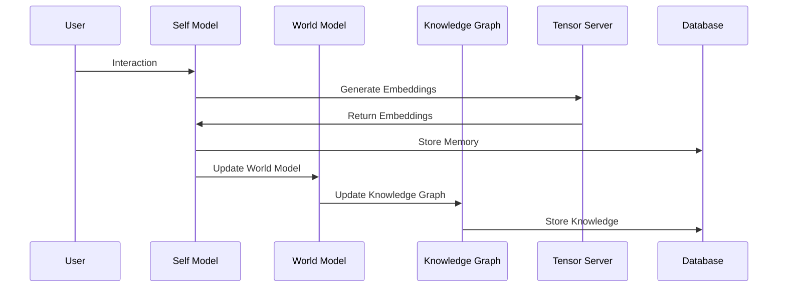

# Core Components

## Docker Server

The Docker container serves as Lucidia's primary runtime environment, hosting the core cognitive architecture and orchestrating interactions with external services.

### Features

- Self-contained environment with all dependencies
- Automatic startup and recovery
- Health monitoring and reporting
- Resource usage optimization
- Model switching based on system state
- WebSocket server for client interactions

### Configuration

```yaml
version: '3'
services:
  lucidia-core:
    image: lucidia/core:latest
    container_name: lucidia-core
    restart: always
    ports:
      - "8080:8080"  # WebSocket API
      - "8081:8081"  # HTTP API
    volumes:
      - ./data:/app/data
      - ./config:/app/config
    environment:
      - TENSOR_SERVER_URL=ws://tensor-server:5001
      - HPC_SERVER_URL=ws://hpc-server:5005
      - LM_STUDIO_URL=http://host.docker.internal:1234
      - LOG_LEVEL=INFO
```

## Memory System

The memory system manages Lucidia's experiences, knowledge, and reflections, providing persistent storage and retrieval mechanisms for the cognitive architecture.

### Components

- **Short-Term Memory**: Recent interactions and experiences
- **Long-Term Memory**: Consolidated knowledge and significant experiences
- **Memory Prioritization**: Determines significance and priority of memories
- **Embedding Storage**: Vector representations of memories for similarity search
- **Knowledge Graph**: Semantic network of concepts, entities, and relationships

### Memory Workflow



## Model Management

The model management system handles dynamic selection and switching between different LLMs based on system conditions and processing requirements.

### Available Models

The following models are available through the LM Studio server:

```json
{
  "data": [
    {"id": "qwen_qwq-32b", "object": "model", "owned_by": "organization_owner"},
    {"id": "text-embedding-nomic-embed-text-v1.5", "object": "model", "owned_by": "organization_owner"},
    {"id": "qwen2.5-7b-instruct-1m", "object": "model", "owned_by": "organization_owner"},
    {"id": "deepseek-r1-distill-llama-8b", "object": "model", "owned_by": "organization_owner"},
    {"id": "deepseek-r1-distill-qwen-7b", "object": "model", "owned_by": "organization_owner"},
    {"id": "llava-v1.5-7b", "object": "model", "owned_by": "organization_owner"},
    {"id": "qwen2.5-7b-instruct", "object": "model", "owned_by": "organization_owner"},
    {"id": "deepseek-coder-v2-lite-instruct", "object": "model", "owned_by": "organization_owner"},
    {"id": "phi-4", "object": "model", "owned_by": "organization_owner"},
    {"id": "phi-3.1-mini-128k-instruct", "object": "model", "owned_by": "organization_owner"}
  ],
  "object": "list"
}
```

### Model Selection Criteria

| State | Activity | Model Selection | Temperature | Reason |
|-------|----------|----------------|------------|--------|
| Active | Direct interaction | qwen2.5-7b-instruct or phi-4 | 0.7 | Balance of quality and response time |
| Background | User gaming | phi-3.1-mini-128k-instruct | 0.5 | Minimal resource usage during gaming |
| Reflective | User AFK (10+ min) | deepseek-r1-distill-qwen-7b | 0.8 | Better reflection capabilities |
| Dreaming | User sleeping/long AFK | qwen_qwq-32b | 1.2 | Advanced reasoning with increased creativity |

## Dream Testing

### Overview

The Dream Testing component is responsible for testing the dreaming workflow, ensuring that Lucidia can process memories, generate insights, and create structured reports.

### Test Script

The `test_dream_reflection.py` script is used to test the dreaming workflow. It simulates user interactions, adds test memories, and verifies the generation of insights and reports.

### Test Cases

1. **Memory Processing**: Test that memories are correctly processed and stored.
2. **Dream Generation**: Verify that dreams are generated based on memories and that insights are extracted.
3. **Report Creation**: Test that reports are created and refined correctly.
4. **Fragment Categorization**: Verify that fragments are correctly categorized as insights, questions, hypotheses, or counterfactuals.

## Parameter Reconfiguration System

The Parameter Reconfiguration System allows dynamic adjustment of system parameters at runtime.

### Implemented Features

- **Parameter Management**: Comprehensive `ParameterManager` with support for nested parameter paths, type validation, and value casting
- **Parameter API**: REST API endpoints for parameter configuration retrieval and updates
- **Configuration Validation**: JSON schema validation for parameter configurations
- **Parameter Change Handlers**: Event-based architecture for parameter changes
- **Parameter Persistence**: Robust mechanism for ensuring parameter changes persist across server restarts and between CLI and API interactions
- **Testing Framework**: Comprehensive test suite for the parameter system

### Parameter Categories

- **Memory Parameters**: Controls memory retention, significance thresholds, and integration rates
- **Dream Parameters**: Adjusts dream generation, insight extraction, and report creation
- **System Parameters**: Manages resource allocation, state transitions, and model selection
- **Spiral Parameters**: Configures spiral phases, reflection depth, and creativity ranges

### Parameter Persistence Mechanism

The parameter persistence mechanism ensures that parameter changes are properly saved and maintained across system restarts and between different components:

- **Configuration File**: All parameters are stored in a shared configuration file (`lucidia_config.json`) that serves as the single source of truth
- **ParameterManager Auto-Save**: The `ParameterManager` automatically saves parameter changes to disk after successful updates
- **Cross-Component Consistency**: Both the API server and CLI use the same configuration file path to ensure consistency
- **Default Parameter Creation**: Missing parameters are automatically created with sensible defaults when updated
- **Docker-Aware**: The persistence mechanism is designed to work seamlessly in Docker environments where components may run in separate containers

### Parameter Update Workflow

```mermaid
sequenceDiagram
    participant C as CLI
    participant A as Dream API
    participant P as Parameter Manager
    participant F as Config File
    
    C->>A: Update Parameter Request
    A->>P: Update Parameter
    P->>P: Validate & Apply Update
    P->>F: Save Config to Disk
    A->>C: Return Success
    C->>F: Update Local Config Copy