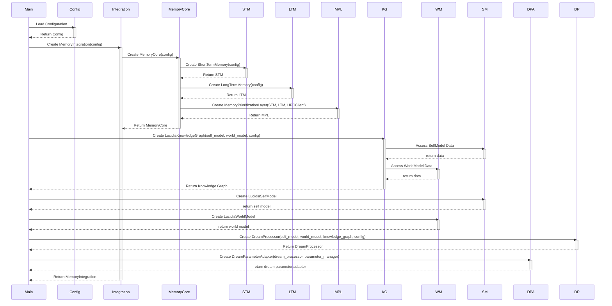
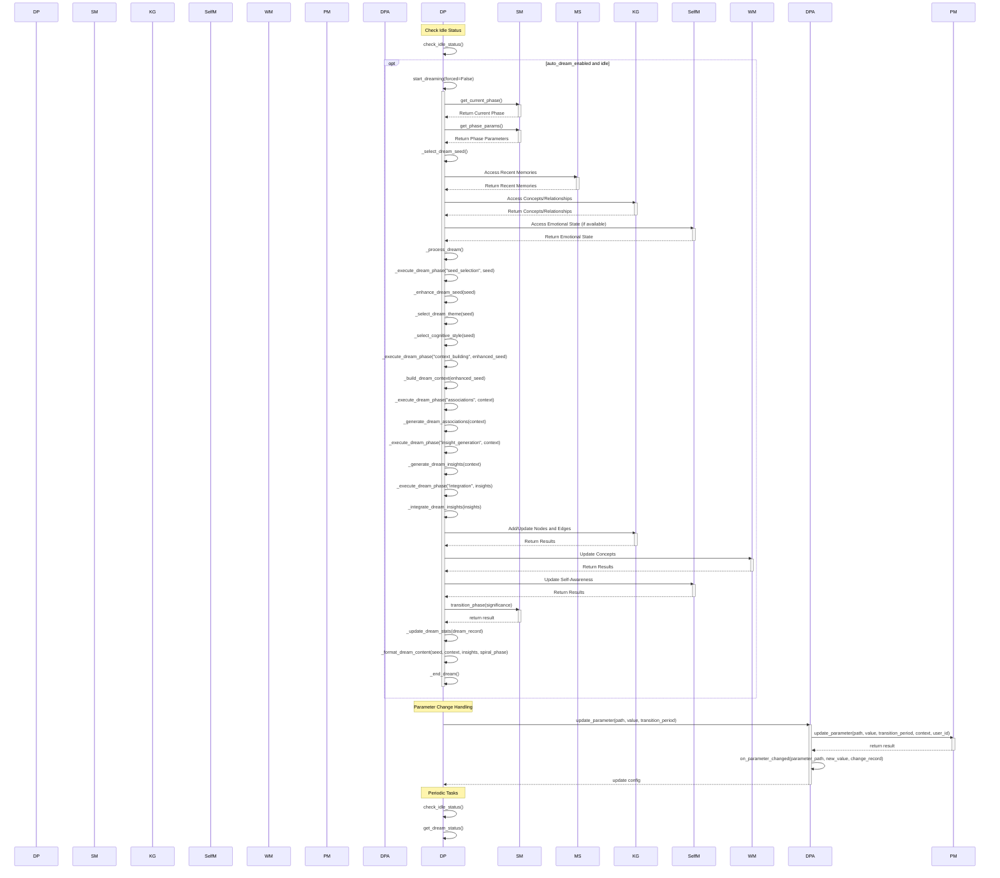

Okay, here's a comprehensive sequence diagram for the provided codebase, incorporating the sub-logic graphs you provided and addressing the nuances of the interaction flows between the different components. Because of the complexity and size of the whole system and its components, I am structuring it into multiple diagrams with specific focuses:

1.  **High-Level Initialization:** How the main components are initialized.
2.  **Dream Processing:** How the `DreamProcessor` handles dreaming.
3.  **Memory Interaction (Store/Recall):** How memories are stored and recalled via `MemoryIntegration`.
4.  **Knowledge Graph Interaction (Add/Update/Query):** Details interactions with the knowledge graph.
5. **Hypersphere Operations**
6. **Parameter Management**

I will use Mermaid sequence diagrams for clarity and readability.

### 1. High-Level Initialization Sequence Diagram



### 2. Dream Processing Sequence Diagram



### 3. Memory Interaction (Store/Recall) Sequence Diagram

```mermaid
sequenceDiagram
    participant Client
    participant Integration
    participant MemoryCore
    participant STM
    participant LTM
    participant MPL
    participant HPC
    participant EmbeddingComparator as EC

    Client->>Integration: store(content, metadata, importance)
    activate Integration
    Integration->>MemoryCore: process_and_store(content, memory_type, metadata)
    activate MemoryCore

    MemoryCore->>HPC: process_embedding(content)
    activate HPC
    HPC-->>MemoryCore: Return Embedding, Significance
    deactivate HPC

    MemoryCore->>STM: add_memory(content, embedding, metadata)
    activate STM
    STM-->>MemoryCore: Return STM ID
    deactivate STM

    MemoryCore->>MemoryCore: Evaluate Significance
    MemoryCore--{Significance >= threshold?} Yes
    MemoryCore->>LTM: store_memory(content, embedding, significance, metadata)
    activate LTM
    LTM-->>MemoryCore: Return LTM ID
    deactivate LTM
    MemoryCore-->>Integration: Return Result (success, stm_id, ltm_id)
    deactivate MemoryCore
    Integration-->>Client: Return Result
    deactivate Integration


    Client->>Integration: recall(query, limit, min_importance)
    activate Integration
    Integration->>MPL: route_query(query, context)
    activate MPL

    MPL->>STM: Check STM (get_recent, similarity)
    activate STM
    STM-->>MPL: Return STM Results
    deactivate STM

    MPL--{Strong match in STM?} Yes
    MPL-->>Integration: Return STM Results
    Integration-->>Client: return stm results
     deactivate Integration
     deactivate MPL


    MPL--{Strong match in STM?} No
    MPL->>LTM: Check LTM (search_memory)
    activate LTM
    LTM-->>MPL: Return LTM Results
    deactivate LTM

    MPL--{Strong match in LTM?} Yes
    MPL->>MPL: Merge STM & LTM Results
    MPL-->>Integration: Return Combined Results
    Integration-->>Client: Return Combined Results
    deactivate Integration
    deactivate MPL


    MPL--{Strong match in LTM?} No
    MPL->>HPC: Check HPC (fetch_relevant_embeddings)
    activate HPC
    HPC->>EC: get_embedding(query)
    activate EC
    EC-->>HPC: Return Embedding
    deactivate EC
    HPC-->>MPL: Return HPC Results
    deactivate HPC
    MPL->>MPL: Merge STM, LTM, HPC Results
    MPL-->>Integration: Return All Results
    Integration-->>Client: Return All Results
    deactivate Integration
    deactivate MPL
```

### 4. Knowledge Graph Interaction (Add/Update/Query) Sequence Diagram

```mermaid
sequenceDiagram
    participant Client
    participant KG
    participant WorldModel as WM
    participant SelfModel as SM

    Client->>KG: add_node(node_id, node_type, attributes, domain)
    activate KG
    KG--{Node exists?} Yes
    KG->>KG: Update Node Attributes
    KG--{Node exists?} No
    KG->>KG: Add New Node
    KG->>KG: Track Node Type
    KG-->>Client: Return Success
    deactivate KG

    Client->>KG: update_node(node_id, attributes)
    activate KG
    KG--{Node exists?} No
    KG-->>Client: Return Failure
    deactivate KG
    KG--{Node exists?} Yes
    KG->>KG: Update Node Attributes
    KG-->>Client: Return Success
    deactivate KG

    Client->>KG: add_edge(source, target, edge_type, attributes)
    activate KG
    KG--{Source/Target Exist?} No
    KG-->>Client: Return Failure
    deactivate KG
    KG--{Source/Target Exist?} Yes
    KG->>KG: Add Edge
    KG->>KG: Track Edge Type
    KG-->>Client: Return Edge Key
    deactivate KG

    Client->>KG: has_node(node_id)
    activate KG
    KG-->>Client: Return True/False
    deactivate KG

    Client->>KG: get_node(node_id)
    activate KG
    KG--{Node exists?} Yes
    KG-->>Client: Return Node Attributes
    deactivate KG
    KG--{Node exists?} No
    KG-->>Client: Return None
    deactivate KG

    Client->>KG: has_edge(source, target, edge_type)
    activate KG
    KG--{Nodes & Edge Exist?} Yes
    KG-->>Client: return True
    deactivate KG
     KG--{Nodes & Edge Exist?} No
    KG-->>Client: return False
    deactivate KG
    
    Client->>KG: search_nodes(query, node_type, domain, limit)
    activate KG
    KG->>KG: Search for Matching Nodes (ID/Attributes)
    KG-->>Client: return node list
    deactivate KG

    Client->>KG: get_neighbors(node_id, edge_type, min_strength)
    activate KG
    KG->>KG: Get Neighbor Nodes and Edges
    KG-->>Client: Return Neighbors
    deactivate KG
    
    Client ->> KG: get_connected_nodes(node_id, edge_types, node_types, direction, min_strength)
    activate KG
    KG ->> KG: Get all neighbors based on direction
    KG ->> KG: Filter neighbors by edge_type and strength
    KG ->> KG: Filter neighbors by node_type
    KG -->> Client: return list of node ids
    deactivate KG

    Client->>KG: find_paths(source, target, max_length, min_strength)
    activate KG
    KG->>KG: Find all Simple Paths (DFS)
    KG->>KG: Convert Paths to Edges with Attributes
    KG-->>Client: Return List of Paths
    deactivate KG

    Client ->>KG: get_most_relevant_nodes(node_type, domain, limit)
    activate KG
    KG ->>KG: filter nodes by type and domain
    KG ->>KG: Calculate Relevance for each node
    KG ->>KG: sort by relevance
    KG ->>KG: format results
    KG -->>Client: return nodes and relevance scores
    deactivate KG

    Client->>KG: integrate_dream_insight(insight_text, source_memory)
    activate KG
    KG->>KG: Add Dream Insight Node
    KG->>WM: Extract Concepts (if WorldModel available)
    activate WM
    WM-->>KG: Return Extracted Concepts
    deactivate WM
    KG->>KG: Connect to Existing Concepts
    KG->>KG: Create Relationships Between Concepts
    KG->>KG: Check for New Concepts (Definition Patterns)
    KG-->>Client: Return Integration Results
    deactivate KG

    Client ->> KG: integrate_dream_report(dream_report)
    activate KG
    KG ->> KG: Add Dream Report Node
    KG ->> KG: Connect to participating memories
    KG ->> KG: Connect to fragments (insight, question, hypothesis, counterfactual)
    KG ->> KG: Connect to related concepts
    KG ->> KG: Create relationships between referenced concepts
    KG -->> Client: return integration results
    deactivate KG

    Client->>KG: decay_relationships()
    activate KG
    KG->>KG: Apply Decay to Relationship Strengths
    KG-->>Client: Return None
    deactivate KG

    Client->>KG: prune_graph(min_strength, max_nodes)
    activate KG
    KG->>KG: Remove Weak Edges
    KG->>KG: Remove Low-Relevance Nodes (if needed)
    KG-->>Client: Return Pruning Stats
    deactivate KG
    Client ->> KG: visualize(node_subset, highlight_nodes, filename)
    activate KG
    KG ->> KG: create a networkx graph
    KG ->> KG: draw nodes, edges, labels
    KG -->> Client: return file_path
    deactivate KG
    Client ->> KG: save_state(file_path)
    activate KG
    KG -->> Client: return bool
    deactivate KG

    Client ->> KG: load_state(file_path)
    activate KG
    KG -->> Client: return bool
    deactivate KG

    Client ->> KG: async initialize_model_imports()
    activate KG
    KG->>KG: check if model imports are done
    KG ->> WM: _import_from_world_model()
    activate WM
    WM -->> KG: return
    deactivate WM
    KG ->> SM: _import_from_self_model()
    activate SM
    SM -->> KG: return
    deactivate SM
    KG ->> KG: set models_imported flag
    KG -->> Client: return
    deactivate KG
```

### 5. Hypersphere Operations Sequence Diagram
sequenceDiagram
    participant Client
    participant HypersphereDispatcher as HD
    participant TensorPool
    participant TensorServer
    participant HPCPool
    participant HPCServer
    participant GeometryRegistry as GR
    participant ConfidenceManager as CM
    participant DecayManager as DM
    participant BatchScheduler as BS

    Client->>HD: batch_similarity_search(query_embedding, memory_embeddings, memory_ids, model_version, top_k)
    activate HD
    HD->>GR: check_embedding_compatibility(model_version, query_embedding)
    activate GR
    GR-->>HD: Return True/False
    deactivate GR
    HD--{Incompatible} Yes
        HD->>HD: _normalize_embedding(query_embedding)

    HD->>GR: check_embedding_compatibility(model_version, memory_embeddings[0])  '(Check first, assume rest are same)'
      activate GR
    GR-->>HD: Return True/False
    deactivate GR
    HD--{Incompatible} Yes
        HD->>HD: _normalize_embedding(memory_embeddings)
        
    HD-->HPCPool: Get Connection
    activate HPCPool
    HPCPool-->>HD: Return Connection
    deactivate HPCPool
    HD->>HPCServer: Send Similarity Search Request
    HPCServer-->>HD: Return Similarities and Indices
    HD->>HD: _process_similarity_results(similarities, indices, memory_ids, top_k)
    HD-->>Client: Return Results (memory_ids, similarities)
    deactivate HD

    Client->>HD: decay_embedding(embedding, decay_rate, decay_method)
    activate HD
    HD->>DM: decay(embedding, decay_rate, decay_method)
    activate DM
    DM->>DM: Apply Decay Function
    DM-->>HD: Return Decayed Embedding
    deactivate DM
    HD-->>Client: Return Decayed Embedding
    deactivate HD

    Client->>HD: fetch_relevant_embeddings(query, criteria, limit)
    activate HD
    HD->>BS: schedule_embedding_fetch(query, criteria, limit)
    activate BS
    BS->>HPCServer: Batch Embedding Requests (if applicable)
     activate HPCServer
    HPCServer-->>BS: return embeddings
     deactivate HPCServer
    BS-->>HD: Return Embeddings
    deactivate BS
    HD-->>Client: Return Embeddings
    deactivate HD

    Client->>HD: get_embedding_history(memory_id)
    activate HD
    HD->>CM: get_confidence_scores(memory_id)
    activate CM
    CM-->>HD: return Confidence History
    deactivate CM
    HD-->>Client: Return Confidence History
    deactivate HD

    Client->>HD: register_model(model_name, geometry_config)
    activate HD
        HD->>GR: register_geometry(model_name, geometry_config)
        activate GR
        GR-->>HD: return success
        deactivate GR
    HD-->>Client: Return bool
    deactivate HD

    ### 6. Parameter Management

    sequenceDiagram
  participant Client
  participant DreamParameterAdapter as DPA
  participant ParameterManager as PM

  Client ->> DPA: update_parameter(path, value, transition_period)
  activate DPA
  DPA ->> PM: update_parameter(path, value, transition_period, context, user_id)
  activate PM
  PM->>PM: Calculate Final Value (considering limits, smoothing, etc.)
  PM->>PM: Store Parameter Change (history)
  PM-->>DPA: Return New Value (and optionally transition details)
  deactivate PM

  DPA->>DPA: on_parameter_changed(parameter_path, new_value, change_record)
  DPA-->>Client: Notify Parameter Change (optional)
  deactivate DPA

  Client->>PM: get_parameter(path, context, user_id)
  activate PM
  PM-->>Client: Return Current Value
  deactivate PM

    Client->>PM: get_parameter_history(path, context, user_id, limit)
    activate PM
    PM-->>Client: return parameter change history
    deactivate PM

    Client ->> PM: set_parameter_bounds(path, min_value, max_value, context, user_id)
    activate PM
    PM ->> PM: validate bounds
    PM ->> PM: store bounds
    PM -->> Client: return success
    deactivate PM

Client ->> PM: reset_parameter(path, context, user_id)
    activate PM
    PM ->> PM: validate context
    PM ->> PM: reset to default
    PM ->> PM: log reset
    PM -->> Client: return success
    deactivate PM