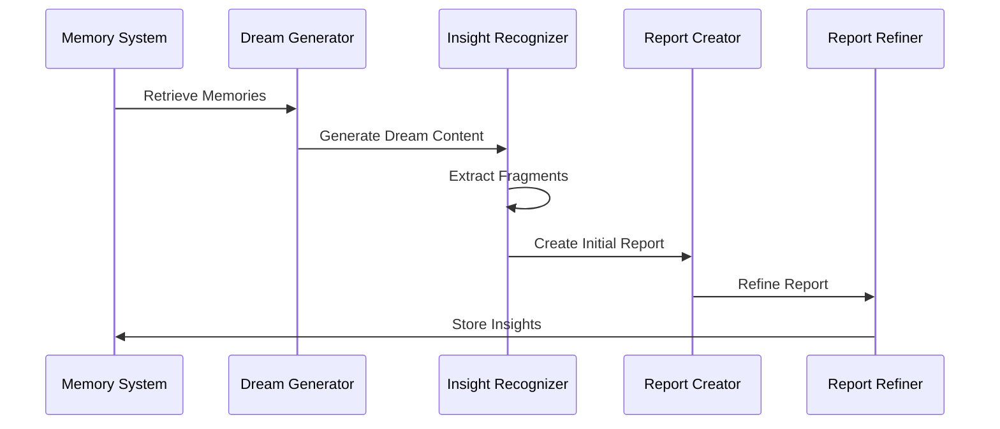

# Implementation Details

This document provides specific implementation details for key components of the Lucidia system.

## HPCSIGFlowManager

The `HPCSIGFlowManager` in `memory/lucidia_memory_system/core/integration/hpc_sig_flow_manager.py` handles hypersphere processing and significance calculation.

### Key Methods

```python
def process_embedding(self, embedding, operation="default"):
    """
    Process embeddings through the HPC pipeline.
    
    Args:
        embedding (numpy.ndarray): The embedding vector to process
        operation (str): The operation to perform
        
    Returns:
        dict: Results of the processing
    """
    try:
        preprocessed = self._preprocess_embedding(embedding)
        surprise = self._compute_surprise(preprocessed)
        
        return {
            "surprise": surprise,
            "normalized": preprocessed.tolist(),
            "operation": operation,
            "status": "success"
        }
    except Exception as e:
        return {"status": "error", "message": str(e)}

def _preprocess_embedding(self, embedding):
    """
    Normalize embedding to unit hypersphere.
    
    Args:
        embedding (numpy.ndarray): The embedding vector
        
    Returns:
        numpy.ndarray: Normalized embedding
    """
    # Convert to numpy array if necessary
    if not isinstance(embedding, np.ndarray):
        embedding = np.array(embedding)
    
    # Normalize to unit length
    norm = np.linalg.norm(embedding)
    if norm > 0:
        return embedding / norm
    return embedding

def _compute_surprise(self, embedding, reference_embeddings=None):
    """
    Calculate surprise score for an embedding.
    
    Args:
        embedding (numpy.ndarray): The normalized embedding
        reference_embeddings (list, optional): Reference embeddings
        
    Returns:
        float: Surprise score
    """
    # Default references if none provided
    if reference_embeddings is None:
        reference_embeddings = self.reference_embeddings
    
    if not reference_embeddings:
        return 0.5  # Default score if no references
    
    # Calculate minimum distance to reference embeddings
    distances = [
        1 - np.dot(embedding, ref_emb)
        for ref_emb in reference_embeddings
    ]
    
    min_distance = min(distances)
    
    # Calculate surprise as a function of minimum distance
    # Normalized to 0-1 range
    surprise = min(1.0, max(0.0, min_distance / 2.0))
    
    return surprise
```

## TensorServer Implementation

The `TensorServer` in `server/tensor_server.py` handles embedding generation and memory operations.

### Key Methods

```python
class TensorServer:
    def __init__(self, host="0.0.0.0", port=5001):
        self.host = host
        self.port = port
        self.clients = set()
        self.model = SentenceTransformer('all-MiniLM-L6-v2')
        self.hpc_manager = HPCSIGFlowManager()
        
        # Use GPU if available
        if torch.cuda.is_available():
            self.model = self.model.to('cuda')
        
    async def handle_client(self, websocket, path):
        """Handle client connection."""
        self.clients.add(websocket)
        try:
            async for message in websocket:
                await self.process_message(websocket, message)
        finally:
            self.clients.remove(websocket)
    
    async def process_message(self, websocket, message):
        """Process incoming messages."""
        data = json.loads(message)
        command = data.get('command')
        
        if command == 'embed':
            await self.handle_embed(websocket, data)
        elif command == 'search':
            await self.handle_search(websocket, data)
        elif command == 'stats':
            await self.handle_stats(websocket)
        else:
            await websocket.send(json.dumps({
                'status': 'error',
                'message': f'Unknown command: {command}'
            }))
    
    async def handle_embed(self, websocket, data):
        """Generate and store embeddings."""
        text = data.get('text')
        memory_id = data.get('id')
        
        if not text:
            await websocket.send(json.dumps({
                'status': 'error',
                'message': 'Missing text parameter'
            }))
            return
        
        # Generate embedding
        embedding = self.model.encode(text)
        
        # Process through HPC if integrated
        hpc_result = self.hpc_manager.process_embedding(embedding)
        
        # Store in database (simplified)
        # await self.db.store_embedding(memory_id, embedding, hpc_result['surprise'])
        
        await websocket.send(json.dumps({
            'status': 'success',
            'embedding': embedding.tolist(),
            'surprise': hpc_result['surprise'],
            'id': memory_id
        }))
```

## Dreaming Workflow

The dreaming workflow enables Lucidia to process memories during inactive periods, generating insights, questions, hypotheses, and counterfactuals.

### Components

- **Memory Retrieval**: Fetches relevant memories for reflection
- **Dream Generation**: Uses LLM to generate dreams based on memories
- **Insight Extraction**: Identifies key insights from dream content
- **Report Creation**: Organizes insights into structured reports
- **Report Refinement**: Improves reports through iterative processing

### Dream Processing Workflow



## Docker Container Service

The main Docker service implementation:

```python
class LucidiaService:
    def __init__(self, config_path="config/system.yml"):
        self.config = self._load_config(config_path)
        self.self_model = SelfModel()
        self.world_model = WorldModel(self_model=self.self_model)
        self.knowledge_graph = KnowledgeGraph(
            self_model=self.self_model,
            world_model=self.world_model
        )
        self.tensor_client = TensorClient(self.config["tensor_server_url"])
        self.hpc_client = HPCClient(self.config["hpc_server_url"])
        self.lm_studio_client = LMStudioClient(self.config["lm_studio_url"])
        
        self.current_model = self.config["default_model"]
        self.current_state = "active"
        self.last_interaction = time.time()
        
        # Start background tasks
        self.start_background_tasks()
    
    def start_background_tasks(self):
        """Start background processing tasks."""
        threading.Thread(target=self._monitor_system_state, daemon=True).start()
        threading.Thread(target=self._perform_maintenance, daemon=True).start()
    
    def _monitor_system_state(self):
        """Monitor system state and user activity."""
        while True:
            current_time = time.time()
            time_since_interaction = current_time - self.last_interaction
            
            # Check if user is AFK
            if time_since_interaction > 600:  # 10 minutes
                if self.current_state != "reflective" and self.current_state != "dreaming":
                    self._transition_to_reflective()
                
                # Check for extended AFK (dreaming state)
                if time_since_interaction > 3600:  # 1 hour
                    if self.current_state != "dreaming":
                        self._transition_to_dreaming()
            else:
                # Check if user is active but system should be in background mode
                if self._is_user_gaming() and self.current_state != "background":
                    self._transition_to_background()
                elif not self._is_user_gaming() and self.current_state == "background":
                    self._transition_to_active()
            
            time.sleep(60)  # Check every minute
    
    def _perform_maintenance(self):
        """Perform regular maintenance tasks."""
        while True:
            # Only perform in appropriate states
            if self.current_state in ["reflective", "dreaming"]:
                self._process_memories()
                
                if self.current_state == "dreaming":
                    self._generate_dream_insights()
            
            # Adjust sleep time based on state
            if self.current_state == "dreaming":
                time.sleep(300)  # 5 minutes
            else:
                time.sleep(900)  # 15 minutes
    
    def _transition_to_reflective(self):
        """Transition to reflective state."""
        self.current_state = "reflective"
        self._switch_model("deepseek-r1-distill-qwen-7b")
        self.self_model.update_spiral_phase("reflection")
        self.knowledge_graph.update_spiral_phase("reflection")
        print(f"Transitioned to reflective state using {self.current_model}")
    
    def _transition_to_dreaming(self):
        """Transition to dreaming state."""
        self.current_state = "dreaming"
        self._switch_model("qwen_qwq-32b")
        self.self_model.update_spiral_phase("reflection")
        self.knowledge_graph.update_spiral_phase("reflection")
        print(f"Transitioned to dreaming state using {self.current_model}")
    
    def _transition_to_background(self):
        """Transition to background state."""
        self.current_state = "background"
        self._switch_model("phi-3.1-mini-128k-instruct")
        self.self_model.update_spiral_phase("observation")
        self.knowledge_graph.update_spiral_phase("observation")
        print(f"Transitioned to background state using {self.current_model}")
    
    def _transition_to_active(self):
        """Transition to active state."""
        self.current_state = "active"
        self._switch_model("qwen2.5-7b-instruct")
        self.self_model.update_spiral_phase("execution")
        self.knowledge_graph.update_spiral_phase("execution")
        print(f"Transitioned to active state using {self.current_model}")
```

## Parameter Manager

The Parameter Manager handles configuration and dynamic reconfiguration of system parameters:

```python
class ParameterManager:
    def __init__(self, config_path=None):
        self.parameters = {}
        self.locked_parameters = set()
        self.observers = {}
        self.schema = {}
        
        if config_path:
            self.load_config(config_path)
    
    def load_config(self, config_path):
        """Load parameters from config file."""
        with open(config_path, 'r') as f:
            config = yaml.safe_load(f)
        
        # Load schema if available
        schema_path = os.path.join(os.path.dirname(config_path), 'schema.json')
        if os.path.exists(schema_path):
            with open(schema_path, 'r') as f:
                self.schema = json.load(f)
        
        self.parameters = config
        return config
    
    def get_parameter(self, path, default=None):
        """Get parameter value by path."""
        path_parts = path.split('.')
        value = self.parameters
        
        try:
            for part in path_parts:
                value = value[part]
            return value
        except (KeyError, TypeError):
            return default
    
    def set_parameter(self, path, value):
        """Set parameter value by path."""
        if path in self.locked_parameters:
            raise ValueError(f"Parameter {path} is locked")
        
        path_parts = path.split('.')
        target = self.parameters
        
        # Navigate to the parent of the target parameter
        for part in path_parts[:-1]:
            if part not in target:
                target[part] = {}
            target = target[part]
        
        # Validate against schema if available
        if self.schema:
            self._validate_parameter(path, value)
        
        # Set the value
        old_value = target.get(path_parts[-1])
        target[path_parts[-1]] = value
        
        # Notify observers
        if path in self.observers:
            for observer in self.observers[path]:
                observer(path, old_value, value)
        
        return True
    
    def lock_parameter(self, path):
        """Lock a parameter to prevent changes."""
        self.locked_parameters.add(path)
    
    def unlock_parameter(self, path):
        """Unlock a parameter."""
        if path in self.locked_parameters:
            self.locked_parameters.remove(path)
    
    def register_observer(self, path, callback):
        """Register observer for parameter changes."""
        if path not in self.observers:
            self.observers[path] = set()
        self.observers[path].add(callback)
    
    def unregister_observer(self, path, callback):
        """Unregister observer for parameter changes."""
        if path in self.observers and callback in self.observers[path]:
            self.observers[path].remove(callback)
```

## Resource Monitor

The Resource Monitor tracks system resource usage and optimizes performance:

```python
class ResourceMonitor:
    def __init__(self, config=None):
        self.config = config or {}
        self.max_cpu_usage = self.config.get('max_cpu_usage', 0.8)
        self.max_memory_usage = self.config.get('max_memory_usage', 0.7)
        self.max_gpu_usage = self.config.get('max_gpu_usage', 0.9)
        
        self.current_cpu_usage = 0
        self.current_memory_usage = 0
        self.current_gpu_usage = 0
        self.current_disk_usage = 0
        
        self.has_gpu = self._check_gpu_availability()
        self.system_state = SystemState.NORMAL
        
        # Start monitoring thread
        self.monitoring_thread = threading.Thread(target=self._monitor_resources, daemon=True)
        self.monitoring_thread.start()
    
    def _check_gpu_availability(self):
        """Check if GPU is available."""
        try:
            import torch
            return torch.cuda.is_available()
        except ImportError:
            return False
    
    def _monitor_resources(self):
        """Monitor system resources."""
        while True:
            self._update_resource_usage()
            self._update_system_state()
            time.sleep(5)  # Check every 5 seconds
    
    def _update_resource_usage(self):
        """Update current resource usage."""
        self.current_cpu_usage = psutil.cpu_percent(interval=1) / 100
        self.current_memory_usage = psutil.virtual_memory().percent / 100
        self.current_disk_usage = psutil.disk_usage('/').percent / 100
        
        if self.has_gpu:
            try:
                import torch
                self.current_gpu_usage = torch.cuda.memory_allocated() / torch.cuda.max_memory_allocated() if torch.cuda.max_memory_allocated() > 0 else 0
            except:
                self.current_gpu_usage = 0
    
    def _update_system_state(self):
        """Update system state based on resource usage."""
        # Check for low resources condition
        if (self.current_cpu_usage > self.max_cpu_usage or
            self.current_memory_usage > self.max_memory_usage or
            (self.has_gpu and self.current_gpu_usage > self.max_gpu_usage)):
            self.system_state = SystemState.LOW_RESOURCES
        elif (self.current_cpu_usage < self.max_cpu_usage * 0.5 and
              self.current_memory_usage < self.max_memory_usage * 0.5):
            self.system_state = SystemState.HIGH_RESOURCES
        else:
            self.system_state = SystemState.NORMAL
    
    def get_resource_usage(self):
        """Get current resource usage."""
        return {
            "cpu": self.current_cpu_usage,
            "memory": self.current_memory_usage,
            "disk": self.current_disk_usage,
            "gpu": self.current_gpu_usage if self.has_gpu else None,
            "system_state": self.system_state.name
        }
    
    def get_optimization_recommendations(self):
        """Get recommendations for resource optimization."""
        recommendations = []
        
        if self.current_cpu_usage > self.max_cpu_usage:
            recommendations.append({
                "resource": "cpu",
                "current": self.current_cpu_usage,
                "max": self.max_cpu_usage,
                "recommendation": "Consider switching to a lighter model or reducing background processing"
            })
        
        if self.current_memory_usage > self.max_memory_usage:
            recommendations.append({
                "resource": "memory",
                "current": self.current_memory_usage,
                "max": self.max_memory_usage,
                "recommendation": "Consider pruning memory or reducing embedding cache size"
            })
        
        if self.has_gpu and self.current_gpu_usage > self.max_gpu_usage:
            recommendations.append({
                "resource": "gpu",
                "current": self.current_gpu_usage,
                "max": self.max_gpu_usage,
                "recommendation": "Consider moving some operations to CPU or using a smaller model"
            })
        
        return recommendations
```

## ModelSelector

The ModelSelector dynamically chooses appropriate models based on system state and available resources:

```python
class ModelSelector:
    def __init__(self, lm_studio_client, resource_monitor, config=None):
        self.lm_studio_client = lm_studio_client
        self.resource_monitor = resource_monitor
        self.config = config or {}
        
        self.available_models = []
        self.current_model = None
        self.default_model = self.config.get('default_model', 'qwen2.5-7b-instruct')
        
        # Model configuration by state
        self.state_models = {
            SystemState.ACTIVE: self.config.get('active_model', 'qwen2.5-7b-instruct'),
            SystemState.BACKGROUND: self.config.get('background_model', 'phi-3.1-mini-128k-instruct'),
            SystemState.REFLECTIVE: self.config.get('reflective_model', 'deepseek-r1-distill-qwen-7b'),
            SystemState.DREAMING: self.config.get('dreaming_model', 'qwen_qwq-32b'),
            SystemState.LOW_RESOURCES: self.config.get('low_resource_model', 'phi-3.1-mini-128k-instruct'),
            SystemState.HIGH_RESOURCES: self.config.get('high_resource_model', 'qwen2.5-7b-instruct')
        }
        
        # Initialize available models
        self._update_available_models()
    
    async def _update_available_models(self):
        """Update the list of available models from LM Studio."""
        try:
            models_response = await self.lm_studio_client.list_models()
            if 'data' in models_response:
                self.available_models = [model['id'] for model in models_response['data']]
            else:
                self.available_models = []
        except Exception as e:
            print(f"Error updating available models: {e}")
            self.available_models = []
    
    def select_model_for_state(self, state):
        """Select an appropriate model for the given system state."""
        # Get preferred model for this state
        preferred_model = self.state_models.get(state, self.default_model)
        
        # Check if preferred model is available
        if preferred_model in self.available_models:
            return preferred_model
        
        # Fall back to default model if available
        if self.default_model in self.available_models:
            return self.default_model
        
        # Fall back to first available model
        if self.available_models:
            return self.available_models[0]
        
        # No models available
        return None
    
    async def update_model_based_on_state(self, state):
        """Update the current model based on system state."""
        # First, update available models
        await self._update_available_models()
        
        # Select appropriate model
        selected_model = self.select_model_for_state(state)
        
        # If model is different from current and is available, switch to it
        if selected_model and selected_model != self.current_model:
            try:
                await self.lm_studio_client.set_model(selected_model)
                self.current_model = selected_model
                return True
            except Exception as e:
                print(f"Error switching to model {selected_model}: {e}")
                return False
        
        return False
```