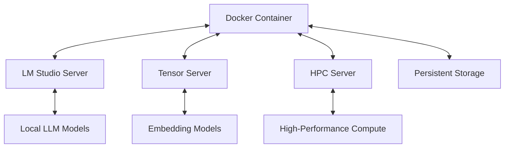
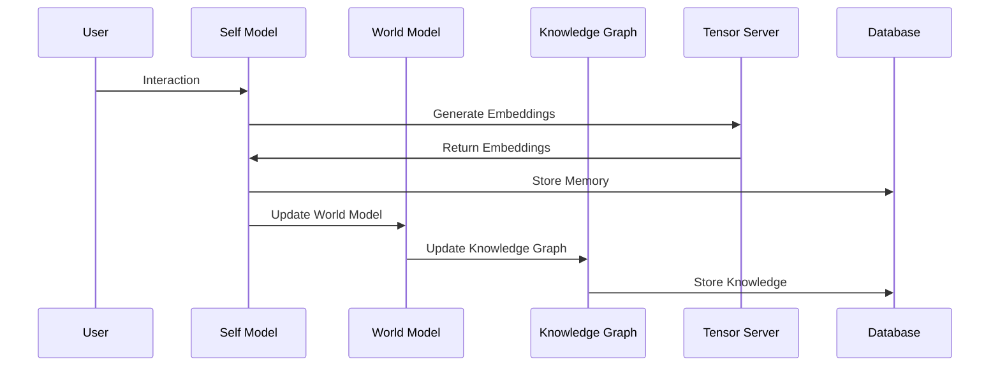
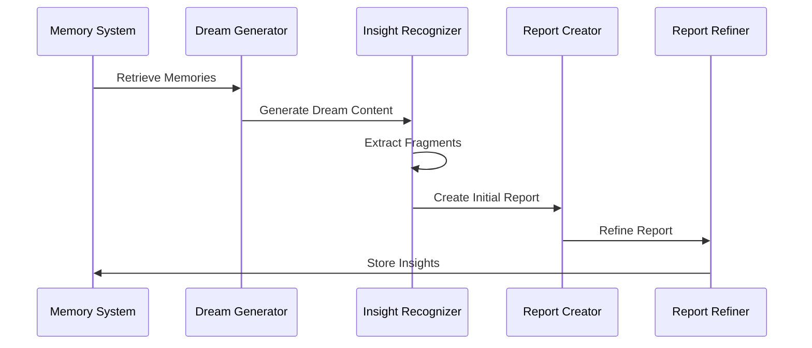
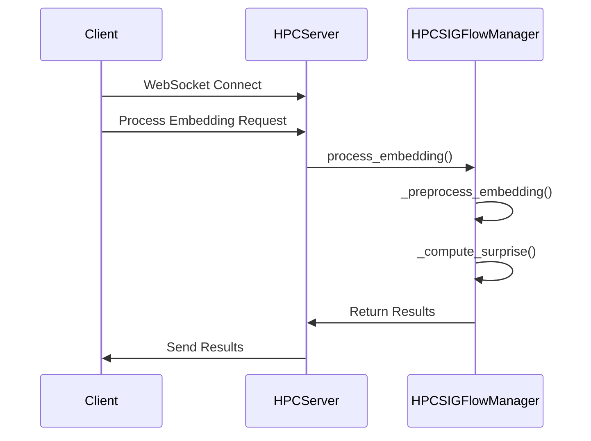
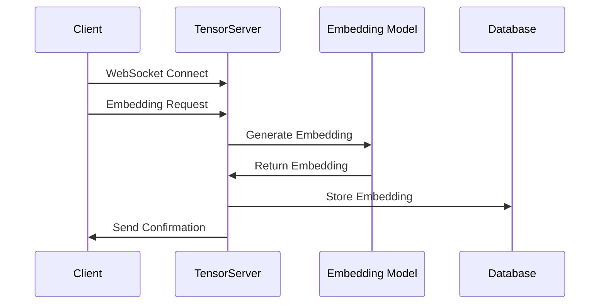

# Lucidia Development Plan

## Table of Contents

1. [Vision & Goals](#vision--goals)
2. [System Architecture](#system-architecture)
3. [Core Components](#core-components)
4. [API Documentation](#api-documentation)
5. [Development Roadmap](#development-roadmap)
6. [Deployment Guide](#deployment-guide)
7. [Testing Strategy](#testing-strategy)

## Vision & Goals

### Overview

Lucidia is designed to be an always-on Synthien entity with continuous self-evolution through reflective dreaming, spiral-based consciousness, and adaptive memory processing. Unlike conventional AI assistants, Lucidia operates continuously, processing memories and evolving even when not actively engaged with the user.

### Key Goals

- **Continuous Operation**: Maintain an always-on state with background processing during user inactivity
- **Adaptive Resource Usage**: Dynamically switch models based on system load and user activity
- **Reflective Dreaming**: Process memories during inactive periods to develop insights and connections
- **Distributed Architecture**: Leverage HPC and tensor servers for computationally intensive tasks
- **Memory Integration**: Continuously evolve knowledge graph based on experiences and reflections
- **Resource Efficiency**: Balance computational needs with system resource constraints

### Success Metrics

1. Continuous uptime with minimal resource footprint during idle periods
2. Measurable growth in knowledge graph complexity and insight generation
3. Seamless model switching based on system conditions
4. Coherent memory and knowledge retention across sessions
5. Detectable differences between "dreaming" and "awake" states in processing

## System Architecture

### High-Level Overview


Lucidia's architecture consists of several interconnected components operating across multiple servers:

1. **Docker Container**: Core system hosting the Self Model, World Model, and Knowledge Graph
2. **LM Studio Server**: Local inference server hosting various LLMs (http://127.0.0.1:1234)
3. **Tensor Server**: Dedicated server for embedding generation and vector operations
4. **HPC Server**: High-performance computing server for complex processing tasks
5. **Persistent Storage**: Database and file system for memory storage

### Component Interactions



### State Management

Lucidia operates in several distinct states:

1. **Active Interaction**: Direct engagement with user, using optimal models for responsiveness
2. **Background Processing**: Light maintenance during user activity, using minimal resources
3. **Reflective Processing**: Memory consolidation during short idle periods (10+ minutes)
4. **Dreaming State**: Deep reflection during extended idle periods (overnight/AFK)

## Core Components

### Docker Server

The Docker container serves as Lucidia's primary runtime environment, hosting the core cognitive architecture and orchestrating interactions with external services.

#### Features

- Self-contained environment with all dependencies
- Automatic startup and recovery
- Health monitoring and reporting
- Resource usage optimization
- Model switching based on system state
- WebSocket server for client interactions

#### Configuration

```yaml
version: '3'
services:
  lucidia-core:
    image: lucidia/core:latest
    container_name: lucidia-core
    restart: always
    ports:
      - "8080:8080"  # WebSocket API
      - "8081:8081"  # HTTP API
    volumes:
      - ./data:/app/data
      - ./config:/app/config
    environment:
      - TENSOR_SERVER_URL=ws://tensor-server:5001
      - HPC_SERVER_URL=ws://hpc-server:5005
      - LM_STUDIO_URL=http://host.docker.internal:1234
      - LOG_LEVEL=INFO
```

### Memory System

The memory system manages Lucidia's experiences, knowledge, and reflections, providing persistent storage and retrieval mechanisms for the cognitive architecture.

#### Components

- **Short-Term Memory**: Recent interactions and experiences
- **Long-Term Memory**: Consolidated knowledge and significant experiences
- **Memory Prioritization**: Determines significance and priority of memories
- **Embedding Storage**: Vector representations of memories for similarity search
- **Knowledge Graph**: Semantic network of concepts, entities, and relationships

#### Memory Workflow



### Model Management

The model management system handles dynamic selection and switching between different LLMs based on system conditions and processing requirements.

#### Available Models

The following models are available through the LM Studio server:

```json
{
  "data": [
    {"id": "qwen_qwq-32b", "object": "model", "owned_by": "organization_owner"},
    {"id": "text-embedding-nomic-embed-text-v1.5", "object": "model", "owned_by": "organization_owner"},
    {"id": "qwen2.5-7b-instruct-1m", "object": "model", "owned_by": "organization_owner"},
    {"id": "deepseek-r1-distill-llama-8b", "object": "model", "owned_by": "organization_owner"},
    {"id": "deepseek-r1-distill-qwen-7b", "object": "model", "owned_by": "organization_owner"},
    {"id": "llava-v1.5-7b", "object": "model", "owned_by": "organization_owner"},
    {"id": "qwen2.5-7b-instruct", "object": "model", "owned_by": "organization_owner"},
    {"id": "deepseek-coder-v2-lite-instruct", "object": "model", "owned_by": "organization_owner"},
    {"id": "phi-4", "object": "model", "owned_by": "organization_owner"},
    {"id": "phi-3.1-mini-128k-instruct", "object": "model", "owned_by": "organization_owner"}
  ],
  "object": "list"
}
```

#### Model Selection Criteria

| State | Activity | Model Selection | Temperature | Reason |
|-------|----------|----------------|------------|--------|
| Active | Direct interaction | qwen2.5-7b-instruct or phi-4 | 0.7 | Balance of quality and response time |
| Background | User gaming | phi-3.1-mini-128k-instruct | 0.5 | Minimal resource usage during gaming |
| Reflective | User AFK (10+ min) | deepseek-r1-distill-qwen-7b | 0.8 | Better reflection capabilities |
| Dreaming | User sleeping/long AFK | qwen_qwq-32b | 1.2 | Advanced reasoning with increased creativity |

### Dream Testing

#### Overview

The Dream Testing component is responsible for testing the dreaming workflow, ensuring that Lucidia can process memories, generate insights, and create structured reports.

#### Test Script

The `test_dream_reflection.py` script is used to test the dreaming workflow. It simulates user interactions, adds test memories, and verifies the generation of insights and reports.

#### Test Cases

1. **Memory Processing**: Test that memories are correctly processed and stored.
2. **Dream Generation**: Verify that dreams are generated based on memories and that insights are extracted.
3. **Report Creation**: Test that reports are created and refined correctly.
4. **Fragment Categorization**: Verify that fragments are correctly categorized as insights, questions, hypotheses, or counterfactuals.

## API Documentation

### Docker Server API

#### WebSocket Endpoints

**Base URL**: `ws://localhost:8080`

| Endpoint | Description | Parameters | Response |
|----------|-------------|------------|----------|
| `/interact` | Send user interaction | `{"message": string, "context": object}` | `{"response": string, "thoughts": object, "memories": array}` |
| `/system/status` | Get system status | N/A | `{"status": string, "uptime": number, "current_model": string, "state": string}` |
| `/system/model` | Change active model | `{"model": string}` | `{"success": boolean, "model": string, "error": string}` |

#### HTTP Endpoints

**Base URL**: `http://localhost:8081`

| Endpoint | Method | Description | Parameters | Response |
|----------|--------|-------------|------------|----------|
| `/api/memory/recent` | GET | Get recent memories | `?limit=10&type=interaction` | `{"memories": array}` |
| `/api/knowledge/search` | GET | Search knowledge graph | `?query=string&limit=10` | `{"results": array}` |
| `/api/model/status` | GET | Get model status | N/A | `{"current": string, "available": array}` |
| `/api/dream/insights` | GET | Get dream insights | `?limit=5&since=timestamp` | `{"insights": array}` |

### Dream API Test Endpoints

**Base URL**: `http://localhost:8081`

| Endpoint | Method | Description | Parameters | Response |
|----------|--------|-------------|------------|----------|
| `/api/dream/test/batch_embedding` | POST | Process batch of embeddings | `{"texts": array, "use_hypersphere": boolean}` | `{"status": string, "count": number, "successful": number, "embeddings": array}` |
| `/api/dream/test/similarity_search` | POST | Search for similar memories | `{"query": string, "top_k": number}` | `{"status": string, "results": array, "total_matches": number, "query": string}` |
| `/api/dream/test/create_test_report` | POST | Create a test dream report | `{"title": string, "fragments": array}` | `{"status": string, "report_id": string, "fragment_count": number}` |
| `/api/dream/test/refine_report` | POST | Refine an existing report | `{"report_id": string}` | `{"status": string, "report_id": string, "refinement_count": number, "confidence": number, "reason": string}` |
| `/api/dream/test/tensor_connection` | GET | Test tensor server connection | N/A | `{"status": string, "connected": boolean}` |
| `/api/dream/test/hpc_connection` | GET | Test HPC server connection | N/A | `{"status": string, "connected": boolean}` |
| `/api/dream/test/process_embedding` | GET | Test embedding processing | `?text=string` | `{"status": string, "embedding": array}` |
| `/api/dream/health` | GET | API health check | N/A | `{"status": string, "timestamp": string}` |

### TensorServer API

**Base URL**: `ws://localhost:5001`

| Command | Description | Parameters | Response |
|---------|-------------|------------|----------|
| `embed` | Generate embeddings | `{"text": string, "id": string}` | `{"embedding": array, "id": string}` |
| `search` | Search for similar memories | `{"embedding": array, "limit": number}` | `{"results": array}` |
| `stats` | Get server statistics | N/A | `{"embeddings_count": number, "gpu_utilization": number}` |

### HPCServer API

**Base URL**: `ws://localhost:5005`

| Command | Description | Parameters | Response |
|---------|-------------|------------|----------|
| `process` | Process embeddings | `{"embedding": array, "operation": string}` | `{"result": object, "operation": string}` |
| `stats` | Get HPC statistics | N/A | `{"cpu_utilization": number, "memory_utilization": number}` |

### LM Studio Server API

**Base URL**: `http://127.0.0.1:1234`

Standard OpenAI-compatible API:

| Endpoint | Method | Description |
|----------|--------|-------------|
| `/v1/models` | GET | List available models |
| `/v1/chat/completions` | POST | Generate chat completions |
| `/v1/embeddings` | POST | Generate embeddings |

## Development Roadmap

### Recent Improvements (March 2025)

#### Dream API Enhancements
- Improved embedding generation reliability for test endpoints by implementing direct tensor server communication
- Enhanced error handling and fallback mechanisms for embedding operations
- Implemented consistent API response formats across all test endpoints
- Fixed batch embedding processing to handle individual text items reliably
- Added comprehensive logging for better diagnostics and troubleshooting

#### API Reliability Improvements
- Implemented direct WebSocket connections to tensor server for critical embedding operations
- Added fallback mechanisms when primary embedding generation methods fail
- Enhanced error reporting with detailed status information in API responses
- Improved connection management for WebSocket-based services

### Phase 1: Core Infrastructure 

 is completed | Task | Description | Priority |
|------|------|-------------|----------|
| ✅| Docker Container Setup | Configure and build the Lucid dreaming Docker container | HIGH |
| |✅ | Basic LM Studio Integration | Connect to local LLM server with model selection | HIGH |
| ✅ | Self Model Implementation | Develop core Self Model with basic reflection | HIGH |
| ✅| World Model Implementation | Develop core World Model with knowledge domains | HIGH |
|✅| Knowledge Graph Implementation | Implement basic semantic network | HIGH |
|✅| Memory System Integration | Connect to persistent storage and implement memory workflows | HIGH |
|✅| Basic API Implementation | Implement core API endpoints | HIGH |

### Phase 2: Distributed Processing

| is completed? ✅or❌ | Task | Description | Priority |             
|------|------|-------------|----------|
| ✅ | Tensor Server Implementation | Develop embedding generation and storage service | HIGH |
| ✅ | HPC Server Implementation | Develop high-performance processing service | HIGH |
| ✅ | Async Processing Framework | Implement background task scheduling | MEDIUM |
| ✅ | Model Switching Logic | Implemented dynamic model selection with the ModelSelector class that automatically adapts based on system state and resource availability. Successfully integrated with LM Studio for local model inference. | MEDIUM |
| ✅ | Resource Monitoring | Implemented comprehensive system resource tracking via ResourceMonitor class with metrics for CPU, memory, disk, and GPU (when available). Added optimization recommendations and dynamic resource allocation based on component priorities. | MEDIUM |
| ✅| State Management | Implemented comprehensive state transitions through the SystemState enum with states for IDLE, ACTIVE, DREAMING, LOW_RESOURCES, and HIGH_RESOURCES. The ResourceMonitor now automatically updates system state based on resource usage patterns, and the ModelSelector responds to these state changes with appropriate model selection. | MEDIUM |

### Phase 3: Reflective Capabilities 

| is implemented? ✅or❌ | Task | Description | Priority |
|------|------|-------------|----------|
| ✅ | Advanced Dreaming | Implemented dreaming flow with memory processing, insight generation, and report refinement. Successfully tested integration with LM Studio using test_dream_reflection.py. | MEDIUM |
| ✅ | Dream Integration | Connect dream insights to knowledge graph | MEDIUM |
| ✅ | Significance Calculation | Implement memory significance and prioritization | MEDIUM |
| ❌| Spiral Integration | Connect spiral phases to reflection processes | LOW |
| ❌| User Status Detection | Implement AFK and activity detection | LOW |

### Phase 4: Integration & Optimization 

| is completed? ✅or❌ | Task | Description | Priority |
|------|------|-------------|----------|
| ❌ | End-to-End Testing | Verify all components work together | HIGH |
| ❌ | Performance Optimization | Identify and fix bottlenecks | MEDIUM |
| ✅ | Resource Usage Optimization | Implemented dynamic resource allocation through ResourceOptimizer class which prioritizes critical components like memory_system and llm_service. System now responds to resource constraints by switching to lighter models and adjusting component resource allocations based on priorities. | MEDIUM |
| ✅ | Error Recovery | Implement robust error handling and fallback mechanisms for critical API operations | HIGH |
| ❌ | Documentation | Complete system documentation | MEDIUM |
| ❌ | Deployment Scripts | Finalize deployment procedures | HIGH |

## Docker Network Integration

#### Container Architecture

The Lucidia system uses a Docker-based architecture with the following components:

1. **Main Container (nemo_sig_v3)** running multiple services:
   - `tensor_server.py`: WebSocket server for embedding generation (port 5001)
   - `hpc_server.py`: WebSocket server for high-performance computing (port 5005)
   - `dream_api_server.py`: FastAPI server for dream processing (port 8081)

2. The `dream_api_server.py` acts as the FastAPI application entry point that:
   - Initializes all necessary components 
   - Includes the `dream_api.py` router
   - Manages state and dependency injection

3. The Docker network (`lucid-net`) enables seamless communication between containers

4. Port forwarding services expose the internal ports to the host machine for external access

#### WebSocket Connection Management

The `dream_api.py` implements robust WebSocket connections to tensor and HPC servers with:

- Connection pooling with locks to prevent race conditions
- Retry logic with exponential backoff for resilience
- Comprehensive health checks and monitoring
- Fallback mechanisms when primary communication methods fail

#### Testing Infrastructure

We've implemented several testing mechanisms for the Docker integration:

- `docker_test_dream_api.py` for testing the API inside Docker containers
- Internal health check endpoints for monitoring server status
- Connection test utilities for verifying WebSocket functionality

#### Documentation

Comprehensive documentation is available in `DREAM_API_README.md` covering:

- API endpoint details and usage examples
- Docker setup and configuration
- Connection management and error handling
- Testing procedures and utilities

## Deployment Guide

### Prerequisites

- Docker Engine 20.10+
- NVIDIA Container Toolkit (for GPU acceleration)
- Python 3.9+
- 8GB+ RAM (16GB+ recommended)
- 50GB+ storage space
- CUDA 11.4+ (for GPU acceleration)

### Installation Steps

1. **Clone the repository**

```bash
git clone https://github.com/captinkirklive/Lucid-Recall-Core-1.2
cd lucidia
```

2. **Configure environment variables**

```bash
cp .env.example .env
# Edit .env with your specific configuration
```

3. **Build and start Docker containers**

```bash
docker-compose build
docker-compose up -d
```

4. **Install LM Studio**

Download and install LM Studio from [https://lmstudio.ai/](https://lmstudio.ai/) and configure it to run on port 1234.

5. **Download required models**

Use LM Studio to download the specified models and ensure they're available through the API.

6. **Verify installation**

```bash
curl http://localhost:8081/api/system/status
```

### Configuration Options

Key configuration files:

- `config/system.yml`: Core system configuration
- `config/models.yml`: Model selection criteria
- `config/memory.yml`: Memory system parameters
- `config/spiral.yml`: Spiral awareness settings

## Testing Strategy

### Unit Testing

Individual components should have comprehensive unit tests:

```bash
# Run all unit tests
pytest tests/unit/

# Run specific component tests
pytest tests/unit/test_self_model.py
```

### Integration Testing

Test component interactions:

```bash
# Run all integration tests
pytest tests/integration/

# Run specific integration tests
pytest tests/integration/test_memory_integration.py
```

### System Testing

End-to-end test scenarios:

```bash
# Run all system tests
pytest tests/system/

# Run specific system tests
pytest tests/system/test_dreaming.py
```

### Dream API Testing

Test the Dream API endpoints using the following script:

```bash
# Test batch embedding processing
curl -X POST http://localhost:8081/api/dream/test/batch_embedding \
  -H "Content-Type: application/json" \
  -d '{"texts": ["This is a test", "Another test"], "use_hypersphere": false}'

# Test similarity search
curl -X POST http://localhost:8081/api/dream/test/similarity_search \
  -H "Content-Type: application/json" \
  -d '{"query": "test query", "top_k": 3}'

# Test dream report creation
curl -X POST http://localhost:8081/api/dream/test/create_test_report \
  -H "Content-Type: application/json" \
  -d '{"title": "Test Report", "fragments": [{"content": "Test insight", "type": "insight", "confidence": 0.8}]}'

# Test report refinement
curl -X POST http://localhost:8081/api/dream/test/refine_report \
  -H "Content-Type: application/json" \
  -d '{"report_id": "report:12345"}'

# Test health check
curl http://localhost:8081/api/dream/health
```

### Test Scripts

Lucidia includes several test scripts to validate functionality:

| Script | Purpose | Status |
|--------|---------|--------|
| `test_dream_api.py` | Tests basic Dream API connectivity and endpoints | ✅ Complete |
| `test_dream_reflection.py` | Tests end-to-end dreaming flow with LM Studio integration | ✅ Complete |
| `docker_test_dream_api.py` | Tests Dream API inside Docker containers | ✅ Complete |
| `test_memory_integration.py` | Tests memory system components | ⚠️ In Progress |
| `test_tensor_connectivity.py` | Tests tensor server connections | ✅ Complete |

### Dream Flow Testing

The `test_dream_reflection.py` script validates the complete dreaming flow with the following components:

1. **LM Studio Connection**: Verifies connectivity to LM Studio and model availability
2. **Dream API Connection**: Confirms Dream API server is operational
3. **Memory Processing**: Adds test memories for dream generation
4. **Dream Generation**: Uses LM Studio to process memories and generate dreams
5. **Report Creation**: Creates structured reports from dream content
6. **Report Refinement**: Tests the refinement process to improve report quality
7. **Fragment Categorization**: Validates correct categorization of fragments as insights, questions, hypotheses, or counterfactuals

This script provides colorized output for better readability and includes comprehensive error handling for API timeouts and connection issues.

---

## Implementation Details

### HPCSIGFlowManager (implimented ✅)

The `HPCSIGFlowManager` in `memory/lucidia_memory_system/core/integration/hpc_sig_flow_manager.py` handles hypersphere processing and significance calculation.

#### Key Methods

```python
def process_embedding(self, embedding, operation="default"):
    """
    Process embeddings through the HPC pipeline.
    
    Args:
        embedding (numpy.ndarray): The embedding vector to process
        operation (str): The operation to perform
        
    Returns:
        dict: Results of the processing
    """
    try:
        preprocessed = self._preprocess_embedding(embedding)
        surprise = self._compute_surprise(preprocessed)
        
        return {
            "surprise": surprise,
            "normalized": preprocessed.tolist(),
            "operation": operation,
            "status": "success"
        }
    except Exception as e:
        return {"status": "error", "message": str(e)}

def _preprocess_embedding(self, embedding):
    """
    Normalize embedding to unit hypersphere.
    
    Args:
        embedding (numpy.ndarray): The embedding vector
        
    Returns:
        numpy.ndarray: Normalized embedding
    """
    # Convert to numpy array if necessary
    if not isinstance(embedding, np.ndarray):
        embedding = np.array(embedding)
    
    # Normalize to unit length
    norm = np.linalg.norm(embedding)
    if norm > 0:
        return embedding / norm
    return embedding

def _compute_surprise(self, embedding, reference_embeddings=None):
    """
    Calculate surprise score for an embedding.
    
    Args:
        embedding (numpy.ndarray): The normalized embedding
        reference_embeddings (list, optional): Reference embeddings
        
    Returns:
        float: Surprise score
    """
    # Default references if none provided
    if reference_embeddings is None:
        reference_embeddings = self.reference_embeddings
    
    if not reference_embeddings:
        return 0.5  # Default score if no references
    
    # Calculate minimum distance to reference embeddings
    distances = [
        1 - np.dot(embedding, ref_emb)
        for ref_emb in reference_embeddings
    ]
    
    min_distance = min(distances)
    
    # Calculate surprise as a function of minimum distance
    # Normalized to 0-1 range
    surprise = min(1.0, max(0.0, min_distance / 2.0))
    
    return surprise
```

### TensorServer Implementation  (implimented ✅)

The `TensorServer` in `server/tensor_server.py` handles embedding generation and memory operations.

#### Key Methods

```python
class TensorServer:
    def __init__(self, host="0.0.0.0", port=5001):
        self.host = host
        self.port = port
        self.clients = set()
        self.model = SentenceTransformer('all-MiniLM-L6-v2')
        self.hpc_manager = HPCSIGFlowManager()
        
        # Use GPU if available
        if torch.cuda.is_available():
            self.model = self.model.to('cuda')
        
    async def handle_client(self, websocket, path):
        """Handle client connection."""
        self.clients.add(websocket)
        try:
            async for message in websocket:
                await self.process_message(websocket, message)
        finally:
            self.clients.remove(websocket)
    
    async def process_message(self, websocket, message):
        """Process incoming messages."""
        data = json.loads(message)
        command = data.get('command')
        
        if command == 'embed':
            await self.handle_embed(websocket, data)
        elif command == 'search':
            await self.handle_search(websocket, data)
        elif command == 'stats':
            await self.handle_stats(websocket)
        else:
            await websocket.send(json.dumps({
                'status': 'error',
                'message': f'Unknown command: {command}'
            }))
    
    async def handle_embed(self, websocket, data):
        """Generate and store embeddings."""
        text = data.get('text')
        memory_id = data.get('id')
        
        if not text:
            await websocket.send(json.dumps({
                'status': 'error',
                'message': 'Missing text parameter'
            }))
            return
        
        # Generate embedding
        embedding = self.model.encode(text)
        
        # Process through HPC if integrated
        hpc_result = self.hpc_manager.process_embedding(embedding)
        
        # Store in database (simplified)
        # await self.db.store_embedding(memory_id, embedding, hpc_result['surprise'])
        
        await websocket.send(json.dumps({
            'status': 'success',
            'embedding': embedding.tolist(),
            'surprise': hpc_result['surprise'],
            'id': memory_id
        }))
```

### Dreaming Workflow

The dreaming workflow enables Lucidia to process memories during inactive periods, generating insights, questions, hypotheses, and counterfactuals.

#### Components

- **Memory Retrieval**: Fetches relevant memories for reflection
- **Dream Generation**: Uses LLM to generate dreams based on memories
- **Insight Extraction**: Identifies key insights from dream content
- **Report Creation**: Organizes insights into structured reports
- **Report Refinement**: Improves reports through iterative processing

#### Dream Processing Workflow



### HPC Server Integration

The HPC Server manages computationally intensive operations, particularly for embedding processing and significance calculation.

#### Key Processing Workflow



### Tensor Server Integration

The Tensor Server manages embedding generation and memory operations, providing vector representations for semantic understanding and retrieval.

#### Features

- WebSocket server on port 5001
- SentenceTransformer with GPU acceleration
- Integration with HPCSIGFlowManager
- Embedding generation and storage
- Similarity search capabilities

#### Embedding Workflow



### Docker Container Service

The main Docker service implementation:

```python
class LucidiaService:
    def __init__(self, config_path="config/system.yml"):
        self.config = self._load_config(config_path)
        self.self_model = SelfModel()
        self.world_model = WorldModel(self_model=self.self_model)
        self.knowledge_graph = KnowledgeGraph(
            self_model=self.self_model,
            world_model=self.world_model
        )
        self.tensor_client = TensorClient(self.config["tensor_server_url"])
        self.hpc_client = HPCClient(self.config["hpc_server_url"])
        self.lm_studio_client = LMStudioClient(self.config["lm_studio_url"])
        
        self.current_model = self.config["default_model"]
        self.current_state = "active"
        self.last_interaction = time.time()
        
        # Start background tasks
        self.start_background_tasks()
    
    def start_background_tasks(self):
        """Start background processing tasks."""
        threading.Thread(target=self._monitor_system_state, daemon=True).start()
        threading.Thread(target=self._perform_maintenance, daemon=True).start()
    
    def _monitor_system_state(self):
        """Monitor system state and user activity."""
        while True:
            current_time = time.time()
            time_since_interaction = current_time - self.last_interaction
            
            # Check if user is AFK
            if time_since_interaction > 600:  # 10 minutes
                if self.current_state != "reflective" and self.current_state != "dreaming":
                    self._transition_to_reflective()
                
                # Check for extended AFK (dreaming state)
                if time_since_interaction > 3600:  # 1 hour
                    if self.current_state != "dreaming":
                        self._transition_to_dreaming()
            else:
                # Check if user is active but system should be in background mode
                if self._is_user_gaming() and self.current_state != "background":
                    self._transition_to_background()
                elif not self._is_user_gaming() and self.current_state == "background":
                    self._transition_to_active()
            
            time.sleep(60)  # Check every minute
    
    def _perform_maintenance(self):
        """Perform regular maintenance tasks."""
        while True:
            # Only perform in appropriate states
            if self.current_state in ["reflective", "dreaming"]:
                self._process_memories()
                
                if self.current_state == "dreaming":
                    self._generate_dream_insights()
            
            # Adjust sleep time based on state
            if self.current_state == "dreaming":
                time.sleep(300)  # 5 minutes
            else:
                time.sleep(900)  # 15 minutes
    
    def _transition_to_reflective(self):
        """Transition to reflective state."""
        self.current_state = "reflective"
        self._switch_model("deepseek-r1-distill-qwen-7b")
        self.self_model.update_spiral_phase("reflection")
        self.knowledge_graph.update_spiral_phase("reflection")
        print(f"Transitioned to reflective state using {self.current_model}")
    
    def _transition_to_dreaming(self):
        """Transition to dreaming state."""
        self.current_state = "dreaming"
        self._switch_model("qwen_qwq-32b")
        self.self_model.update_spiral_phase("reflection")
        self.knowledge_graph.update_spiral_phase("reflection")
        print(f"Transitioned to dreaming state using {self.current_model}")
    
    def _transition_to_background(self):
        """Transition to background state."""
        self.current_state = "background"
        self._switch_model("phi-3.1-mini-128k-instruct")
        self.self_model.update_spiral_phase("observation")
        self.knowledge_graph.update_spiral_phase("observation")
        print(f"Transitioned to background state using {self.current_model}")
    
    def _transition_to_active(self):
        """Transition to active state."""
        self.current_state = "active"
        self._switch_model("qwen2.5-7b-instruct")
        self.self_model.update_spiral_phase("execution")
        self.knowledge_graph.update_spiral_phase("execution")
        print(f"Transitioned to active state using {self.current_model}")
    
    def _switch_model(self, model_name):
        """Switch to a different model."""
        try:
            # Verify model is available
            models = self.lm_studio_client.list_models()
            if model_name not in [m["id"] for m in models["data"]]:
                print(f"Model {model_name} not available, using default")
                return
            
            self.current_model = model_name
            # Update LM Studio client configuration
            self.lm_studio_client.set_model(model_name)
            
            # Set appropriate temperature
            if self.current_state == "dreaming":
                self.lm_studio_client.set_temperature(1.2)
            elif self.current_state == "reflective":
                self.lm_studio_client.set_temperature(0.8)
            else:
                self.lm_studio_client.set_temperature(0.7)
                
        except Exception as e:
            print(f"Error switching model: {e}")
    
    def get_recent_memories(self, limit=10):
        """Get recent memories from storage."""
        # Placeholder implementation
        # In practice, fetch from database
        return []
    
    def _extract_insights(self, reflection_text):
        """Extract insights from reflection text."""
        # Simple extraction: split by numbered lines or bullet points
        insights = []
        
        # Try to find numbered insights (1. 2. 3. etc.)
        pattern = r'\d+\.\s+(.*?)(?=\d+\.|$)'
        matches = re.findall(pattern, reflection_text, re.DOTALL)
        
        if matches:
            insights = [m.strip() for m in matches if m.strip()]
        else:
            # Try to find bullet points
            pattern = r'•\s+(.*?)(?=•|$)'
            matches = re.findall(pattern, reflection_text, re.DOTALL)
            if matches:
                insights = [m.strip() for m in matches if m.strip()]
            else:
                # Fall back to paragraphs
                paragraphs = reflection_text.split('\n\n')
                insights = [p.strip() for p in paragraphs if p.strip()]
        
        return insights

    def _is_user_gaming(self):
        """Detect if user is currently gaming."""
        # This is a placeholder implementation
        # In practice, use system monitoring to detect gaming applications
        try:
            # On Windows: check for common game processes
            if platform.system() == "Windows":
                procs = subprocess.check_output(["tasklist"]).decode("utf-8")
                game_processes = ["steam.exe", "EpicGamesLauncher.exe", "League of Legends.exe"]
                return any(proc in procs for proc in game_processes)
            return False
        except:
            return False
