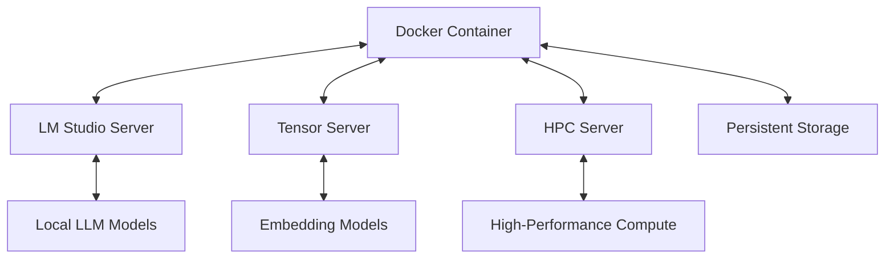

# System Architecture

## High-Level Overview

Lucidia's architecture consists of several interconnected components operating across multiple servers:

1. **Docker Container**: Core system hosting the Self Model, World Model, and Knowledge Graph
2. **LM Studio Server**: Local inference server hosting various LLMs (http://127.0.0.1:1234)
3. **Tensor Server**: Dedicated server for embedding generation and vector operations
4. **HPC Server**: High-performance computing server for complex processing tasks
5. **Persistent Storage**: Database and file system for memory storage

## Component Interactions

The components interact through a combination of APIs, WebSockets, and direct function calls:

## State Management

Lucidia operates in several distinct states:

1. **Active Interaction**: Direct engagement with user, using optimal models for responsiveness
2. **Background Processing**: Light maintenance during user activity, using minimal resources
3. **Reflective Processing**: Memory consolidation during short idle periods (10+ minutes)
4. **Dreaming State**: Deep reflection during extended idle periods (overnight/AFK)

The system dynamically transitions between these states based on user activity, system resource availability, and scheduled maintenance tasks.

## Memory Architecture

Lucidia's memory system is organized in a hierarchical structure with three main layers:

1. **Short-Term Memory (STM)**: Temporary storage for immediate context and recent interactions
2. **Long-Term Memory (LTM)**: Persistent significance-weighted storage for important memories
3. **Memory Processing Layer (MPL)**: Processes and transforms memories between layers

The LTM system specifically uses asynchronous batch processing and significance-based retention to ensure only the most important memories are preserved long-term. Dynamic decay algorithms gradually reduce the significance of memories over time unless they are frequently accessed or highly significant.

For detailed information about the LTM implementation, see the [Long-Term Memory Guide](./long-term-memory-guide.md).

## Reflection and Dream Processing

Lucidia features a sophisticated Reflection Engine that analyzes dream content and extracted insights to enhance its metacognitive capabilities. The engine:

1. Evaluates the coherence and meaning of dreams
2. Assesses the quality and relevance of extracted insights
3. Identifies missed opportunities and alternative interpretations
4. Connects new insights to existing knowledge
5. Provides meta-cognitive assessment of dream processing

The Reflection Engine works closely with the Dream Processor and Long-Term Memory system to store significant insights as persistent memories. For detailed information, see the [Reflection Engine Guide](./reflection-engine-guide.md).

## Docker Network Integration

### Container Architecture

The Lucidia system uses a Docker-based architecture with the following components:

1. **Main Container (nemo_sig_v3)** running multiple services:
   - `tensor_server.py`: WebSocket server for embedding generation (port 5001)
   - `hpc_server.py`: WebSocket server for high-performance computing (port 5005)
   - `dream_api_server.py`: FastAPI server for dream processing (port 8081)

2. The `dream_api_server.py` acts as the FastAPI application entry point that:
   - Initializes all necessary components 
   - Includes the `dream_api.py` router
   - Manages state and dependency injection

3. The Docker network (`lucid-net`) enables seamless communication between containers

4. Port forwarding services expose the internal ports to the host machine for external access

### Docker Environment Dependencies

The system relies on several key dependencies managed through Docker:

1. **Core Dependencies**:
   - FastAPI and Uvicorn for API endpoints
   - WebSockets for real-time communication
   - Pydantic for data validation
   - NumPy and scikit-learn for numerical operations

2. **Validation Dependencies**:
   - jsonschema (v4.17.3) for parameter configuration validation
   
3. **System Resource Management**:
   - psutil (v5.9.5) for monitoring system resources and optimizing performance

These dependencies are specified in `requirements.luciddream.txt` and installed during Docker image building.

### WebSocket Connection Management

The `dream_api.py` implements robust WebSocket connections to tensor and HPC servers with:

- Connection pooling with locks to prevent race conditions
- Retry logic with exponential backoff for resilience
- Comprehensive health checks and monitoring
- Fallback mechanisms when primary communication methods fail