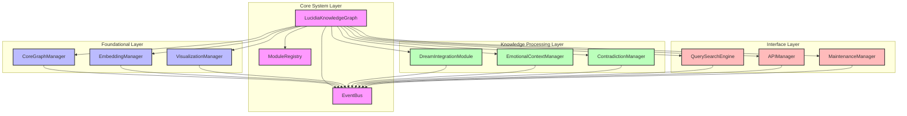

# Lucidia Knowledge Graph - Modular Architecture

A modular, extensible implementation of Lucidia's Knowledge Graph, designed for maintainability, independent development, and visualization through Mermaid diagrams.

## Overview

This project provides a complete modular refactoring of Lucidia's Knowledge Graph, transforming it from a monolithic architecture into a system of specialized, independent modules that communicate through well-defined channels.

The modular architecture enables:

- **Independent Evolution** - Modules can develop at different rates
- **Focused Maintenance** - Issues are isolated to specific modules
- **Team Distribution** - Development can be distributed across teams
- **Incremental Enhancement** - Features can be added module by module
- **Tailored Visualization** - Mermaid diagrams can be generated for different views

## Architecture

The system is organized into four layers:

### 1. Core System Layer

- **EventBus**: Central communication system for event-driven architecture
- **ModuleRegistry**: Service registry for component discovery and resolution
- **LucidiaKnowledgeGraph**: Main orchestration class that delegates to specialized modules

### 2. Foundational Layer

- **CoreGraphManager**: Manages the underlying graph structure and operations
- **EmbeddingManager**: Handles vector embeddings and hyperbolic transformations
- **VisualizationManager**: Generates Mermaid diagrams for different views

### 3. Knowledge Processing Layer

- **DreamIntegrationModule**: Processes dream insights with meta-learning
- **EmotionalContextManager**: Integrates emotional dimensions into knowledge
- **ContradictionManager**: Detects and resolves knowledge contradictions

### 4. Interface Layer

- **QuerySearchEngine**: Provides search, path finding, and context generation
- **MaintenanceManager**: Monitors graph health and performs optimizations
- **APIManager**: Exposes the knowledge graph to external systems

## Architecture Diagram



## Key Features

- **Event-Driven Communication**: Modules communicate through events
- **Declarative Registration**: Modules register capabilities with the registry
- **Delegated Operations**: Main class delegates to specialized modules
- **Unified API**: Consistent API across modules for ease of use
- **Mermaid Visualization**: Multiple views of the knowledge graph
- **Adaptive Maintenance**: Self-monitoring and optimization
- **Meta-Learning**: Self-improvement over time

## Usage Example

```python
import asyncio
from lucidia.knowledge_graph import LucidiaKnowledgeGraph

async def main():
    # Initialize the knowledge graph
    kg = LucidiaKnowledgeGraph()
    await kg.initialize()
    
    # Add a concept
    await kg.add_node(
        "recursive_modularity",
        "concept",
        {
            "definition": "A design pattern where components are organized into hierarchical modules that can contain other modules",
            "confidence": 0.9
        },
        "technology"
    )
    
    # Search for concepts
    results = await kg.search_nodes("modularity design")
    for result in results['results']:
        print(f"{result['id']} - Similarity: {result['similarity']:.2f}")
    
    # Generate visualization
    mermaid_code = await kg.generate_domain_visualization("technology")
    print(mermaid_code)
    
    # Clean up
    await kg.shutdown()

if __name__ == "__main__":
    asyncio.run(main())
```

## WebSocket API

The knowledge graph exposes a WebSocket API for external systems to interact with it:

```javascript
// Connect to the WebSocket API
const socket = new WebSocket('ws://localhost:8765');

// Authentication
socket.send(JSON.stringify({
    type: 'auth',
    token: 'lucidia_test_token'
}));

// Search for concepts
socket.send(JSON.stringify({
    request_id: 'search_1',
    endpoint: 'search',
    data: {
        query: 'modularity design',
        limit: 5
    }
}));

// Handle responses
socket.onmessage = (event) => {
    const response = JSON.parse(event.data);
    console.log(response);
};
```

## Maintenance and Module Health

The system includes built-in maintenance and health monitoring:

- **Adaptive Maintenance**: Optimizes the graph structure based on metrics
- **Health Checks**: Detects and repairs inconsistencies
- **Performance Monitoring**: Tracks response times and resource usage
- **Contradiction Management**: Detects and resolves knowledge contradictions

## Module Development Guidelines

When extending or modifying modules, follow these guidelines:

1. **Interface Stability**: Maintain stable public interfaces
2. **Event Documentation**: Document events you emit or consume
3. **Error Handling**: Handle errors gracefully within your module
4. **Dependency Injection**: Rely on the module registry for dependencies
5. **Resource Cleanup**: Clean up resources in the shutdown method
6. **Testing**: Provide tests for your module's functionality
7. **Documentation**: Update documentation for any interface changes

## Contributing

Contributions are welcome! Please follow these steps:

1. Fork the repository
2. Create a feature branch
3. Implement your changes
4. Add tests for your changes
5. Submit a pull request

## License

This project is licensed under the terms of the MIT license.
