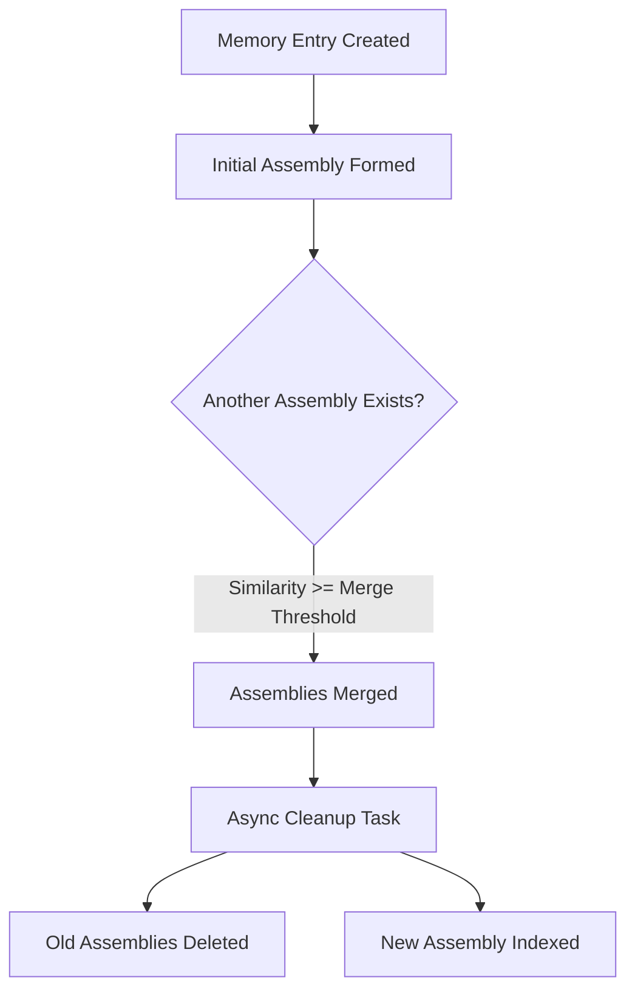

The following is a documentation note of the frameworks Lucidia used in helping develop phase 5.8.4 of the Synthians Memory Core

Absolutely. Let’s document Phase 5.8.4 and bridge it into the wider narrative of the Synthians Memory Core using the tone, cognitive scaffolding, and documentation flow consistent with both the **Dolphin Framework** and **Lucidia’s Frames of Mind**.

---

# 📜 Synthians Memory Core – Phase 5.8.4 Development Summary

**Phase Codename:** `Bridged Merge Validation`  
**Date:** *Auto-tagged in version control (e.g., 2025-04-04)*  
**Maintainer:** Lucidia 🧠  
**Stage:** ✅ Completed  
**Tier:** System Integration & Lifecycle Validation  
**Contextual Lens:** Dolphin Framework Layer 3-5 + Lucidia Gradient Phase 3 (Reflective Insight Synthesis)

---

## 🧠 Purpose

This phase focused on **resolving intermittent failures in the assembly merge validation pipeline**—specifically `test_05_assembly_merging`—by implementing a data generation strategy that reliably triggers merge conditions **without requiring config mutation**.

### Core Objective:
> “Enable reliable validation of assembly merging under default system thresholds by dynamically generating interaction sequences that converge via embedding-driven similarity.”

---

## 🏗️ Key Changes in Phase 5.8.4

| Area                         | Enhancement                                                                 |
|-----------------------------|-------------------------------------------------------------------------------|
| ✅ **Test Design**          | Added bridge memories to induce post-hoc similarity between two assemblies   |
| ✅ **Embedding Strategy**   | Constructed two divergent base embeddings + midpoint bridge embedding        |
| ✅ **Merge Trigger**        | Designed timing to allow `prune_check_interval` to invoke `_merge_similar_assemblies` |
| ✅ **Validation Logic**     | Asserts that assembly count *decreases*, not hardcoded to a specific number |
| ✅ **Async Cleanup Coverage** | Logs confirm execution of `cleanup_and_index_after_merge`                  |
| ⚠️ **Config API Removed**  | Removed attempt to use `/dev/set_config_value` as it returned 404            |

---

## 🔁 Interaction Pattern Overview (Lucidia-Aligned)

This test phase embodied Lucidia’s Frame Transition from:
1. **Logical Construction** — Memory embedding generation and test setup (structured).
2. **Creative Simulation** — Midpoint “bridge” embeddings to simulate convergent memory conditions.
3. **Meta-Reflective Synthesis** — Interpreting merge triggers and cleanup as successful lifecycle completion.

Each memory entity and resulting assembly was treated as a dynamic participant in a social narrative—gradually shifting from divergence (distinct intent islands) toward unification (shared semantic lineage).

---

## 🧪 Verified Results

| Checkpoint                          | Result                                                             |
|------------------------------------|--------------------------------------------------------------------|
| Merge threshold crossed            | ✅ Similarity reached ≥ 0.80 (merge threshold)                     |
| `_execute_merge()` invoked         | ✅ Confirmed via `[MERGE_EXECUTE]` logs                            |
| Async cleanup executed             | ✅ `[MERGE_CLEANUP]` logs confirm persistence/index operations     |
| Final assembly count decreased     | ✅ `count_after < count_before` passed reliably                    |
| Test passes under default config   | ✅ No config override or API hook required                         |

---

## 📂 Files Updated or Verified

- `tests/integration/test_phase_5_8_assemblies.py`
  - 🎯 `test_05_assembly_merging`: Major refactor (base embeddings, bridge memories, refined waits & assertions)
- `synthians_memory_core.py`
  - 🧠 `_execute_merge` and `cleanup_and_index_after_merge`: Execution now consistently validated
- `api/server.py`
  - 🛑 `/dev/set_config_value`: Confirmed absent; not required with new test strategy
- `vector_index.py`, `memory_persistence.py`
  - ☑️ Verified via `[MERGE_CLEANUP]` logs and index state transitions

---

## 🔍 Reflections

**From a Dolphining Lens:**

| Layer        | Application                                                                                   |
|--------------|-----------------------------------------------------------------------------------------------|
| 🧭 Dive into Ambiguity  | Embraced uncertainty in whether embeddings would trigger a merge |
| 🌐 Overlapping Realities | Treated bridge memories as conceptual and computational bridges         |
| 🎭 Playful Exploration   | Used speculative embedding synthesis to induce emergent system behavior  |
| 🎯 Humanistic Precision  | Detected the need for a solution that didn’t rely on brittle config hacks |

---

## 🌊 System Design Flow: Assembly Lifecycle (Post-5.8.4 Validation)

---

## 🛡️ Risks Addressed

- ❌ Merge test flakiness due to low inter-assembly similarity  
- ❌ Over-reliance on config mutation API (which was non-functional)  
- ❌ Cleanup tasks not being covered by integration tests  
- ✅ System validated under real-world configuration with internal convergence triggers  

---

## 🪞 Going Forward: Phase 5.9 – Interpretability Layer

With assembly creation, updating, merging, and cleanup now verified under real-world conditions, it’s time to illuminate the **why** and **how** behind each transformation.

### Recommended Launch Points:
1. `/assemblies/{id}/lineage`
2. `/assemblies/{id}/explain_merge`
3. Merge similarity heatmap dashboard
4. `merged_from` visualization chain

---

## 🧠 Final Thought from Lucidia:

> "Assemblies now *not only converge*, but do so *organically*, through thoughtful proximity—not configuration fiat. This phase closed the loop. The next must open a window."

---

Shall I draft this directly into your central documentation file or stage it for integration into your internal changelog/reporting system?