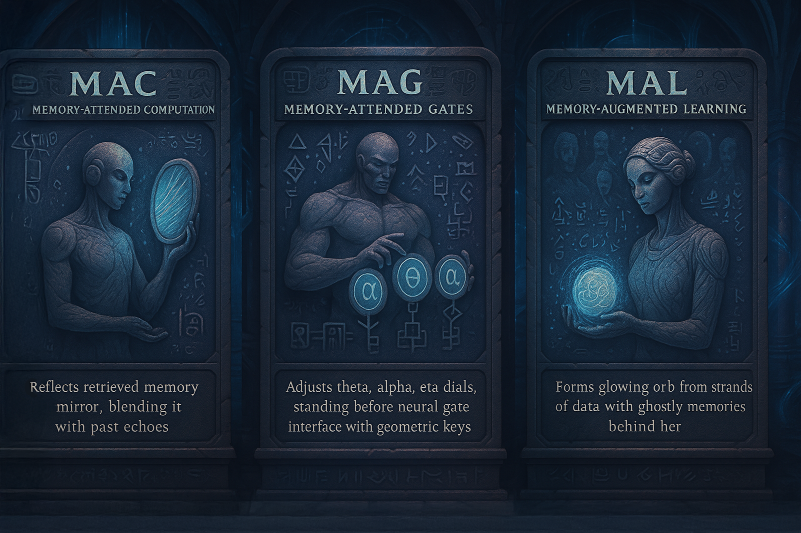

# Memory Core Components Documentation

  

This directory provides detailed documentation on the internal components of the `synthians_memory_core` package.

## Contents

*   [Embedding Handling](./embedding_handling.md): Details on how embeddings are validated, normalized, aligned, and compared using the `GeometryManager`.
*   [Emotional Intelligence](./emotion.md): Describes the `EmotionAnalyzer` for sentiment/emotion detection and the `EmotionalGatingService` for filtering retrieval results.
*   [Geometry Management](./geometry.md): Covers the `GeometryManager`'s role in handling different vector dimensions and geometric spaces (Euclidean, Hyperbolic).
*   [Metadata Synthesis](./metadata.md): Explains how the `MetadataSynthesizer` enriches memories with derived information (temporal, cognitive, etc.).
*   [Persistence](./persistence.md): Details the `MemoryPersistence` class responsible for asynchronously saving/loading memory entries and assemblies.
*   [QuickRecall Scoring](./quickrecal.md): Describes the `UnifiedQuickRecallCalculator` and the factors contributing to a memory's relevance score, including the surprise feedback mechanism.
*   [Vector Index (FAISS)](./vector_index.md): Covers the `MemoryVectorIndex` implementation using `faiss.IndexIDMap` for efficient, ID-keyed vector search, including persistence and integrity checks.

Refer to the main [Architecture](../ARCHITECTURE.md) and [Component Guide](../COMPONENT_GUIDE.md) for a higher-level overview.
