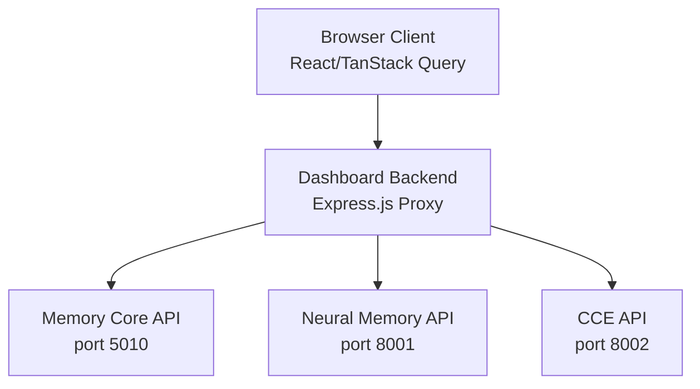
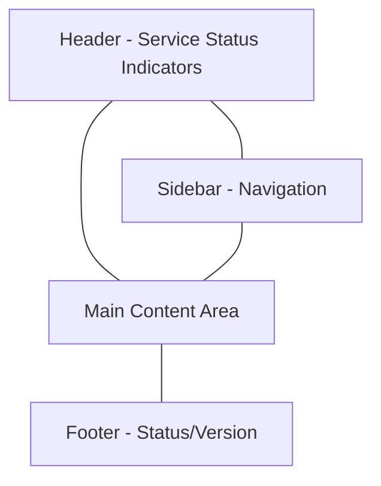

# Synthians Cognitive Dashboard Specification

**Note: This document specifies the planned implementation for Phase 5.9.1. The backend APIs needed for this dashboard are not yet implemented in Phase 5.8 and will be added in Phase 5.9.**

This specification outlines the design and API requirements for the Synthians Cognitive Dashboard, a React-based web application for monitoring and interacting with the Synthians Cognitive Architecture.

## Architecture Overview

The dashboard follows a modern front-end architecture pattern:

1. **Client Application**: React-based SPA using Vite, TypeScript, and Tailwind CSS
2. **Backend Proxy Server**: Express.js server proxying requests to the Synthians services
3. **API Integration**: TanStack Query for data fetching, caching, and synchronization



## Technology Stack

- **Frontend**: React 18+, Vite, TypeScript, Tailwind CSS, Shadcn UI
- **State Management**: TanStack Query (React Query) for server state, React Context for UI state
- **Charts/Visualizations**: Recharts, D3.js 
- **Backend**: Express.js for the proxy server
- **Build/Dev**: ESLint, Prettier, Jest, React Testing Library

## Core UI Components

The dashboard consists of the following primary views:

1. **Overview/Home**: System status, alerts, key metrics
2. **Memory Insights**: Memory stats, assembly details, explainability views
3. **Neural Memory**: Neural memory metrics, surprise signal visualization
4. **CCE Monitor**: Variant metrics, selection breakdown, performance trends
5. **Configuration**: Runtime configuration viewing and management
6. **Diagnostics**: Logs, merge history, repair tools

## API Requirements

The dashboard will consume the following existing and planned APIs:

### Memory Core APIs

- **Existing:**
  - `/health` - Service health check
  - `/stats` - Memory and assembly statistics
  - `/assemblies` - List all assemblies
  - `/assemblies/{id}` - Assembly details

- **Planned (Phase 5.9):**
  - `/assemblies/{id}/explain_activation` - Activation explanation
  - `/assemblies/{id}/explain_merge` - Merge explanation
  - `/assemblies/{id}/lineage` - Assembly ancestry
  - `/diagnostics/merge_log` - Merge history
  - `/config/runtime/memory-core` - Runtime configuration

### Neural Memory APIs

- **Existing:**
  - `/health` - Service health
  - `/diagnose_emoloop` - Memory loop diagnostics

- **Planned (Phase 5.9, proxied):**
  - `/config/runtime/neural-memory` - Runtime configuration

### CCE APIs

- **Existing:**
  - `/health` - Service health
  - `/metrics/recent_cce_responses` - Recent responses

- **Planned (Phase 5.9):**
  - Enhanced metrics for variant selection
  - `/config/runtime/cce` - Runtime configuration

## API Client Implementations

Below are example implementations of the API client hooks using TanStack Query:

```typescript
import axios from 'axios';
import { useQuery, UseQueryOptions } from '@tanstack/react-query';
import {
  ServiceStatus,
  MemoryStats,
  NeuralMemoryStatus,
  NeuralMemoryDiagnostics,
  CCEMetrics,
  Assembly,
  Alert
} from '@shared/schema';

// Define placeholder interfaces for explainability/diagnostics
interface ExplainDataBase {
    success: boolean;
    error: string | null;
}
interface ExplainActivationResponse extends ExplainDataBase {
    explanation: {
        assembly_id: string;
        memory_id?: string;
        check_timestamp: string;
        context?: string;
        calculated_similarity?: number;
        activation_threshold?: number;
        passed_threshold?: boolean;
        notes?: string;
    } | { notes?: string };
}
interface ExplainMergeResponse extends ExplainDataBase {
     explanation: {
        target_assembly_id?: string;
        merge_event_id?: string;
        merge_timestamp?: string;
        source_assembly_ids?: string[];
        similarity_at_merge?: number;
        threshold_at_merge?: number;
        cleanup_status?: string;
        current_lineage?: string[];
        notes?: string;
    } | { notes?: string };
}
interface LineageEntry {
    assembly_id: string;
    name: string;
    depth: number;
}
interface LineageResponse extends ExplainDataBase {
    lineage: LineageEntry[];
    max_depth_reached: boolean;
}
interface MergeLogEntry {
    merge_event_id: string;
    timestamp: string;
    source_assembly_ids: string[];
    target_assembly_id: string;
    similarity_at_merge: number;
    merge_threshold: number;
    outcome: string;
    cleanup_status: string;
}
interface MergeLogResponse extends ExplainDataBase {
    log_entries: MergeLogEntry[];
    count: number;
}
interface RuntimeConfigResponse extends ExplainDataBase {
    service: string;
    config: Record<string, any>;
}

const api = axios.create({
  baseURL: '/api' // Use relative paths for proxy
});

// Helper for TanStack Query function to handle potential errors
const defaultQueryFn = async ({ queryKey }: { queryKey: any[] }) => {
    const url = queryKey.join('/').replace('/api/', '/api/');
    try {
        const { data } = await api.get(url, { 
          params: queryKey[queryKey.length -1] instanceof Object ? queryKey[queryKey.length -1] : {} 
        });
        return data;
    } catch (error: any) {
        console.error(`API Query Error for ${url}:`, error.response?.data || error.message);
        throw new Error(error.response?.data?.message || error.message || `Failed to fetch ${url}`);
    }
};

// === Health Checks ===
export const useMemoryCoreHealth = () => useQuery<ServiceStatus>({ 
  queryKey: ['memory-core', 'health'], queryFn: defaultQueryFn, staleTime: 30000 
});
export const useNeuralMemoryHealth = () => useQuery<ServiceStatus>({ 
  queryKey: ['neural-memory', 'health'], queryFn: defaultQueryFn, staleTime: 30000 
});
export const useCCEHealth = () => useQuery<ServiceStatus>({ 
  queryKey: ['cce', 'health'], queryFn: defaultQueryFn, staleTime: 30000 
});

// === Memory Core Data ===
export const useMemoryCoreStats = () => useQuery<MemoryStats>({ 
  queryKey: ['memory-core', 'stats'], queryFn: defaultQueryFn 
});
export const useAssemblies = () => useQuery<{ success: boolean; assemblies: Assembly[]; count: number }>({ 
  queryKey: ['memory-core', 'assemblies'], queryFn: defaultQueryFn 
});
export const useAssembly = (id: string | null) => useQuery<{ success: boolean; assembly: Assembly }>({ 
  queryKey: ['memory-core', 'assemblies', id], queryFn: defaultQueryFn, enabled: !!id 
});

// === Neural Memory Data ===
export const useNeuralMemoryStatus = () => useQuery<NeuralMemoryStatus>({ 
  queryKey: ['neural-memory', 'status'], queryFn: defaultQueryFn 
});
export const useNeuralMemoryDiagnostics = (window: string = '24h') => useQuery<NeuralMemoryDiagnostics>({ 
  queryKey: ['neural-memory', 'diagnose_emoloop', { window }], queryFn: defaultQueryFn 
});

// === CCE Data ===
export const useCCEStatus = () => useQuery<{ status: string; active_variant: string }>({ 
  queryKey: ['cce', 'status'], queryFn: defaultQueryFn 
});
export const useRecentCCEResponses = (limit: number = 20) => useQuery<CCEMetrics>({ 
  queryKey: ['cce', 'metrics', 'recent_cce_responses', { limit }], queryFn: defaultQueryFn 
});

// === Configuration Data (Phase 5.9) ===
export const useMemoryCoreConfig = () => useQuery<RuntimeConfigResponse>({ 
  queryKey: ['memory-core', 'config', 'runtime', 'memory-core'], queryFn: defaultQueryFn, staleTime: Infinity 
});
export const useNeuralMemoryConfig = () => useQuery<RuntimeConfigResponse>({ 
  queryKey: ['memory-core', 'config', 'runtime', 'neural-memory'], queryFn: defaultQueryFn, staleTime: Infinity 
});
export const useCCEConfig = () => useQuery<RuntimeConfigResponse>({ 
  queryKey: ['memory-core', 'config', 'runtime', 'cce'], queryFn: defaultQueryFn, staleTime: Infinity 
});

// === Alerts ===
export const useAlerts = () => useQuery<{ success: boolean; data: Alert[] }>({ 
  queryKey: ['alerts'], queryFn: defaultQueryFn 
});

// === Explainability Hooks (Phase 5.9) ===
export const useExplainActivation = (assemblyId: string, memoryId?: string) => {
  const queryParams = memoryId ? { memory_id: memoryId } : {};
  return useQuery<ExplainActivationResponse>({
    queryKey: ['memory-core', 'assemblies', assemblyId, 'explain_activation', queryParams],
    queryFn: defaultQueryFn,
    enabled: false, // Only fetch when manually triggered
    retry: 1,
    staleTime: Infinity, // Don't refetch automatically unless triggered
  });
};

export const useExplainMerge = (assemblyId: string | null) => {
  return useQuery<ExplainMergeResponse>({
    queryKey: ['memory-core', 'assemblies', assemblyId, 'explain_merge'],
    queryFn: defaultQueryFn,
    enabled: !!assemblyId,
    retry: 1,
    staleTime: Infinity,
  });
};

export const useAssemblyLineage = (assemblyId: string | null) => {
  return useQuery<LineageResponse>({
    queryKey: ['memory-core', 'assemblies', assemblyId, 'lineage'],
    queryFn: defaultQueryFn,
    enabled: !!assemblyId,
    retry: 1,
    staleTime: Infinity,
  });
};

// === Diagnostics Hooks (Phase 5.9) ===
export const useMergeLog = (limit: number = 100) => {
  return useQuery<MergeLogResponse>({
    queryKey: ['memory-core', 'diagnostics', 'merge_log', { limit }],
    queryFn: defaultQueryFn,
    refetchInterval: 30000 // Every 30 seconds
  });
};

// === Admin Actions (POST requests) ===
export const verifyMemoryCoreIndex = async () => api.post('/memory-core/admin/verify_index');
export const triggerMemoryCoreRetryLoop = async () => api.post('/memory-core/admin/trigger_retry_loop');
export const initializeNeuralMemory = async () => api.post('/neural-memory/init');
export const setCCEVariant = async (variant: string) => api.post('/cce/set_variant', { variant });

// === Manual Refresh Helper ===
export const refreshAllData = async (queryClient: any) => {
  await Promise.all([
    queryClient.invalidateQueries({ queryKey: ['memory-core', 'health'] }),
    queryClient.invalidateQueries({ queryKey: ['neural-memory', 'health'] }),
    queryClient.invalidateQueries({ queryKey: ['cce', 'health'] }),
    queryClient.invalidateQueries({ queryKey: ['memory-core', 'stats'] }),
    queryClient.invalidateQueries({ queryKey: ['memory-core', 'assemblies'] }),
    queryClient.invalidateQueries({ queryKey: ['neural-memory', 'status'] }),
    queryClient.invalidateQueries({ queryKey: ['neural-memory', 'diagnose_emoloop'] }),
    queryClient.invalidateQueries({ queryKey: ['cce', 'status'] }),
    queryClient.invalidateQueries({ queryKey: ['cce', 'metrics', 'recent_cce_responses'] }),
    queryClient.invalidateQueries({ queryKey: ['alerts'] }),
    queryClient.invalidateQueries({ queryKey: ['memory-core', 'config', 'runtime'] }),
    queryClient.invalidateQueries({ queryKey: ['memory-core', 'diagnostics', 'merge_log'] })
  ]);
};
```

## Backend Proxy Server

The dashboard backend serves as a proxy to the Synthians services, providing:

1. **Request Forwarding**: Routes requests to the appropriate service
2. **Error Handling**: Standardizes error responses
3. **Alerting**: Maintains a local store of system alerts
4. **Authentication**: (Future) Handles user authentication

Example routes implementation:

```typescript
// server/routes.ts
import express from 'express';
import type { Express } from "express";
import { createServer, type Server } from "http";
import { storage } from "./storage";
import axios, { AxiosError } from "axios";
import { log } from "./vite";

// Define API endpoints for the various services
const MEMORY_CORE_URL = process.env.MEMORY_CORE_URL || "http://localhost:5010";
const NEURAL_MEMORY_URL = process.env.NEURAL_MEMORY_URL || "http://localhost:8001";
const CCE_URL = process.env.CCE_URL || "http://localhost:8002";

// Helper function for proxying requests
async function proxyRequest(req: express.Request, res: express.Response, targetUrl: string, serviceName: string) {
    const method = req.method;
    const url = targetUrl + req.path.replace(`/api/${serviceName}`, '');
    log(`Proxying ${method} ${req.path} to ${url}`);

    try {
        const response = await axios({
            method: method as any,
            url: url,
            params: req.query,
            data: req.body,
            headers: { 'Content-Type': 'application/json' },
            timeout: 15000 // 15 second timeout
        });
        res.status(response.status).json(response.data);
    } catch (error: any) {
        log(`Proxy Error for ${serviceName}: ${error.message}`);
        if (axios.isAxiosError(error)) {
            const axiosError = error as AxiosError;
            res.status(axiosError.response?.status || 500).json({
                status: "Error",
                message: `Failed to proxy request to ${serviceName}`,
                details: axiosError.response?.data || axiosError.message
            });
        } else {
            res.status(500).json({ 
              status: "Error", 
              message: `Unknown proxy error for ${serviceName}: ${error.message}` 
            });
        }
    }
}

export async function registerRoutes(app: Express): Promise<Server> {
  // API proxy routes to forward requests to internal services

  // --- Memory Core Proxies ---
  app.all("/api/memory-core/*", (req, res) => proxyRequest(req, res, MEMORY_CORE_URL, 'memory-core'));

  // --- Neural Memory Proxies ---
  app.all("/api/neural-memory/*", (req, res) => proxyRequest(req, res, NEURAL_MEMORY_URL, 'neural-memory'));

  // --- CCE Proxies ---
  app.all("/api/cce/*", (req, res) => proxyRequest(req, res, CCE_URL, 'cce'));

  // --- Alerts API (Local Storage) ---
  app.get("/api/alerts", async (req, res) => {
    try {
      const alerts = await storage.getAlerts();
      res.json({ success: true, data: alerts });
    } catch (error: any) {
      log(`Error fetching alerts: ${error.message}`);
      res.status(500).json({ 
        success: false, status: "Error", message: "Failed to fetch alerts" 
      });
    }
  });

  // Create the HTTP server
  const httpServer = createServer(app);

  return httpServer;
}
```

## UI Layout

The dashboard UI follows a standard layout:



## Conclusion

The Synthians Cognitive Dashboard will provide a comprehensive interface for monitoring, understanding, and interacting with the Synthians Cognitive Architecture. It leverages the new explainability and diagnostics features planned for Phase 5.9 to provide deeper insights into system behavior.

The dashboard will be developed in Phase 5.9.1, following the implementation of the backend explainability APIs in Phase 5.9.