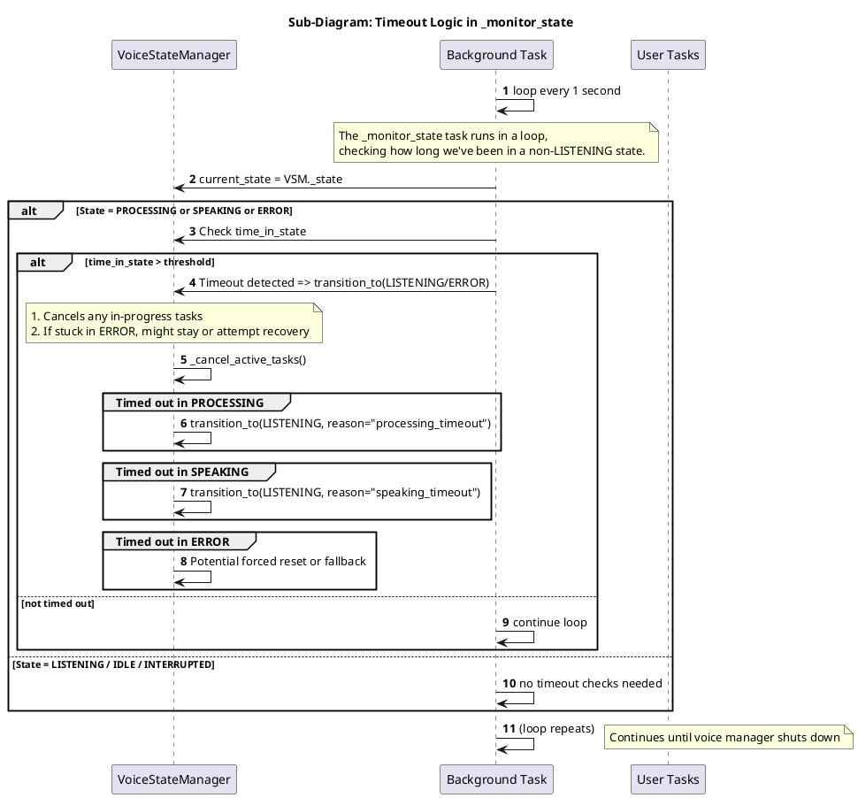
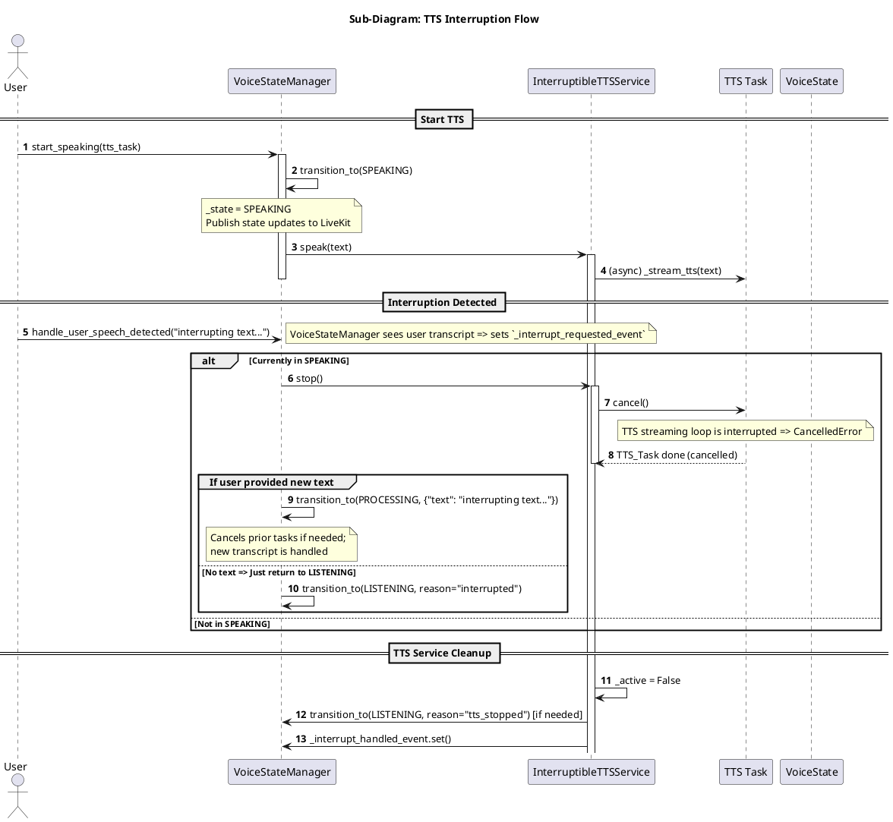
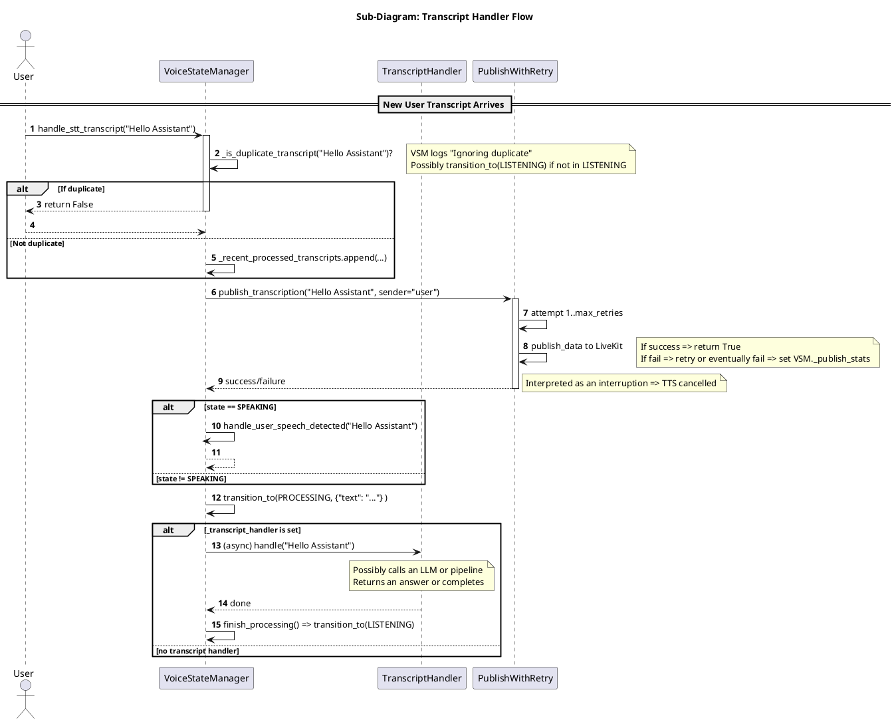

Below are **three smaller PlantUML sequence diagrams** (sub-diagrams) focused on narrower topics in the `VoiceStateManager` and the `InterruptibleTTSService`. Each diagram highlights a distinct aspect:

1. **Timeout Logic** – How the background `_monitor_state` detects stuck states, cancels tasks, and transitions to `ERROR` or back to `LISTENING`.  
2. **TTS Interruption** – How the user interrupts TTS mid-speech, how events are set, how tasks are canceled, and how states transition.  
3. **Transcript Handler Flow** – How a new user transcript is processed, deduplicated, published, handed to the external transcript handler, and possibly leads to generating TTS responses.

Use these sub-diagrams alongside your main comprehensive diagram to clarify specific behaviors in isolation.

---

## 1) **Timeout Logic** 

**Key Points**  
- **`_monitor_state`** runs in an infinite loop (with sleeps in between) to detect if the system is “stuck” in `PROCESSING`, `SPEAKING`, or `ERROR` for too long.  
- On timeout, it triggers `transition_to(LISTENING)` (or stays in `ERROR`), **cancels tasks** (`_cancel_active_tasks()`), and logs a warning.  

---

## 2) **TTS Interruption** 

Below is a more focused look at how the `VoiceStateManager` and the `InterruptibleTTSService` coordinate mid-speech interruption:

**Key Points**  
- **`start_speaking()`** transitions the manager to `SPEAKING`, then calls `ITTS.speak(...)`.  
- If the **user** speaks while TTS is active, `handle_user_speech_detected(...)` triggers an **interrupt** path:
  - The manager sets `_interrupt_requested_event`, calls `ITTS.stop()`.  
  - The TTS service cancels its internal streaming task, clearing or flushing buffers.  
- Depending on whether the user also provided new text, we go to `PROCESSING` or revert to `LISTENING`.  

---

## 3) **Transcript Handler Flow** 

This sub-diagram illustrates how a **new transcript** is processed, including **deduplication**, publishing to LiveKit, and handing off to an **external transcript handler** (often responsible for LLM calls).

**Key Points**  
- **Deduplication**: `_is_duplicate_transcript()` checks if the text is repeated or within a too-short interval.  
- **Publishing**: `publish_transcription(...)` calls `_publish_with_retry` internally to ensure data and transcription are sent to LiveKit.  
- If currently in **SPEAKING**, the transcript is interpreted as an **interruption** path. Otherwise, we **transition to PROCESSING**.  
- If a **transcript handler** is registered, we create an async task to process it (e.g., run an LLM). On completion or timeout, we revert to **LISTENING**.

---

## How to Use These Sub-Diagrams

- Each sub-diagram is meant to be **referenced alongside** your main, end-to-end flow diagram.  
- They provide a closer look at specific behaviors so you or your team can easily see how **interruptions**, **timeouts**, and **transcript handling** work in isolation.  
- The code references (e.g., `transition_to`, `_cancel_active_tasks`, `_is_duplicate_transcript`, `publish_with_retry`, etc.) align with your Python implementation in `VoiceStateManager` and `InterruptibleTTSService`.  

Feel free to adjust naming, detail level, or messages as needed to best document your specific codebase and usage patterns.