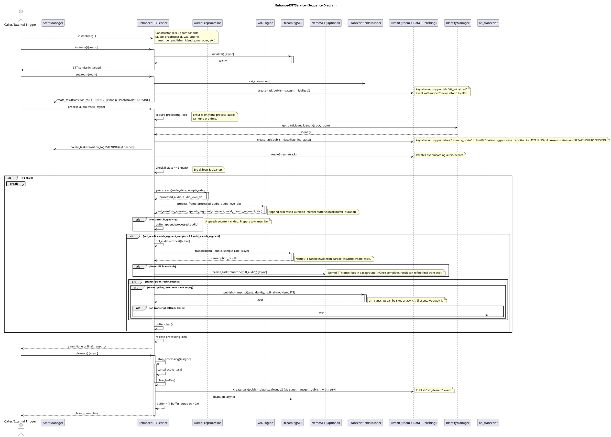

Below is a **detailed UML sequence diagram** illustrating the primary interactions within the `EnhancedSTTService` during initialization, audio processing, optional NemoSTT transcription, data publishing, and cleanup. It follows standard UML notations while highlighting key **async/await** and `asyncio.create_task` calls.  

> **Note**: In a single diagram, concurrency and asynchronous tasks can get visually complex. This diagram shows the main flow and indicates where asynchronous tasks (`create_task`) branch off or run in parallel. Depending on your documentation needs, you may prefer splitting certain details into sub-diagrams.

### Diagram Explanation

1. **Initialization**  
   - The `EnhancedSTTService` is instantiated with references to its modular components (`AudioPreprocessor`, `VADEngine`, `StreamingSTT`, `TranscriptionPublisher`, `LiveKitIdentityManager`).  
   - On `initialize()`, it triggers `StreamingSTT.initialize()` and publishes an initialization event (`stt_initialized`) to LiveKit asynchronously.

2. **Setting the LiveKit Room (optional step)**  
   - `set_room(room)` associates a LiveKit `Room` instance with the service, which is needed for publishing data events and retrieving participant identities.

3. **Processing Audio**  
   - `process_audio(track)` is the core method for handling incoming `rtc.AudioTrack` data from LiveKit.  
   - A lock (`processing_lock`) ensures only one track is processed at a time.  
   - The service retrieves the participant identity (via `LiveKitIdentityManager`), publishes a "listening" event to LiveKit, and transitions the `StateManager` to a `LISTENING` state if appropriate.  
   - An `AudioStream` is created to yield audio frames from the track in an asynchronous loop.

4. **Processing Each Frame**  
   - For each frame, audio is preprocessed (`AudioPreprocessor.preprocess`) and sent to the `VADEngine` to detect speech activity.  
   - If speech is active, audio data is buffered.  
   - When a speech segment completes (based on VAD), the buffered audio is passed to `StreamingSTT` for transcription.  
   - Optionally, if a `NemoSTT` instance is provided, the same segment is sent there in an asynchronous task (`asyncio.create_task`), allowing both transcriptions to run concurrently.  
   - If transcription is successful, the `TranscriptionPublisher` publishes a preliminary or final transcript to LiveKit, and the optional `on_transcript` callback is invoked.

5. **Cleanup**  
   - Once audio processing ends or is explicitly stopped, the service releases the lock and returns control.  
   - A separate `cleanup()` method stops active tasks, clears buffers, optionally publishes a `stt_cleanup` event, and calls `cleanup()` on the transcriber.

---

## Suggestions for Further Clarity

- **Separate Diagrams for Major Phases**: Because the audio processing loop is quite detailed, consider creating one high-level diagram for overall workflow (init, set_room, process_audio, stop/cleanup) and another focusing specifically on the per-frame loop (VAD, buffering, transcription, publishing).  
- **Include NemoSTT Results Handling**: If you handle final NemoSTT results later in the workflow (e.g., replacing or refining the initial transcript), a separate interaction after NemoSTT completes could clarify how that final text is published or updated.  
- **Highlight Error Conditions**: If your application has more complex error recovery, you may want to include an “alt” or “opt” block showing transitions to an `ERROR` state, logging, and specific retry or cleanup behaviors.  

Feel free to let me know if you need any additional interactions, clarifications, or specific method-invocation details added to the diagram!